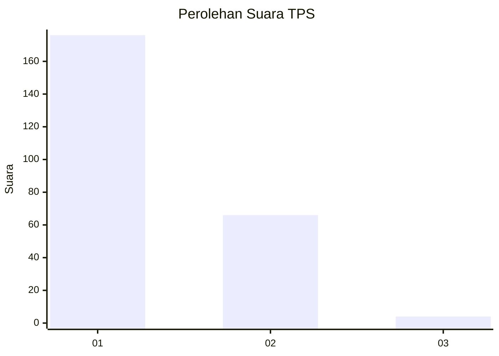
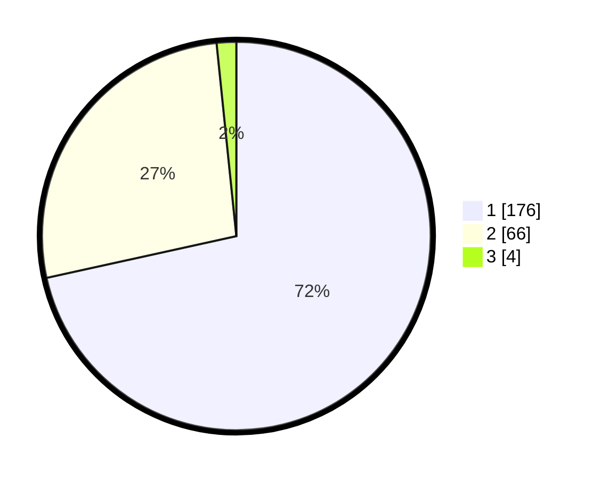

# Hasil

## Grafik

## Tabel

| No. | Nama Paslon    | Suara | Suara (raw) | Persentase |
|:--- |:-------------- | -----:| -----------:| ----------:|
| 1   | ANIES MUHAIMIN | 176   | [176][p-1]  | 71,54      |
| 2   | PRABOWO GIBRAN | 66    | [66][p-2]   | 26,83      |
| 3   | GANJAR MAHFUD  | 4     | [4][p-3]    | 1,63       |

[p-1]: https://github.com/gigit-pemilu/pemilu-2024-11-aceh/blob/main/pilpres/hitung-suara/sub/11-aceh/sub/05-aceh-barat/sub/01-johan-pahlawan/sub/2007-drien-rampak/sub/006-tps/sub/paslon-1.txt
[p-2]: https://github.com/gigit-pemilu/pemilu-2024-11-aceh/blob/main/pilpres/hitung-suara/sub/11-aceh/sub/05-aceh-barat/sub/01-johan-pahlawan/sub/2007-drien-rampak/sub/006-tps/sub/paslon-2.txt
[p-3]: https://github.com/gigit-pemilu/pemilu-2024-11-aceh/blob/main/pilpres/hitung-suara/sub/11-aceh/sub/05-aceh-barat/sub/01-johan-pahlawan/sub/2007-drien-rampak/sub/006-tps/sub/paslon-3.txt

## Foto C Plano

https://sirekap-obj-formc.kpu.go.id/d9fa/pemilu/ppwp/11/05/01/20/07/1105012007006-20240214-194940--fa4621cc-6702-4cd7-ad80-58e1d6d8210b.jpg

https://sirekap-obj-formc.kpu.go.id/d9fa/pemilu/ppwp/11/05/01/20/07/1105012007006-20240214-193618--b08104bb-2c6a-402f-8220-ca16864eafc8.jpg

https://sirekap-obj-formc.kpu.go.id/d9fa/pemilu/ppwp/11/05/01/20/07/1105012007006-20240214-195105--8189de96-0a7f-49b3-82d4-9188bb90da37.jpg

## Metadata

| Key        | Value               |
| ---------- | ------------------- |
| Time Stamp | 2024-02-15 00:56:54 |

## DATA PEMILIH TETAP

Jumlah pemilih dalam DPT: **297**.
 * L: **142**.
 * P: **155**.

## DATA PENGGUNA HAK PILIH

Jumlah pengguna hak pilih dalam DPT: **240**.
 * L: **110**.
 * P: **130**.

Jumlah pengguna hak pilih dalam DPTb: **7**.
 * L: **5**.
 * P: **2**.

Jumlah pengguna hak pilih dalam DPK: **0**.
 * L: **0**.
 * P: **0**.

Jumlah pengguna hak pilih: **247**.
 * L: **115**.
 * P: **132**.

## JUMLAH SUARA SAH DAN TIDAK SAH

JUMLAH SELURUH SUARA SAH: **246**.

JUMLAH SUARA TIDAK SAH: **1**.

JUMLAH SELURUH SUARA SAH DAN SUARA TIDAK SAH: **247**.

