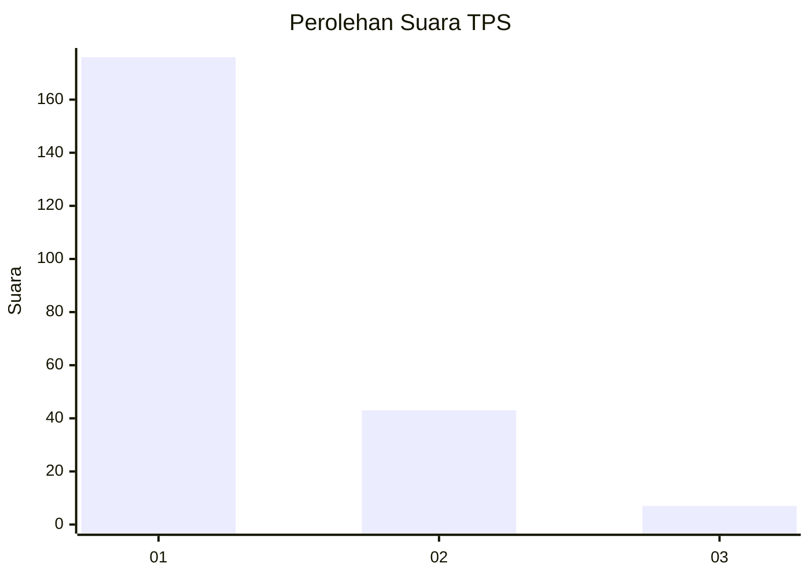
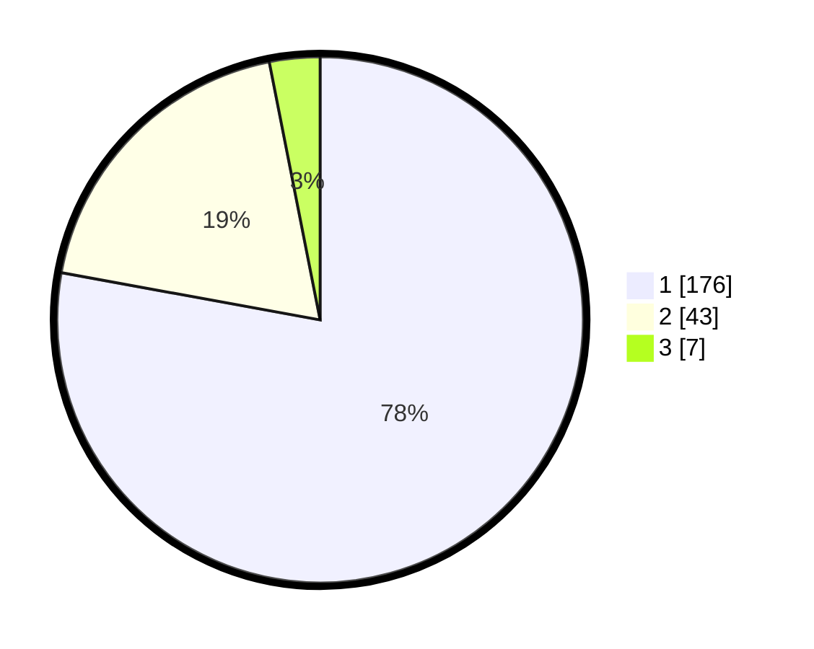

# Hasil

## Grafik

## Tabel

| No. | Nama Paslon    | Suara | Suara (raw) | Persentase |
|:--- |:-------------- | -----:| -----------:| ----------:|
| 1   | ANIES MUHAIMIN | 176   | [176][p-1]  | 77,88      |
| 2   | PRABOWO GIBRAN | 43    | [43][p-2]   | 19,03      |
| 3   | GANJAR MAHFUD  | 7     | [7][p-3]    | 3,10       |

[p-1]: https://github.com/gigit-pemilu/pemilu-2024-11-aceh/blob/main/pilpres/hitung-suara/sub/11-aceh/sub/05-aceh-barat/sub/01-johan-pahlawan/sub/2010-padang-seurahet/sub/001-tps/sub/paslon-1.txt
[p-2]: https://github.com/gigit-pemilu/pemilu-2024-11-aceh/blob/main/pilpres/hitung-suara/sub/11-aceh/sub/05-aceh-barat/sub/01-johan-pahlawan/sub/2010-padang-seurahet/sub/001-tps/sub/paslon-2.txt
[p-3]: https://github.com/gigit-pemilu/pemilu-2024-11-aceh/blob/main/pilpres/hitung-suara/sub/11-aceh/sub/05-aceh-barat/sub/01-johan-pahlawan/sub/2010-padang-seurahet/sub/001-tps/sub/paslon-3.txt

## Foto C Plano

https://sirekap-obj-formc.kpu.go.id/f32d/pemilu/ppwp/11/05/01/20/10/1105012010001-20240217-172435--044100c7-f712-48b3-a27f-275d8a57ef26.jpg

https://sirekap-obj-formc.kpu.go.id/f32d/pemilu/ppwp/11/05/01/20/10/1105012010001-20240215-102614--07d54e81-ce0f-4b02-89df-03b3a55eabda.jpg

https://sirekap-obj-formc.kpu.go.id/f32d/pemilu/ppwp/11/05/01/20/10/1105012010001-20240215-102629--d699d4b1-232c-4640-a397-da095b8638ff.jpg

## Metadata

| Key        | Value               |
| ---------- | ------------------- |
| Time Stamp | 2024-02-17 17:30:00 |

