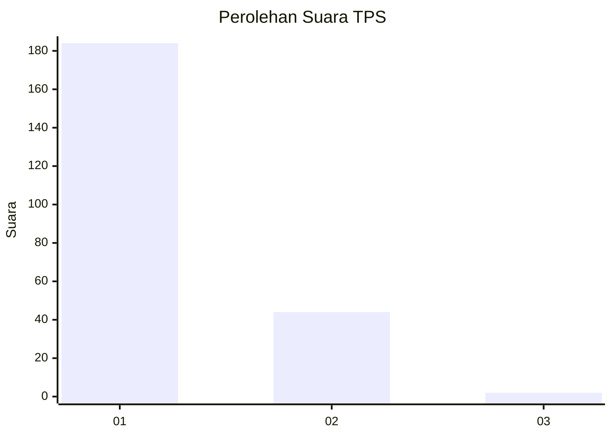
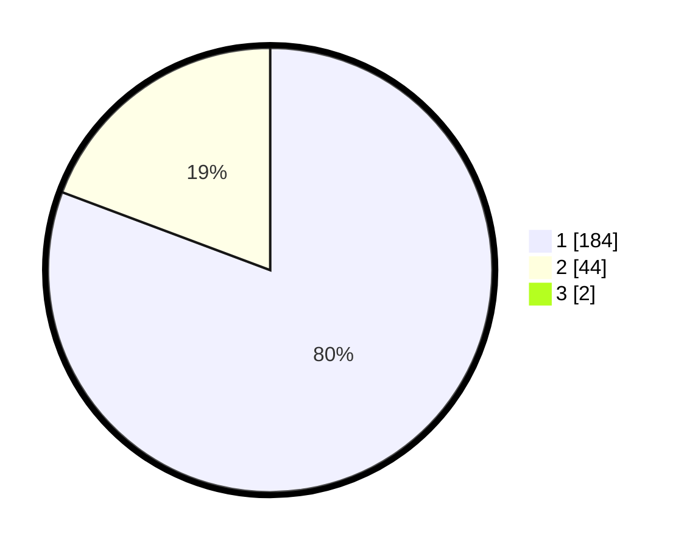

# Hasil

## Grafik

## Tabel

| No. | Nama Paslon    | Suara | Suara (raw) | Persentase |
|:--- |:-------------- | -----:| -----------:| ----------:|
| 1   | ANIES MUHAIMIN | 184   | [184][p-1]  | 80,00      |
| 2   | PRABOWO GIBRAN | 44    | [44][p-2]   | 19,13      |
| 3   | GANJAR MAHFUD  | 2     | [2][p-3]    | 0,87       |

[p-1]: https://github.com/gigit-pemilu/pemilu-2024-11-aceh/blob/main/pilpres/hitung-suara/sub/11-aceh/sub/05-aceh-barat/sub/01-johan-pahlawan/sub/2010-padang-seurahet/sub/002-tps/sub/paslon-1.txt
[p-2]: https://github.com/gigit-pemilu/pemilu-2024-11-aceh/blob/main/pilpres/hitung-suara/sub/11-aceh/sub/05-aceh-barat/sub/01-johan-pahlawan/sub/2010-padang-seurahet/sub/002-tps/sub/paslon-2.txt
[p-3]: https://github.com/gigit-pemilu/pemilu-2024-11-aceh/blob/main/pilpres/hitung-suara/sub/11-aceh/sub/05-aceh-barat/sub/01-johan-pahlawan/sub/2010-padang-seurahet/sub/002-tps/sub/paslon-3.txt

## Foto C Plano

https://sirekap-obj-formc.kpu.go.id/13f0/pemilu/ppwp/11/05/01/20/10/1105012010002-20240215-112233--6a1bc15a-7912-4192-b0bc-10f5156fe57a.jpg

https://sirekap-obj-formc.kpu.go.id/13f0/pemilu/ppwp/11/05/01/20/10/1105012010002-20240215-120105--e559b057-8085-4490-b81b-d5e360c3d731.jpg

https://sirekap-obj-formc.kpu.go.id/13f0/pemilu/ppwp/11/05/01/20/10/1105012010002-20240215-120044--ca1e841e-e873-468a-a14f-7a3d482dba2f.jpg

## Metadata

| Key        | Value               |
| ---------- | ------------------- |
| Time Stamp | 2024-02-15 20:30:46 |

