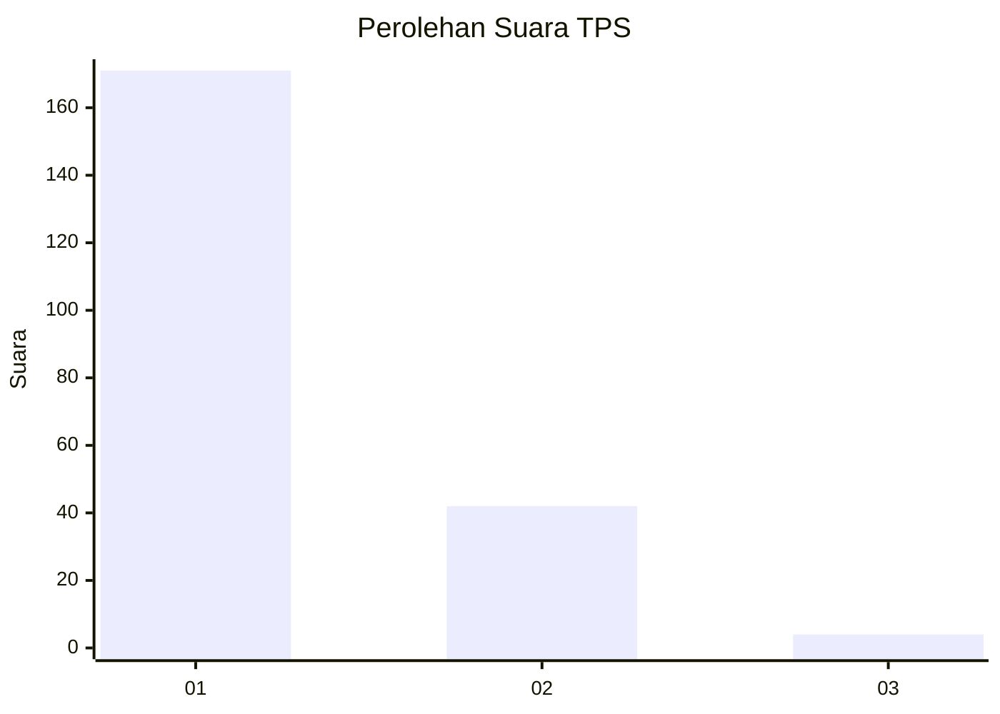
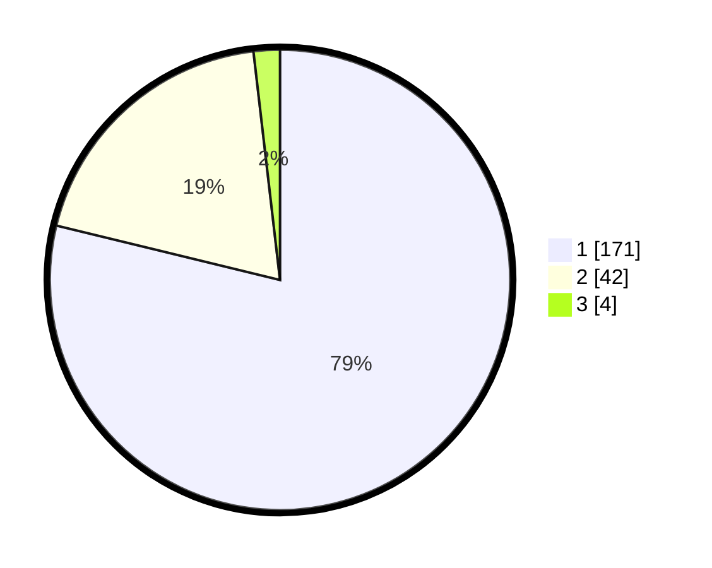

# Hasil

## Grafik

## Tabel

| No. | Nama Paslon    | Suara | Suara (raw) | Persentase |
|:--- |:-------------- | -----:| -----------:| ----------:|
| 1   | ANIES MUHAIMIN | 171   | [171][p-1]  | 78,80      |
| 2   | PRABOWO GIBRAN | 42    | [42][p-2]   | 19,35      |
| 3   | GANJAR MAHFUD  | 4     | [4][p-3]    | 1,84       |

[p-1]: https://github.com/gigit-pemilu/pemilu-2024-11-aceh/blob/main/pilpres/hitung-suara/sub/11-aceh/sub/05-aceh-barat/sub/01-johan-pahlawan/sub/2010-padang-seurahet/sub/004-tps/sub/paslon-1.txt
[p-2]: https://github.com/gigit-pemilu/pemilu-2024-11-aceh/blob/main/pilpres/hitung-suara/sub/11-aceh/sub/05-aceh-barat/sub/01-johan-pahlawan/sub/2010-padang-seurahet/sub/004-tps/sub/paslon-2.txt
[p-3]: https://github.com/gigit-pemilu/pemilu-2024-11-aceh/blob/main/pilpres/hitung-suara/sub/11-aceh/sub/05-aceh-barat/sub/01-johan-pahlawan/sub/2010-padang-seurahet/sub/004-tps/sub/paslon-3.txt

## Foto C Plano

https://sirekap-obj-formc.kpu.go.id/277d/pemilu/ppwp/11/05/01/20/10/1105012010004-20240215-095433--84971ac9-be7b-4cc3-a338-99ee91c2cd1c.jpg

https://sirekap-obj-formc.kpu.go.id/277d/pemilu/ppwp/11/05/01/20/10/1105012010004-20240215-095619--b859143e-1710-4d0f-884e-e33a24c09edc.jpg

https://sirekap-obj-formc.kpu.go.id/277d/pemilu/ppwp/11/05/01/20/10/1105012010004-20240215-095722--d4d647a8-1b30-4b53-97b4-c6a2cf78c3f6.jpg

## Metadata

| Key        | Value               |
| ---------- | ------------------- |
| Time Stamp | 2024-02-15 20:30:46 |

