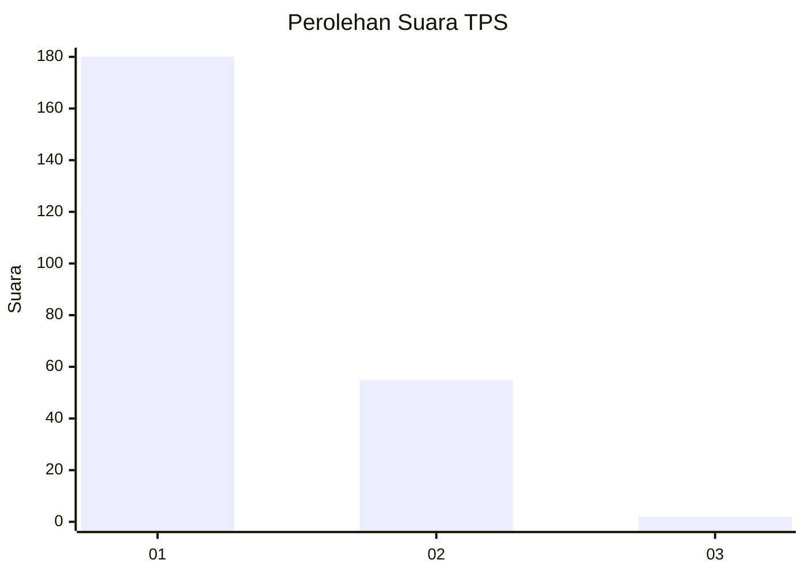
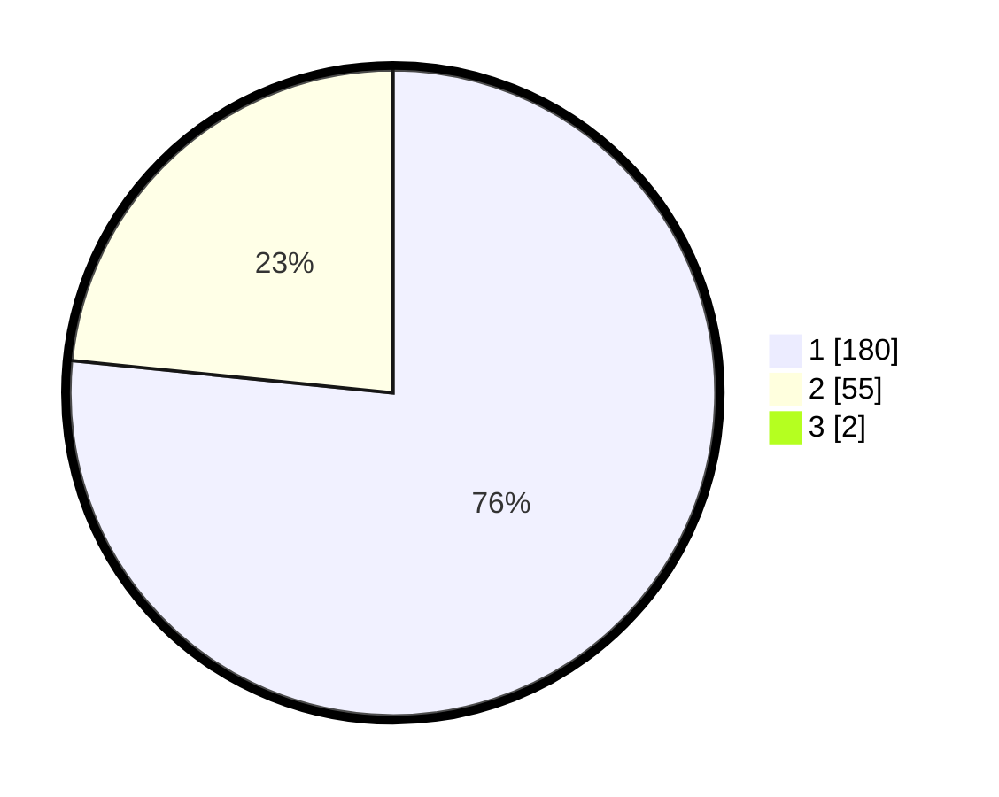

# Hasil

## Grafik

## Tabel

| No. | Nama Paslon    | Suara | Suara (raw) | Persentase |
|:--- |:-------------- | -----:| -----------:| ----------:|
| 1   | ANIES MUHAIMIN | 180   | [180][p-1]  | 75,95      |
| 2   | PRABOWO GIBRAN | 55    | [55][p-2]   | 23,21      |
| 3   | GANJAR MAHFUD  | 2     | [2][p-3]    | 0,84       |

[p-1]: https://github.com/gigit-pemilu/pemilu-2024-11-aceh/blob/main/pilpres/hitung-suara/sub/11-aceh/sub/05-aceh-barat/sub/01-johan-pahlawan/sub/2010-padang-seurahet/sub/006-tps/sub/paslon-1.txt
[p-2]: https://github.com/gigit-pemilu/pemilu-2024-11-aceh/blob/main/pilpres/hitung-suara/sub/11-aceh/sub/05-aceh-barat/sub/01-johan-pahlawan/sub/2010-padang-seurahet/sub/006-tps/sub/paslon-2.txt
[p-3]: https://github.com/gigit-pemilu/pemilu-2024-11-aceh/blob/main/pilpres/hitung-suara/sub/11-aceh/sub/05-aceh-barat/sub/01-johan-pahlawan/sub/2010-padang-seurahet/sub/006-tps/sub/paslon-3.txt

## Foto C Plano

https://sirekap-obj-formc.kpu.go.id/90d2/pemilu/ppwp/11/05/01/20/10/1105012010006-20240215-021449--fc2201ed-e04e-4f4f-a0ee-13649b735d2d.jpg

https://sirekap-obj-formc.kpu.go.id/90d2/pemilu/ppwp/11/05/01/20/10/1105012010006-20240215-021720--946d46d2-48ff-41b5-b5d4-aa94e46c7d9c.jpg

https://sirekap-obj-formc.kpu.go.id/90d2/pemilu/ppwp/11/05/01/20/10/1105012010006-20240215-022734--0883efd6-1681-4bd1-8920-712b691d50a5.jpg

## Metadata

| Key        | Value               |
| ---------- | ------------------- |
| Time Stamp | 2024-02-15 20:30:46 |

