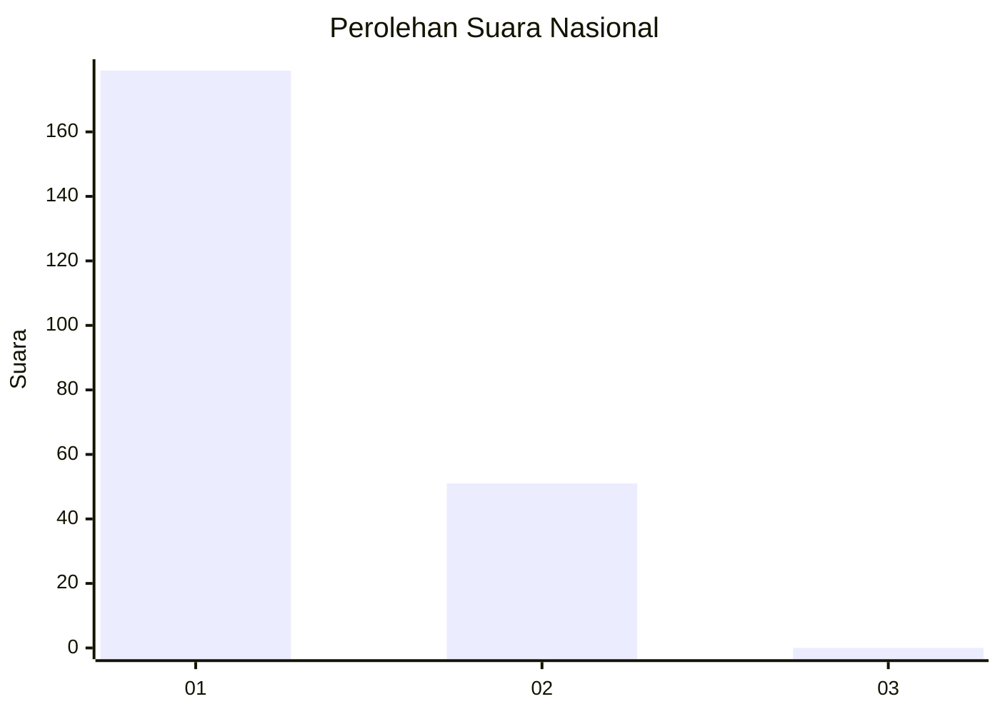
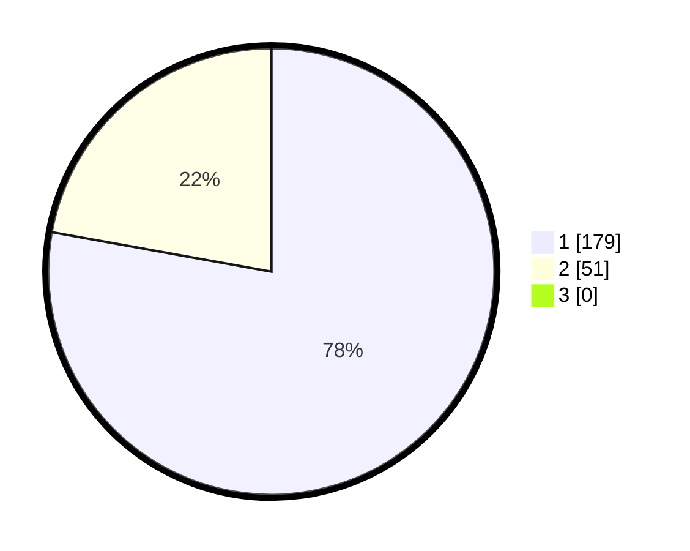

# Hasil

## Grafik

## Tabel

| No. | Nama Paslon    | Suara | Suara (raw) | Persentase |
|:--- |:-------------- | -----:| -----------:| ----------:|
| 1   | ANIES MUHAIMIN | 179   | [179][p-1]  | 77,83      |
| 2   | PRABOWO GIBRAN | 51    | [51][p-2]   | 22,17      |
| 3   | GANJAR MAHFUD  | 0     | [0][p-3]    | 0,00       |

[p-1]: https://github.com/gigit-pemilu/pemilu-2024/blob/main/pilpres/hitung-suara/sub/11-aceh/sub/05-aceh-barat/sub/01-johan-pahlawan/sub/2010-padang-seurahet/sub/007-tps/sub/paslon-1.txt
[p-2]: https://github.com/gigit-pemilu/pemilu-2024/blob/main/pilpres/hitung-suara/sub/11-aceh/sub/05-aceh-barat/sub/01-johan-pahlawan/sub/2010-padang-seurahet/sub/007-tps/sub/paslon-2.txt
[p-3]: https://github.com/gigit-pemilu/pemilu-2024/blob/main/pilpres/hitung-suara/sub/11-aceh/sub/05-aceh-barat/sub/01-johan-pahlawan/sub/2010-padang-seurahet/sub/007-tps/sub/paslon-3.txt

## Foto C Plano

https://sirekap-obj-formc.kpu.go.id/4266/pemilu/ppwp/11/05/01/20/10/1105012010007-20240214-212329--eb48808f-02a0-4928-b39e-450846967707.jpg

https://sirekap-obj-formc.kpu.go.id/4266/pemilu/ppwp/11/05/01/20/10/1105012010007-20240214-212349--c0991b47-ac46-4546-8c02-7510f2a43eae.jpg

https://sirekap-obj-formc.kpu.go.id/4266/pemilu/ppwp/11/05/01/20/10/1105012010007-20240214-212406--002c0a58-20b5-4619-9c9d-830f837b2d71.jpg

## Metadata

| Key        | Value               |
| ---------- | ------------------- |
| Time Stamp | 2024-02-15 20:30:46 |

