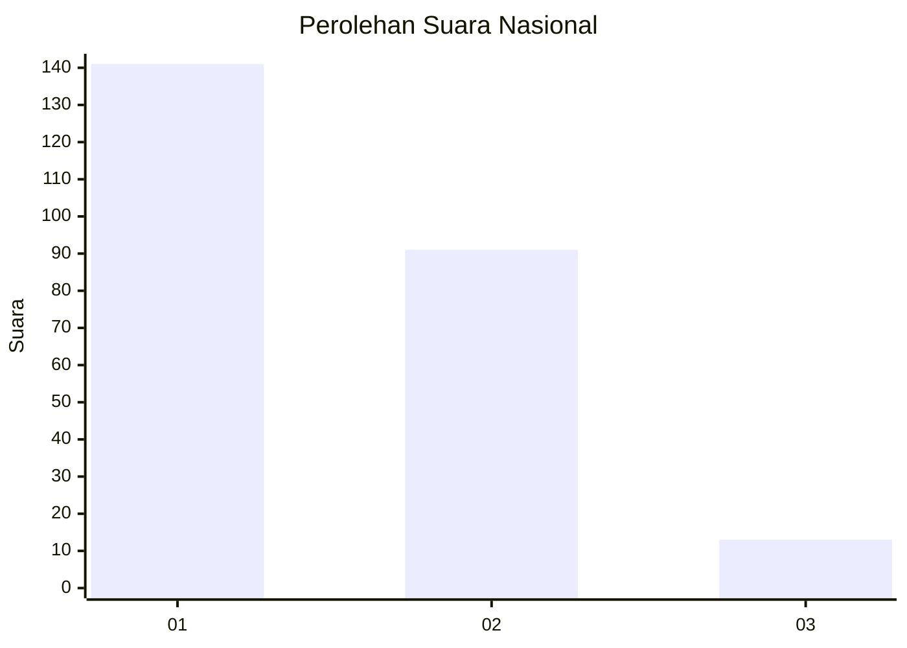
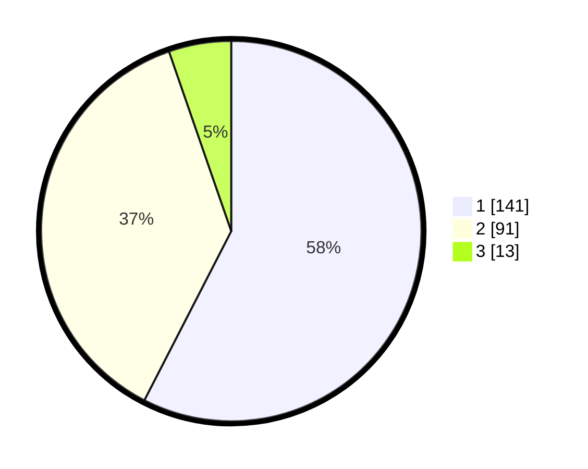

# Hasil

## Grafik

## Tabel

| No. | Nama Paslon    | Suara | Suara (raw) | Persentase |
|:--- |:-------------- | -----:| -----------:| ----------:|
| 1   | ANIES MUHAIMIN | 141   | [141][p-1]  | 57,55      |
| 2   | PRABOWO GIBRAN | 91    | [91][p-2]   | 37,14      |
| 3   | GANJAR MAHFUD  | 13    | [13][p-3]   | 5,31       |

[p-1]: https://github.com/gigit-pemilu/pemilu-2024/blob/main/pilpres/hitung-suara/sub/11-aceh/sub/05-aceh-barat/sub/01-johan-pahlawan/sub/2011-panggong/sub/003-tps/sub/paslon-1.txt
[p-2]: https://github.com/gigit-pemilu/pemilu-2024/blob/main/pilpres/hitung-suara/sub/11-aceh/sub/05-aceh-barat/sub/01-johan-pahlawan/sub/2011-panggong/sub/003-tps/sub/paslon-2.txt
[p-3]: https://github.com/gigit-pemilu/pemilu-2024/blob/main/pilpres/hitung-suara/sub/11-aceh/sub/05-aceh-barat/sub/01-johan-pahlawan/sub/2011-panggong/sub/003-tps/sub/paslon-3.txt

## Foto C Plano

https://sirekap-obj-formc.kpu.go.id/7247/pemilu/ppwp/11/05/01/20/11/1105012011003-20240215-104657--cdfa805f-304d-4353-8512-a026ca6ca7f5.jpg

https://sirekap-obj-formc.kpu.go.id/7247/pemilu/ppwp/11/05/01/20/11/1105012011003-20240214-185414--2ef8d15b-8ad7-40a3-9f9f-4bf289ed306f.jpg

https://sirekap-obj-formc.kpu.go.id/7247/pemilu/ppwp/11/05/01/20/11/1105012011003-20240214-185430--c25aaaa1-37ac-456f-a2ee-cfa454029c2f.jpg

## Metadata

| Key        | Value               |
| ---------- | ------------------- |
| Time Stamp | 2024-02-15 12:00:28 |

