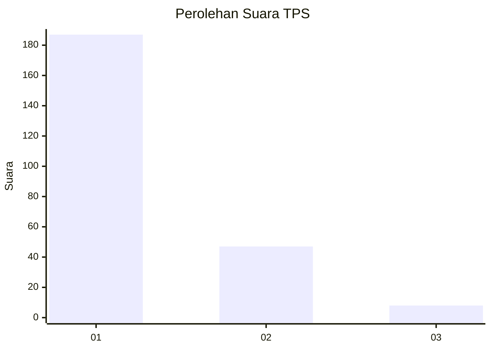
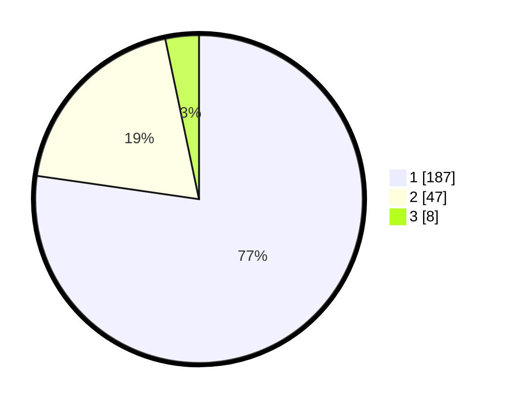

# Hasil

## Grafik

## Tabel

| No. | Nama Paslon    | Suara | Suara (raw) | Persentase |
|:--- |:-------------- | -----:| -----------:| ----------:|
| 1   | ANIES MUHAIMIN | 187   | [187][p-1]  | 77,27      |
| 2   | PRABOWO GIBRAN | 47    | [47][p-2]   | 19,42      |
| 3   | GANJAR MAHFUD  | 8     | [8][p-3]    | 3,31       |

[p-1]: https://github.com/gigit-pemilu/pemilu-2024-11-aceh/blob/main/pilpres/hitung-suara/sub/11-aceh/sub/05-aceh-barat/sub/01-johan-pahlawan/sub/2012-seuneubok/sub/011-tps/sub/paslon-1.txt
[p-2]: https://github.com/gigit-pemilu/pemilu-2024-11-aceh/blob/main/pilpres/hitung-suara/sub/11-aceh/sub/05-aceh-barat/sub/01-johan-pahlawan/sub/2012-seuneubok/sub/011-tps/sub/paslon-2.txt
[p-3]: https://github.com/gigit-pemilu/pemilu-2024-11-aceh/blob/main/pilpres/hitung-suara/sub/11-aceh/sub/05-aceh-barat/sub/01-johan-pahlawan/sub/2012-seuneubok/sub/011-tps/sub/paslon-3.txt

## Foto C Plano

https://sirekap-obj-formc.kpu.go.id/1d38/pemilu/ppwp/11/05/01/20/12/1105012012011-20240214-223459--04b97d88-68fa-4bb4-9fb6-94cf81465c9c.jpg

https://sirekap-obj-formc.kpu.go.id/1d38/pemilu/ppwp/11/05/01/20/12/1105012012011-20240214-205856--f00d0a66-37e8-4669-bc8e-da81763c09e3.jpg

https://sirekap-obj-formc.kpu.go.id/1d38/pemilu/ppwp/11/05/01/20/12/1105012012011-20240214-205952--32266864-7d53-4118-933c-f4ccaa427c10.jpg

## Metadata

| Key        | Value               |
| ---------- | ------------------- |
| Time Stamp | 2024-02-15 09:00:24 |

