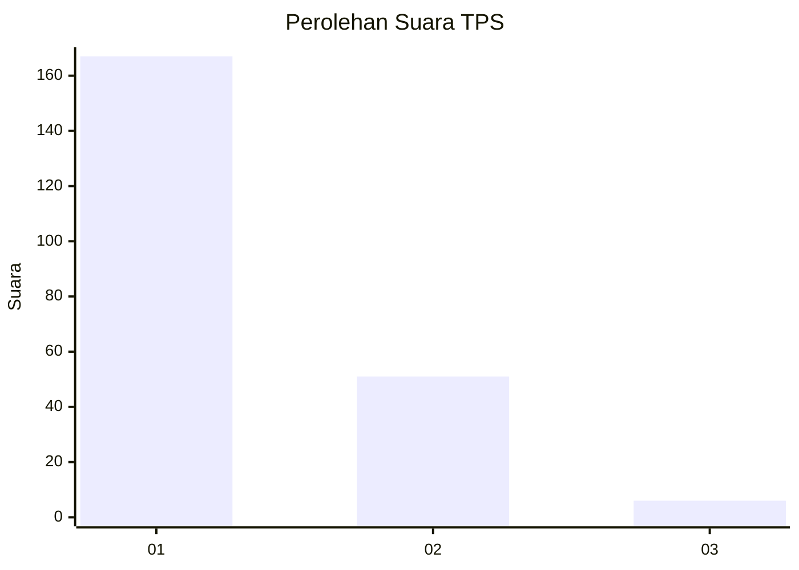
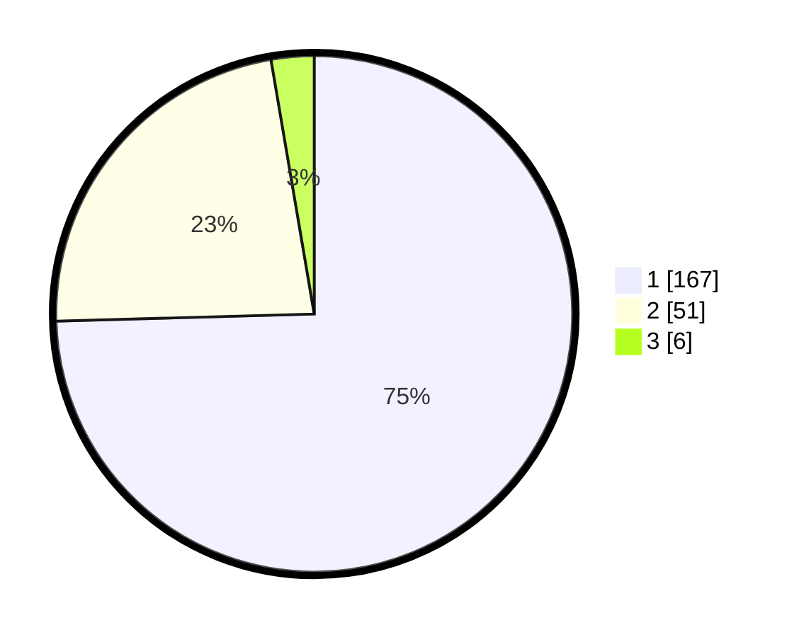

# Hasil

## Grafik

## Tabel

| No. | Nama Paslon    | Suara | Suara (raw) | Persentase |
|:--- |:-------------- | -----:| -----------:| ----------:|
| 1   | ANIES MUHAIMIN | 167   | [167][p-1]  | 74,55      |
| 2   | PRABOWO GIBRAN | 51    | [51][p-2]   | 22,77      |
| 3   | GANJAR MAHFUD  | 6     | [6][p-3]    | 2,68       |

[p-1]: https://github.com/gigit-pemilu/pemilu-2024-11-aceh/blob/main/pilpres/hitung-suara/sub/11-aceh/sub/05-aceh-barat/sub/01-johan-pahlawan/sub/2014-gampa/sub/005-tps/sub/paslon-1.txt
[p-2]: https://github.com/gigit-pemilu/pemilu-2024-11-aceh/blob/main/pilpres/hitung-suara/sub/11-aceh/sub/05-aceh-barat/sub/01-johan-pahlawan/sub/2014-gampa/sub/005-tps/sub/paslon-2.txt
[p-3]: https://github.com/gigit-pemilu/pemilu-2024-11-aceh/blob/main/pilpres/hitung-suara/sub/11-aceh/sub/05-aceh-barat/sub/01-johan-pahlawan/sub/2014-gampa/sub/005-tps/sub/paslon-3.txt

## Foto C Plano

https://sirekap-obj-formc.kpu.go.id/19b7/pemilu/ppwp/11/05/01/20/14/1105012014005-20240215-091828--1acbd955-6a6b-4c55-83ae-73fd5a7668e1.jpg

https://sirekap-obj-formc.kpu.go.id/19b7/pemilu/ppwp/11/05/01/20/14/1105012014005-20240215-092323--713a8fee-bad9-41a3-8c4e-1f89b0de414e.jpg

https://sirekap-obj-formc.kpu.go.id/19b7/pemilu/ppwp/11/05/01/20/14/1105012014005-20240215-092615--dde0df54-9e92-46de-b2df-ce40d0a63430.jpg

## Metadata

| Key        | Value               |
| ---------- | ------------------- |
| Time Stamp | 2024-02-15 20:00:44 |

