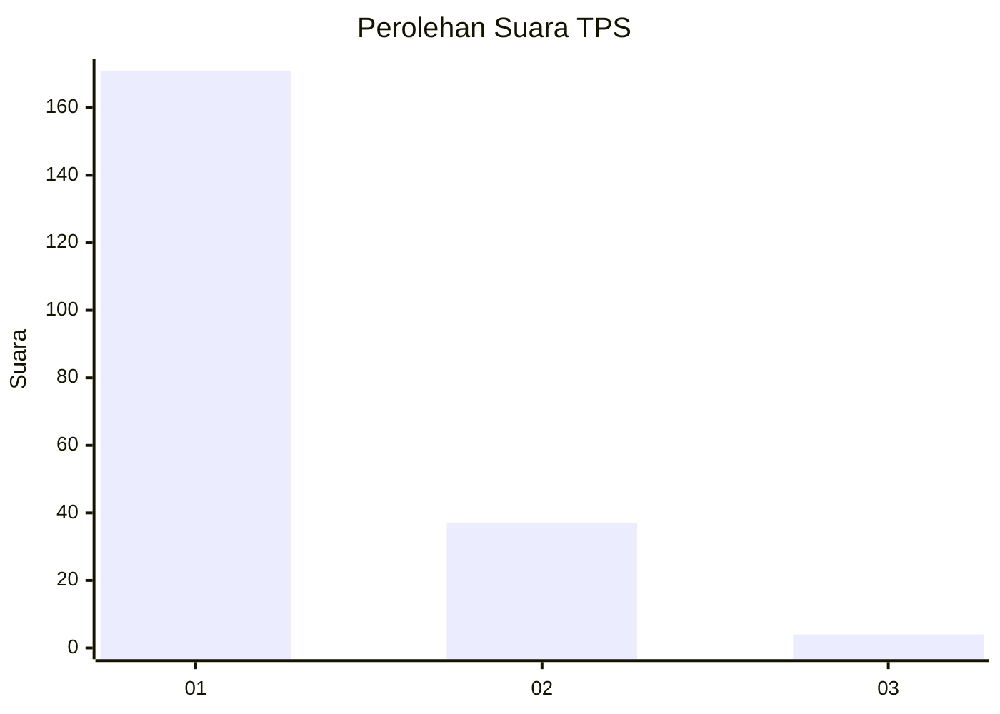
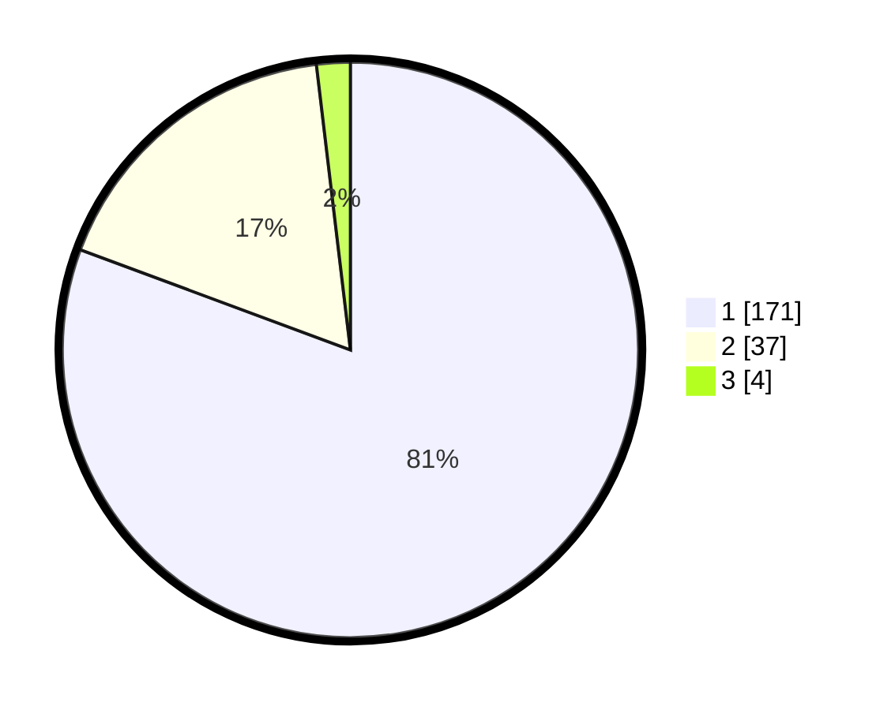

# Hasil

## Grafik

## Tabel

| No. | Nama Paslon    | Suara | Suara (raw) | Persentase |
|:--- |:-------------- | -----:| -----------:| ----------:|
| 1   | ANIES MUHAIMIN | 171   | [171][p-1]  | 80,66      |
| 2   | PRABOWO GIBRAN | 37    | [37][p-2]   | 17,45      |
| 3   | GANJAR MAHFUD  | 4     | [4][p-3]    | 1,89       |

[p-1]: https://github.com/gigit-pemilu/pemilu-2024-11-aceh/blob/main/pilpres/hitung-suara/sub/11-aceh/sub/05-aceh-barat/sub/01-johan-pahlawan/sub/2014-gampa/sub/007-tps/sub/paslon-1.txt
[p-2]: https://github.com/gigit-pemilu/pemilu-2024-11-aceh/blob/main/pilpres/hitung-suara/sub/11-aceh/sub/05-aceh-barat/sub/01-johan-pahlawan/sub/2014-gampa/sub/007-tps/sub/paslon-2.txt
[p-3]: https://github.com/gigit-pemilu/pemilu-2024-11-aceh/blob/main/pilpres/hitung-suara/sub/11-aceh/sub/05-aceh-barat/sub/01-johan-pahlawan/sub/2014-gampa/sub/007-tps/sub/paslon-3.txt

## Foto C Plano

https://sirekap-obj-formc.kpu.go.id/ea97/pemilu/ppwp/11/05/01/20/14/1105012014007-20240215-041824--702922c9-8b93-4724-8236-d34bee1d317e.jpg

https://sirekap-obj-formc.kpu.go.id/ea97/pemilu/ppwp/11/05/01/20/14/1105012014007-20240219-082910--d914a2b5-1d63-4243-b56a-923332cbf3a6.jpg

https://sirekap-obj-formc.kpu.go.id/ea97/pemilu/ppwp/11/05/01/20/14/1105012014007-20240214-195735--1e9655fe-e49f-4388-9272-426f77dd4032.jpg

## Metadata

| Key        | Value               |
| ---------- | ------------------- |
| Time Stamp | 2024-02-24 22:31:28 |

