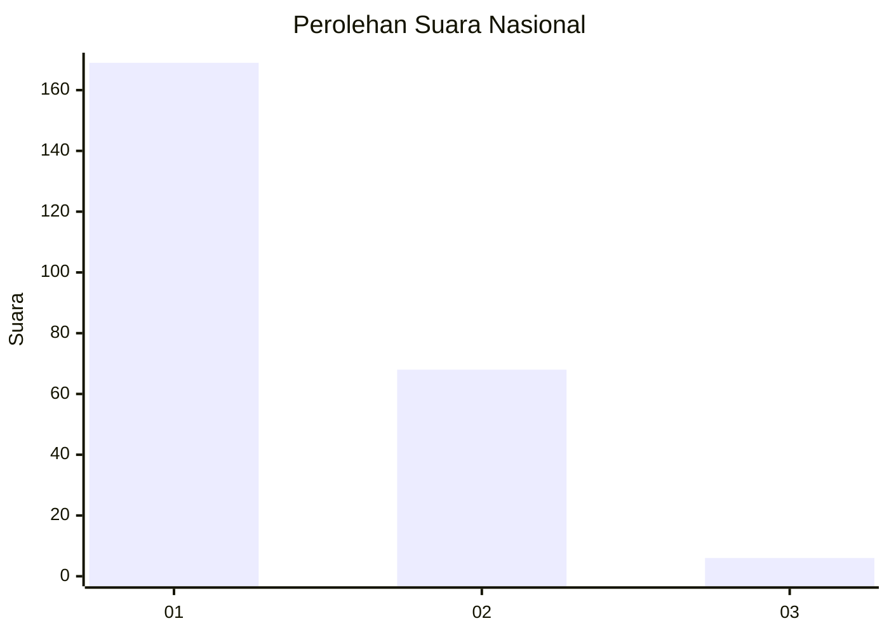
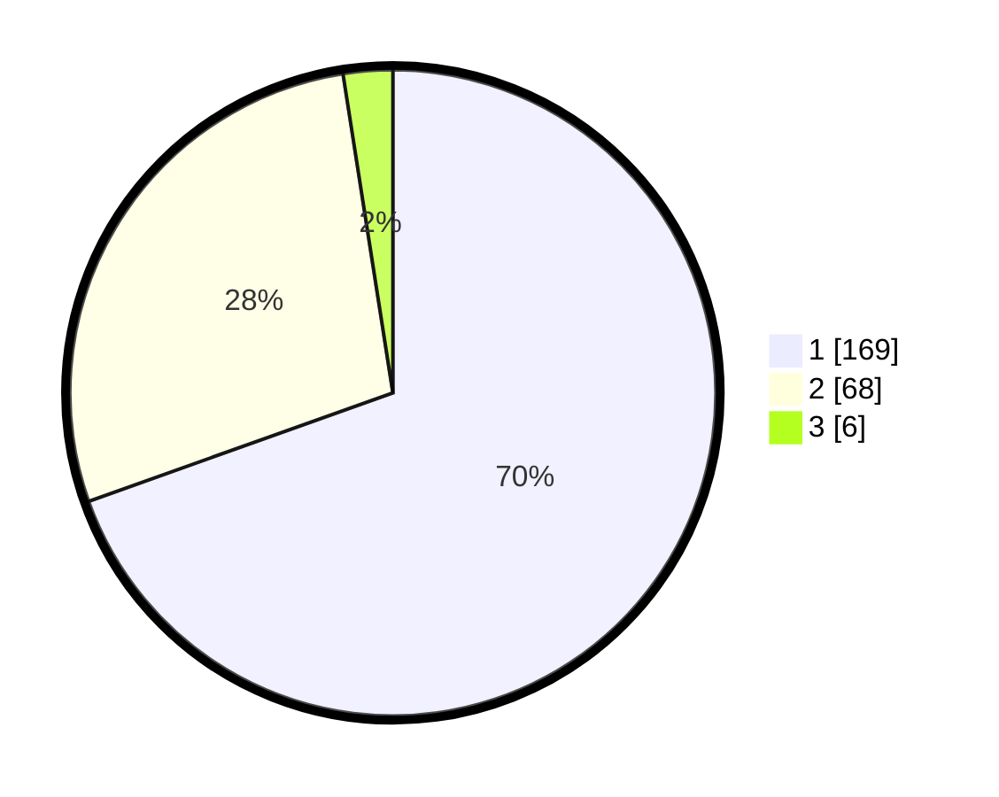

# Hasil

## Grafik

## Tabel

| No. | Nama Paslon    | Suara | Suara (raw) | Persentase |
|:--- |:-------------- | -----:| -----------:| ----------:|
| 1   | ANIES MUHAIMIN | 169   | [169][p-1]  | 69,55      |
| 2   | PRABOWO GIBRAN | 68    | [68][p-2]   | 27,98      |
| 3   | GANJAR MAHFUD  | 6     | [6][p-3]    | 2,47       |

[p-1]: https://github.com/gigit-pemilu/pemilu-2024/blob/main/pilpres/hitung-suara/sub/11-aceh/sub/05-aceh-barat/sub/01-johan-pahlawan/sub/2015-lapang/sub/001-tps/sub/paslon-1.txt
[p-2]: https://github.com/gigit-pemilu/pemilu-2024/blob/main/pilpres/hitung-suara/sub/11-aceh/sub/05-aceh-barat/sub/01-johan-pahlawan/sub/2015-lapang/sub/001-tps/sub/paslon-2.txt
[p-3]: https://github.com/gigit-pemilu/pemilu-2024/blob/main/pilpres/hitung-suara/sub/11-aceh/sub/05-aceh-barat/sub/01-johan-pahlawan/sub/2015-lapang/sub/001-tps/sub/paslon-3.txt

## Foto C Plano

https://sirekap-obj-formc.kpu.go.id/a8d3/pemilu/ppwp/11/05/01/20/15/1105012015001-20240215-012231--2548c24d-51ac-42b1-b9b1-02b3d59e5894.jpg

https://sirekap-obj-formc.kpu.go.id/a8d3/pemilu/ppwp/11/05/01/20/15/1105012015001-20240215-072431--04ec692d-925f-4eeb-9690-a9ad0b8b0689.jpg

https://sirekap-obj-formc.kpu.go.id/a8d3/pemilu/ppwp/11/05/01/20/15/1105012015001-20240215-012320--c50d1ee4-309b-44f6-9bb8-211549fcaf8a.jpg

## Metadata

| Key        | Value               |
| ---------- | ------------------- |
| Time Stamp | 2024-02-16 22:01:00 |

