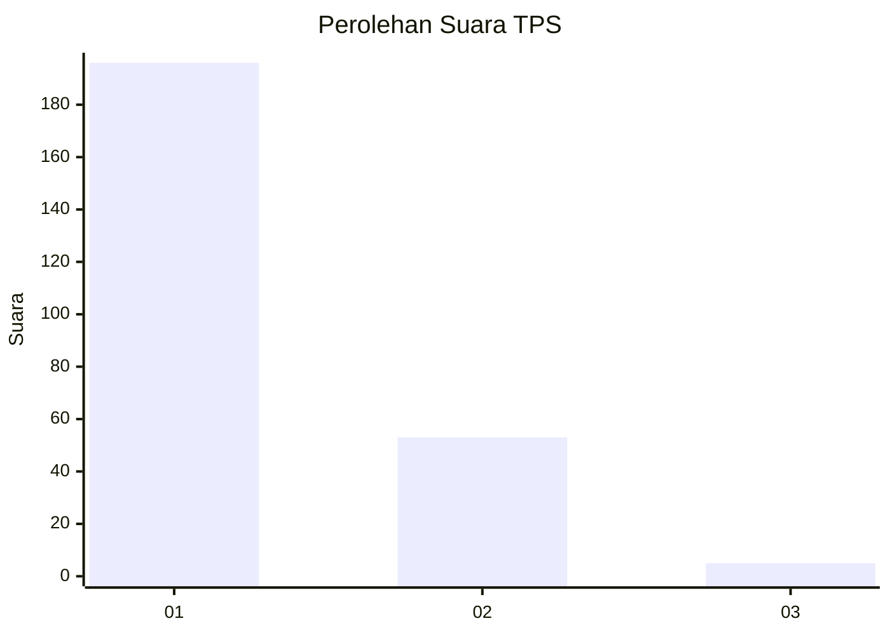
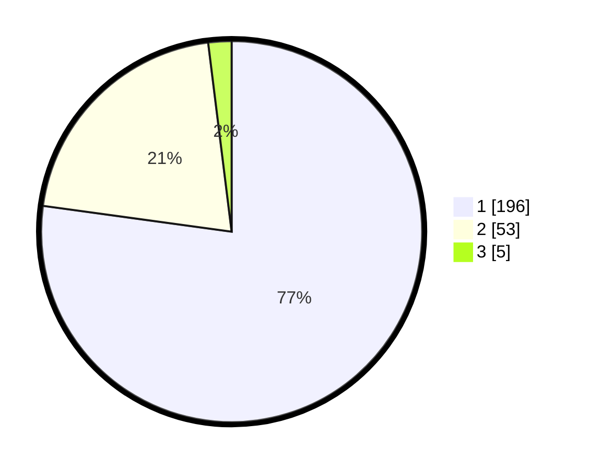

# Hasil

## Grafik

## Tabel

| No. | Nama Paslon    | Suara | Suara (raw) | Persentase |
|:--- |:-------------- | -----:| -----------:| ----------:|
| 1   | ANIES MUHAIMIN | 196   | [196][p-1]  | 77,17      |
| 2   | PRABOWO GIBRAN | 53    | [53][p-2]   | 20,87      |
| 3   | GANJAR MAHFUD  | 5     | [5][p-3]    | 1,97       |

[p-1]: https://github.com/gigit-pemilu/pemilu-2024-11-aceh/blob/main/pilpres/hitung-suara/sub/11-aceh/sub/05-aceh-barat/sub/01-johan-pahlawan/sub/2015-lapang/sub/012-tps/sub/paslon-1.txt
[p-2]: https://github.com/gigit-pemilu/pemilu-2024-11-aceh/blob/main/pilpres/hitung-suara/sub/11-aceh/sub/05-aceh-barat/sub/01-johan-pahlawan/sub/2015-lapang/sub/012-tps/sub/paslon-2.txt
[p-3]: https://github.com/gigit-pemilu/pemilu-2024-11-aceh/blob/main/pilpres/hitung-suara/sub/11-aceh/sub/05-aceh-barat/sub/01-johan-pahlawan/sub/2015-lapang/sub/012-tps/sub/paslon-3.txt

## Foto C Plano

https://sirekap-obj-formc.kpu.go.id/f461/pemilu/ppwp/11/05/01/20/15/1105012015012-20240215-085733--6ce4973d-64e4-4d64-95cc-b610860e62e4.jpg

https://sirekap-obj-formc.kpu.go.id/f461/pemilu/ppwp/11/05/01/20/15/1105012015012-20240215-085946--5a6d269e-a46f-4f01-8a02-c65c0755d62a.jpg

https://sirekap-obj-formc.kpu.go.id/f461/pemilu/ppwp/11/05/01/20/15/1105012015012-20240215-090219--b936b2b9-2727-4f6a-a3a2-7dcfef1b3dac.jpg

## Metadata

| Key        | Value               |
| ---------- | ------------------- |
| Time Stamp | 2024-02-15 21:01:18 |

