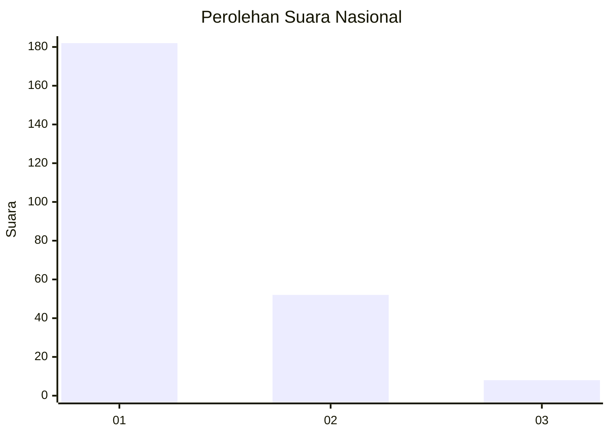
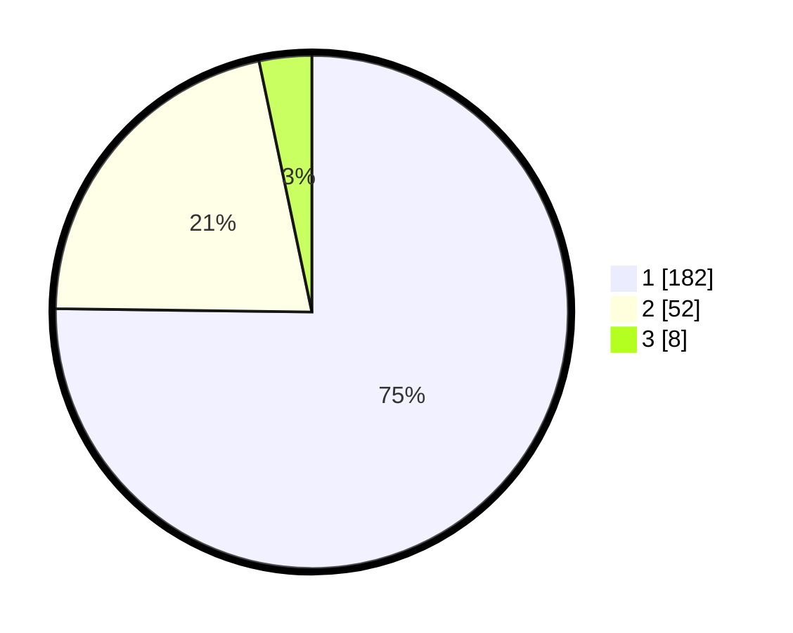

# Hasil

## Grafik

## Tabel

| No. | Nama Paslon    | Suara | Suara (raw) | Persentase |
|:--- |:-------------- | -----:| -----------:| ----------:|
| 1   | ANIES MUHAIMIN | 182   | [182][p-1]  | 75,21      |
| 2   | PRABOWO GIBRAN | 52    | [52][p-2]   | 21,49      |
| 3   | GANJAR MAHFUD  | 8     | [8][p-3]    | 3,31       |

[p-1]: https://github.com/gigit-pemilu/pemilu-2024/blob/main/pilpres/hitung-suara/sub/11-aceh/sub/05-aceh-barat/sub/01-johan-pahlawan/sub/2016-blang-beurandang/sub/001-tps/sub/paslon-1.txt
[p-2]: https://github.com/gigit-pemilu/pemilu-2024/blob/main/pilpres/hitung-suara/sub/11-aceh/sub/05-aceh-barat/sub/01-johan-pahlawan/sub/2016-blang-beurandang/sub/001-tps/sub/paslon-2.txt
[p-3]: https://github.com/gigit-pemilu/pemilu-2024/blob/main/pilpres/hitung-suara/sub/11-aceh/sub/05-aceh-barat/sub/01-johan-pahlawan/sub/2016-blang-beurandang/sub/001-tps/sub/paslon-3.txt

## Foto C Plano

https://sirekap-obj-formc.kpu.go.id/7bcc/pemilu/ppwp/11/05/01/20/16/1105012016001-20240215-152058--00217f86-47c9-430f-be8e-349abc4ed364.jpg

https://sirekap-obj-formc.kpu.go.id/7bcc/pemilu/ppwp/11/05/01/20/16/1105012016001-20240215-152206--bff956c6-ef1d-475d-92a3-0cca4334bbc6.jpg

https://sirekap-obj-formc.kpu.go.id/7bcc/pemilu/ppwp/11/05/01/20/16/1105012016001-20240215-152304--b5337ad3-d3ef-4cdb-8ff6-2cc2aec882fc.jpg

## Metadata

| Key        | Value               |
| ---------- | ------------------- |
| Time Stamp | 2024-02-16 22:01:00 |

