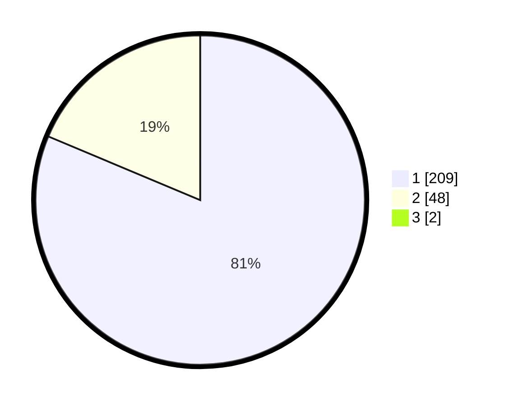

# Hasil

## Grafik

## Tabel

| No. | Nama Paslon    | Suara | Suara (raw) | Persentase |
|:--- |:-------------- | -----:| -----------:| ----------:|
| 1   | ANIES MUHAIMIN | 209   | [209][p-1]  | 80,69      |
| 2   | PRABOWO GIBRAN | 48    | [48][p-2]   | 18,53      |
| 3   | GANJAR MAHFUD  | 2     | [2][p-3]    | 0,77       |

[p-1]: https://github.com/gigit-pemilu/pemilu-2024-11-aceh/blob/main/pilpres/hitung-suara/sub/11-aceh/sub/05-aceh-barat/sub/01-johan-pahlawan/sub/2016-blang-beurandang/sub/003-tps/sub/paslon-1.txt
[p-2]: https://github.com/gigit-pemilu/pemilu-2024-11-aceh/blob/main/pilpres/hitung-suara/sub/11-aceh/sub/05-aceh-barat/sub/01-johan-pahlawan/sub/2016-blang-beurandang/sub/003-tps/sub/paslon-2.txt
[p-3]: https://github.com/gigit-pemilu/pemilu-2024-11-aceh/blob/main/pilpres/hitung-suara/sub/11-aceh/sub/05-aceh-barat/sub/01-johan-pahlawan/sub/2016-blang-beurandang/sub/003-tps/sub/paslon-3.txt

## Foto C Plano

https://sirekap-obj-formc.kpu.go.id/6847/pemilu/ppwp/11/05/01/20/16/1105012016003-20240215-025313--ab6d9e52-051c-42f6-9dd3-a5d6a9ba7d6f.jpg

https://sirekap-obj-formc.kpu.go.id/6847/pemilu/ppwp/11/05/01/20/16/1105012016003-20240215-025453--7c95e6cc-1169-485e-93e0-99ad10cd7088.jpg

https://sirekap-obj-formc.kpu.go.id/6847/pemilu/ppwp/11/05/01/20/16/1105012016003-20240215-025645--4da6d36f-ef7c-4beb-98c8-faeac42fa16c.jpg

## Metadata

| Key        | Value               |
| ---------- | ------------------- |
| Time Stamp | 2024-02-15 21:01:18 |

