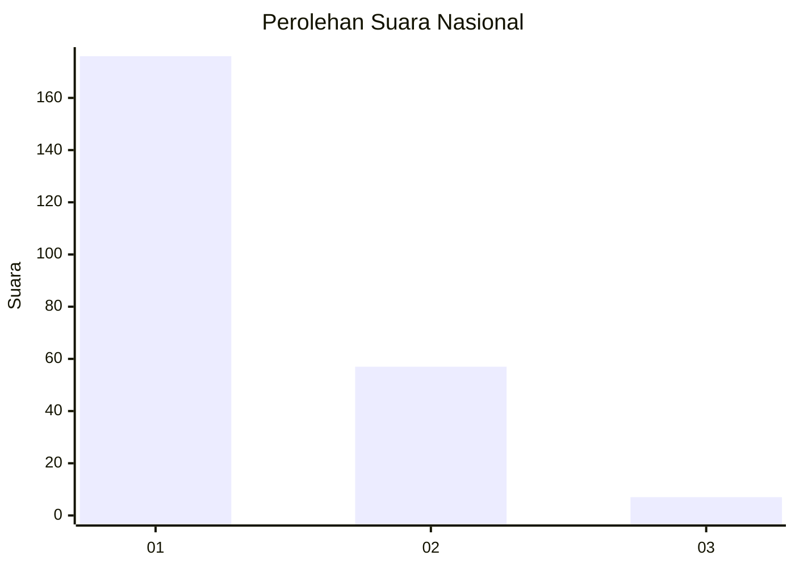
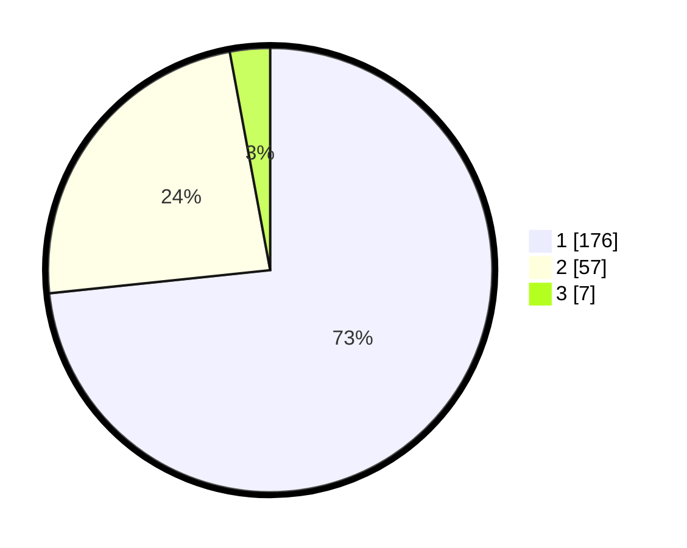

# Hasil

## Grafik

## Tabel

| No. | Nama Paslon    | Suara | Suara (raw) | Persentase |
|:--- |:-------------- | -----:| -----------:| ----------:|
| 1   | ANIES MUHAIMIN | 176   | [176][p-1]  | 73,33      |
| 2   | PRABOWO GIBRAN | 57    | [57][p-2]   | 23,75      |
| 3   | GANJAR MAHFUD  | 7     | [7][p-3]    | 2,92       |

[p-1]: https://github.com/gigit-pemilu/pemilu-2024/blob/main/pilpres/hitung-suara/sub/11-aceh/sub/05-aceh-barat/sub/01-johan-pahlawan/sub/2017-suak-ribee/sub/003-tps/sub/paslon-1.txt
[p-2]: https://github.com/gigit-pemilu/pemilu-2024/blob/main/pilpres/hitung-suara/sub/11-aceh/sub/05-aceh-barat/sub/01-johan-pahlawan/sub/2017-suak-ribee/sub/003-tps/sub/paslon-2.txt
[p-3]: https://github.com/gigit-pemilu/pemilu-2024/blob/main/pilpres/hitung-suara/sub/11-aceh/sub/05-aceh-barat/sub/01-johan-pahlawan/sub/2017-suak-ribee/sub/003-tps/sub/paslon-3.txt

## Foto C Plano

https://sirekap-obj-formc.kpu.go.id/f5d3/pemilu/ppwp/11/05/01/20/17/1105012017003-20240215-093125--d57b9095-2b5c-4d21-9883-5d29b07e006a.jpg

https://sirekap-obj-formc.kpu.go.id/f5d3/pemilu/ppwp/11/05/01/20/17/1105012017003-20240214-220136--429bbc34-faf3-4324-a0da-e804474cc212.jpg

https://sirekap-obj-formc.kpu.go.id/f5d3/pemilu/ppwp/11/05/01/20/17/1105012017003-20240214-220306--4f61a379-f243-45ee-ad81-e5e91b92c7f9.jpg

## Metadata

| Key        | Value               |
| ---------- | ------------------- |
| Time Stamp | 2024-02-15 21:01:18 |

