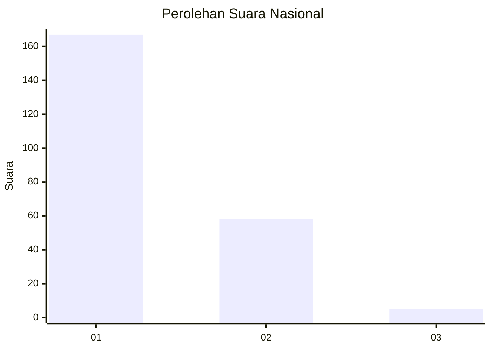
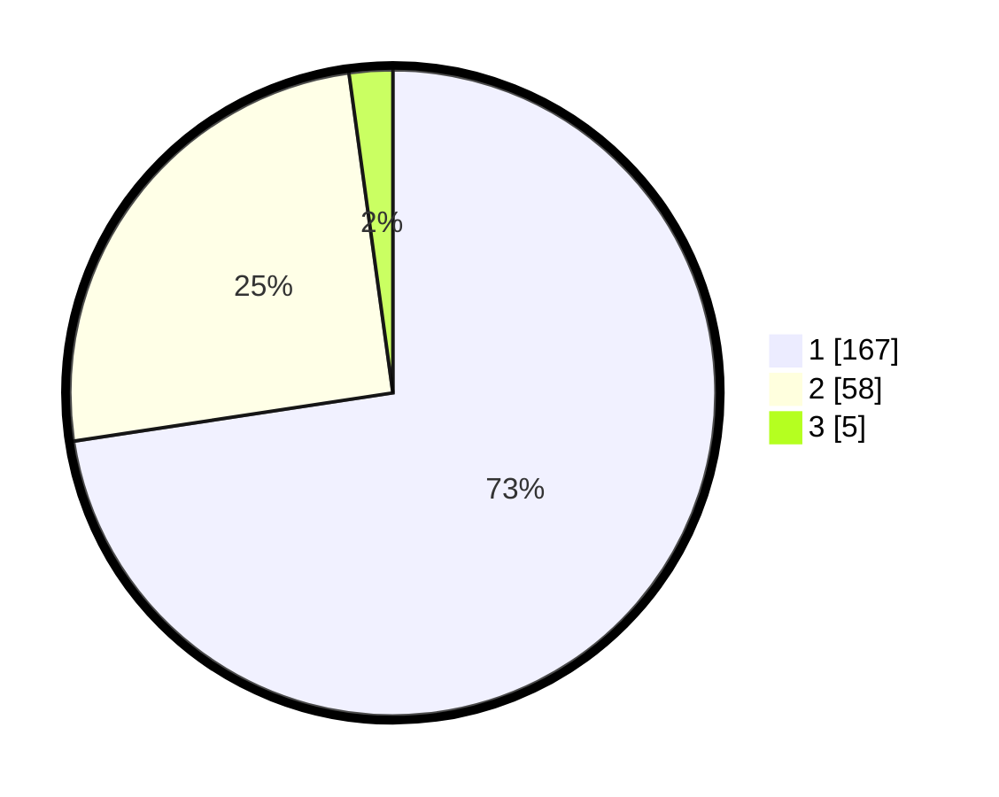

# Hasil

## Grafik

## Tabel

| No. | Nama Paslon    | Suara | Suara (raw) | Persentase |
|:--- |:-------------- | -----:| -----------:| ----------:|
| 1   | ANIES MUHAIMIN | 167   | [167][p-1]  | 72,61      |
| 2   | PRABOWO GIBRAN | 58    | [58][p-2]   | 25,22      |
| 3   | GANJAR MAHFUD  | 5     | [5][p-3]    | 2,17       |

[p-1]: https://github.com/gigit-pemilu/pemilu-2024/blob/main/pilpres/hitung-suara/sub/11-aceh/sub/05-aceh-barat/sub/01-johan-pahlawan/sub/2017-suak-ribee/sub/006-tps/sub/paslon-1.txt
[p-2]: https://github.com/gigit-pemilu/pemilu-2024/blob/main/pilpres/hitung-suara/sub/11-aceh/sub/05-aceh-barat/sub/01-johan-pahlawan/sub/2017-suak-ribee/sub/006-tps/sub/paslon-2.txt
[p-3]: https://github.com/gigit-pemilu/pemilu-2024/blob/main/pilpres/hitung-suara/sub/11-aceh/sub/05-aceh-barat/sub/01-johan-pahlawan/sub/2017-suak-ribee/sub/006-tps/sub/paslon-3.txt

## Foto C Plano

https://sirekap-obj-formc.kpu.go.id/c528/pemilu/ppwp/11/05/01/20/17/1105012017006-20240214-201635--bf0404db-4ca7-4ca4-b2a3-93be32227848.jpg

https://sirekap-obj-formc.kpu.go.id/c528/pemilu/ppwp/11/05/01/20/17/1105012017006-20240214-201332--c52de8b5-3590-4d35-8747-55bf0fe14a66.jpg

## Metadata

| Key        | Value               |
| ---------- | ------------------- |
| Time Stamp | 2024-02-24 22:31:28 |

