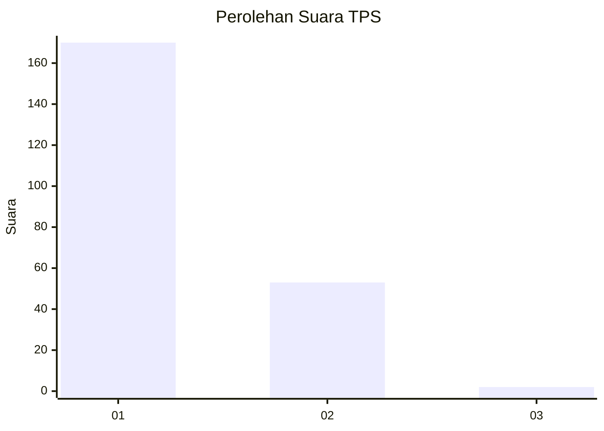
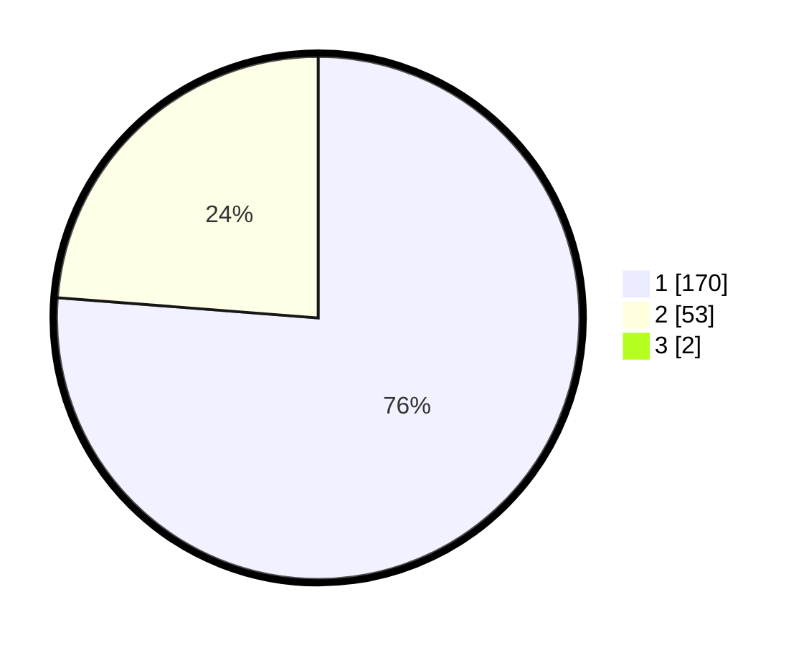

# Hasil

## Grafik

## Tabel

| No. | Nama Paslon    | Suara | Suara (raw) | Persentase |
|:--- |:-------------- | -----:| -----------:| ----------:|
| 1   | ANIES MUHAIMIN | 170   | [170][p-1]  | 75,56      |
| 2   | PRABOWO GIBRAN | 53    | [53][p-2]   | 23,56      |
| 3   | GANJAR MAHFUD  | 2     | [2][p-3]    | 0,89       |

[p-1]: https://github.com/gigit-pemilu/pemilu-2024-11-aceh/blob/main/pilpres/hitung-suara/sub/11-aceh/sub/05-aceh-barat/sub/01-johan-pahlawan/sub/2020-leuhan/sub/004-tps/sub/paslon-1.txt
[p-2]: https://github.com/gigit-pemilu/pemilu-2024-11-aceh/blob/main/pilpres/hitung-suara/sub/11-aceh/sub/05-aceh-barat/sub/01-johan-pahlawan/sub/2020-leuhan/sub/004-tps/sub/paslon-2.txt
[p-3]: https://github.com/gigit-pemilu/pemilu-2024-11-aceh/blob/main/pilpres/hitung-suara/sub/11-aceh/sub/05-aceh-barat/sub/01-johan-pahlawan/sub/2020-leuhan/sub/004-tps/sub/paslon-3.txt

## Foto C Plano

https://sirekap-obj-formc.kpu.go.id/600c/pemilu/ppwp/11/05/01/20/20/1105012020004-20240215-081901--192bf4ce-c9b6-4313-9728-7d3db16446a2.jpg

https://sirekap-obj-formc.kpu.go.id/600c/pemilu/ppwp/11/05/01/20/20/1105012020004-20240215-082211--a21ccf43-2703-4849-809a-c282bf44f6db.jpg

https://sirekap-obj-formc.kpu.go.id/600c/pemilu/ppwp/11/05/01/20/20/1105012020004-20240215-070112--2b188bb5-b4b2-44b5-8235-8c459d28929c.jpg

## Metadata

| Key        | Value               |
| ---------- | ------------------- |
| Time Stamp | 2024-02-15 21:01:18 |

