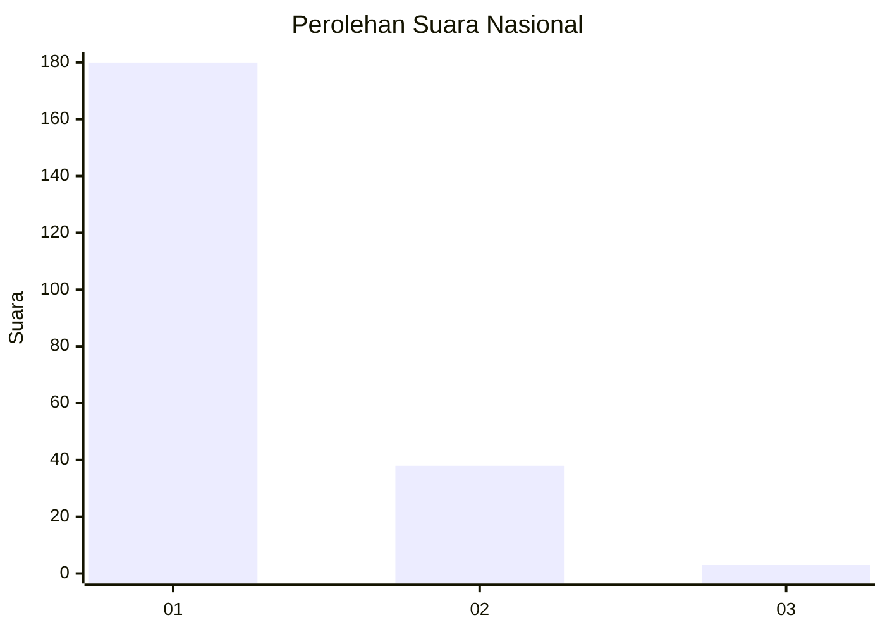
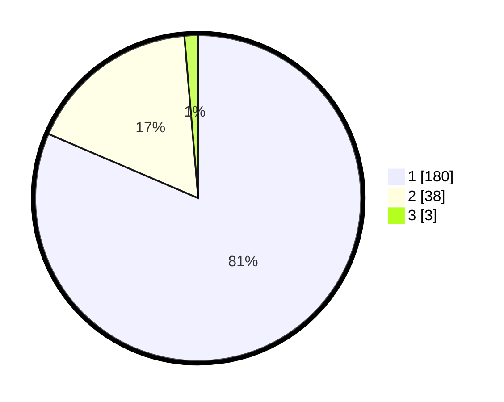

# Hasil

## Grafik

## Tabel

| No. | Nama Paslon    | Suara | Suara (raw) | Persentase |
|:--- |:-------------- | -----:| -----------:| ----------:|
| 1   | ANIES MUHAIMIN | 180   | [180][p-1]  | 81,45      |
| 2   | PRABOWO GIBRAN | 38    | [38][p-2]   | 17,19      |
| 3   | GANJAR MAHFUD  | 3     | [3][p-3]    | 1,36       |

[p-1]: https://github.com/gigit-pemilu/pemilu-2024/blob/main/pilpres/hitung-suara/sub/11-aceh/sub/05-aceh-barat/sub/01-johan-pahlawan/sub/2020-leuhan/sub/010-tps/sub/paslon-1.txt
[p-2]: https://github.com/gigit-pemilu/pemilu-2024/blob/main/pilpres/hitung-suara/sub/11-aceh/sub/05-aceh-barat/sub/01-johan-pahlawan/sub/2020-leuhan/sub/010-tps/sub/paslon-2.txt
[p-3]: https://github.com/gigit-pemilu/pemilu-2024/blob/main/pilpres/hitung-suara/sub/11-aceh/sub/05-aceh-barat/sub/01-johan-pahlawan/sub/2020-leuhan/sub/010-tps/sub/paslon-3.txt

## Foto C Plano

https://sirekap-obj-formc.kpu.go.id/1e02/pemilu/ppwp/11/05/01/20/20/1105012020010-20240214-212355--c03853e8-e2b7-491b-96cb-4ca7eff970b5.jpg

https://sirekap-obj-formc.kpu.go.id/1e02/pemilu/ppwp/11/05/01/20/20/1105012020010-20240215-084317--2dfa6765-9a30-4976-94bb-a004d892c5f9.jpg

https://sirekap-obj-formc.kpu.go.id/1e02/pemilu/ppwp/11/05/01/20/20/1105012020010-20240214-212621--40f89be8-0188-44f0-abfb-a2cbad691f70.jpg

## Metadata

| Key        | Value               |
| ---------- | ------------------- |
| Time Stamp | 2024-02-15 21:01:18 |

