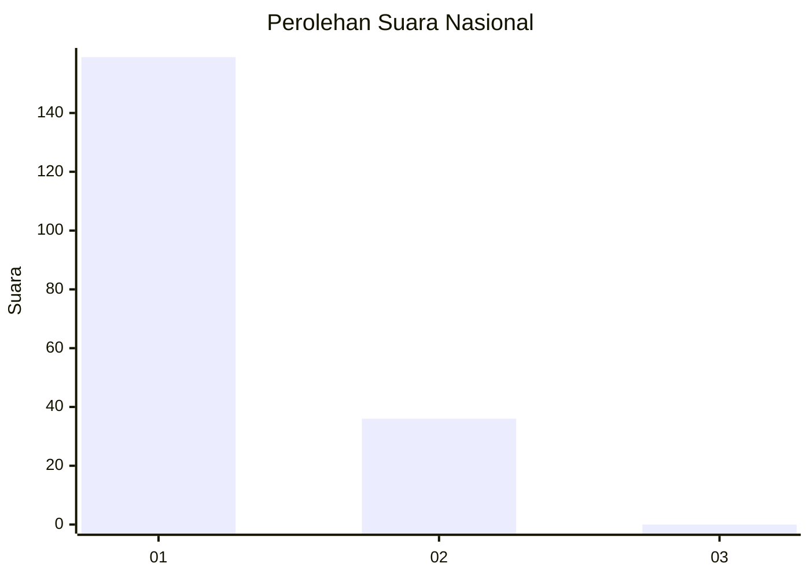
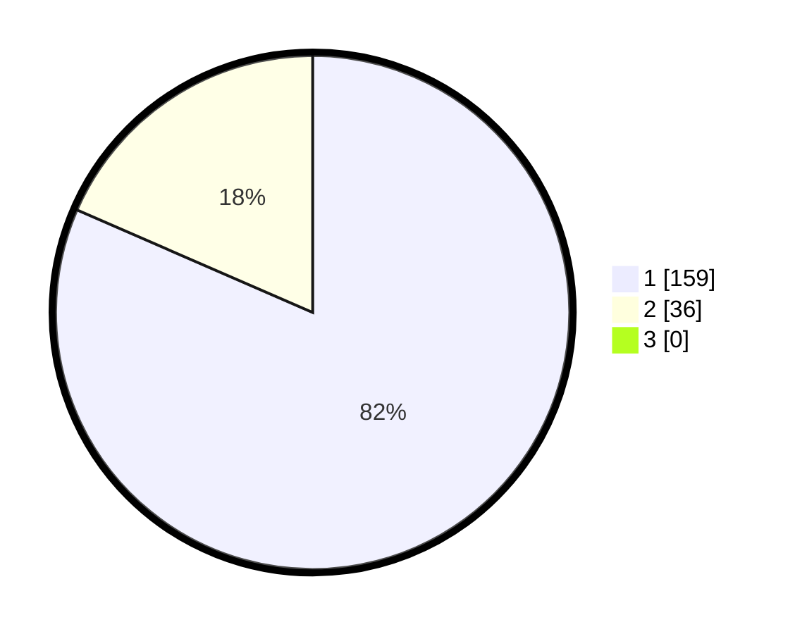

# Hasil

## Grafik

## Tabel

| No. | Nama Paslon    | Suara | Suara (raw) | Persentase |
|:--- |:-------------- | -----:| -----------:| ----------:|
| 1   | ANIES MUHAIMIN | 159   | [159][p-1]  | 81,54      |
| 2   | PRABOWO GIBRAN | 36    | [36][p-2]   | 18,46      |
| 3   | GANJAR MAHFUD  | 0     | [0][p-3]    | 0,00       |

[p-1]: https://github.com/gigit-pemilu/pemilu-2024/blob/main/pilpres/hitung-suara/sub/11-aceh/sub/05-aceh-barat/sub/01-johan-pahlawan/sub/2021-suak-sigadeng/sub/002-tps/sub/paslon-1.txt
[p-2]: https://github.com/gigit-pemilu/pemilu-2024/blob/main/pilpres/hitung-suara/sub/11-aceh/sub/05-aceh-barat/sub/01-johan-pahlawan/sub/2021-suak-sigadeng/sub/002-tps/sub/paslon-2.txt
[p-3]: https://github.com/gigit-pemilu/pemilu-2024/blob/main/pilpres/hitung-suara/sub/11-aceh/sub/05-aceh-barat/sub/01-johan-pahlawan/sub/2021-suak-sigadeng/sub/002-tps/sub/paslon-3.txt

## Foto C Plano

https://sirekap-obj-formc.kpu.go.id/dc79/pemilu/ppwp/11/05/01/20/21/1105012021002-20240215-105901--38739f20-116c-461b-9120-db5332caf6f2.jpg

https://sirekap-obj-formc.kpu.go.id/dc79/pemilu/ppwp/11/05/01/20/21/1105012021002-20240215-110016--dff92198-5a9f-4d4e-a705-a31f2e4dd7a1.jpg

https://sirekap-obj-formc.kpu.go.id/dc79/pemilu/ppwp/11/05/01/20/21/1105012021002-20240214-213845--4a6ea6eb-8306-41d6-aa7a-066765867cf5.jpg

## Metadata

| Key        | Value               |
| ---------- | ------------------- |
| Time Stamp | 2024-02-15 20:00:44 |

