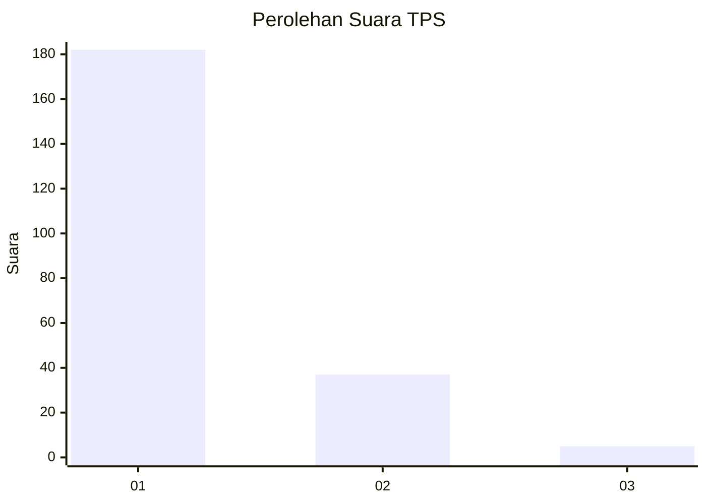
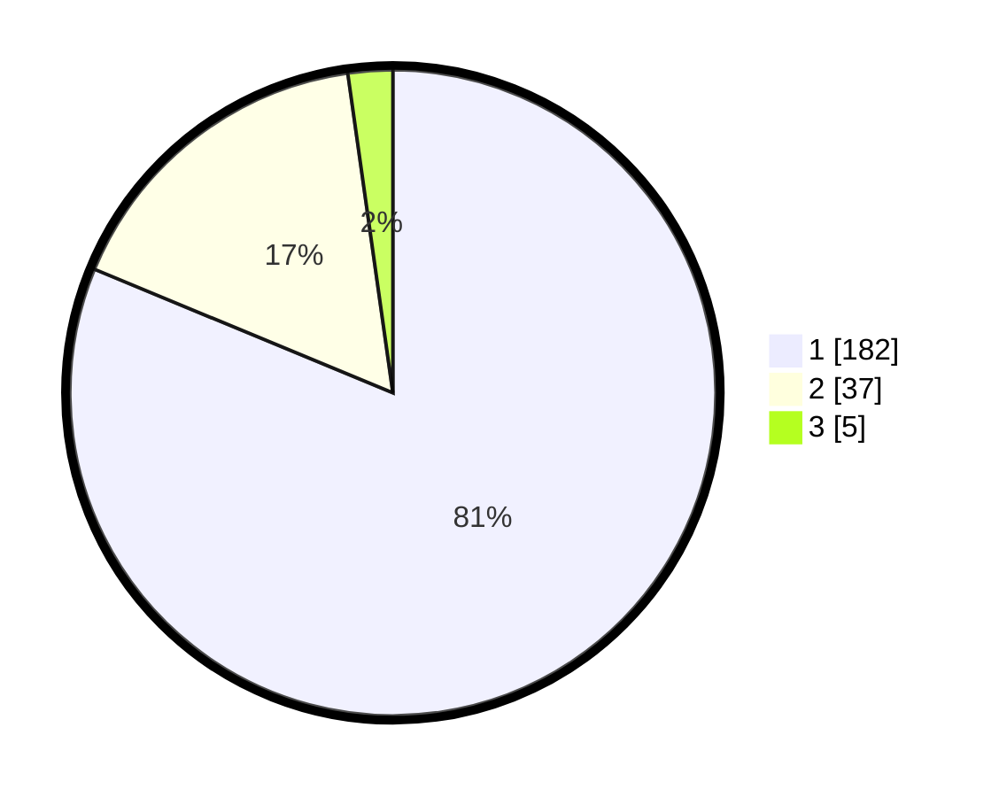

# Hasil

## Grafik

## Tabel

| No. | Nama Paslon    | Suara | Suara (raw) | Persentase |
|:--- |:-------------- | -----:| -----------:| ----------:|
| 1   | ANIES MUHAIMIN | 182   | [182][p-1]  | 81,25      |
| 2   | PRABOWO GIBRAN | 37    | [37][p-2]   | 16,52      |
| 3   | GANJAR MAHFUD  | 5     | [5][p-3]    | 2,23       |

[p-1]: https://github.com/gigit-pemilu/pemilu-2024-11-aceh/blob/main/pilpres/hitung-suara/sub/11-aceh/sub/05-aceh-barat/sub/02-kaway-xvi/sub/2001-keude-aron/sub/002-tps/sub/paslon-1.txt
[p-2]: https://github.com/gigit-pemilu/pemilu-2024-11-aceh/blob/main/pilpres/hitung-suara/sub/11-aceh/sub/05-aceh-barat/sub/02-kaway-xvi/sub/2001-keude-aron/sub/002-tps/sub/paslon-2.txt
[p-3]: https://github.com/gigit-pemilu/pemilu-2024-11-aceh/blob/main/pilpres/hitung-suara/sub/11-aceh/sub/05-aceh-barat/sub/02-kaway-xvi/sub/2001-keude-aron/sub/002-tps/sub/paslon-3.txt

## Foto C Plano

https://sirekap-obj-formc.kpu.go.id/9cd1/pemilu/ppwp/11/05/02/20/01/1105022001002-20240216-022413--42c46e8f-6940-4ef5-b1e0-782d0a3dbfcd.jpg

https://sirekap-obj-formc.kpu.go.id/9cd1/pemilu/ppwp/11/05/02/20/01/1105022001002-20240216-015409--d844c4c0-9ea3-4746-8a4b-6f1efd0fe481.jpg

https://sirekap-obj-formc.kpu.go.id/9cd1/pemilu/ppwp/11/05/02/20/01/1105022001002-20240216-015405--2b63bbf4-0011-45e6-9bf6-c8877b900999.jpg

## Metadata

| Key        | Value               |
| ---------- | ------------------- |
| Time Stamp | 2024-02-16 21:01:00 |

## DATA PEMILIH TETAP

Jumlah pemilih dalam DPT: **251**.
 * L: **123**.
 * P: **128**.

## DATA PENGGUNA HAK PILIH

Jumlah pengguna hak pilih dalam DPT: **221**.
 * L: **112**.
 * P: **109**.

Jumlah pengguna hak pilih dalam DPTb: **3**.
 * L: **1**.
 * P: **2**.

Jumlah pengguna hak pilih dalam DPK: **1**.
 * L: **0**.
 * P: **1**.

Jumlah pengguna hak pilih: **225**.
 * L: **113**.
 * P: **112**.

## JUMLAH SUARA SAH DAN TIDAK SAH

JUMLAH SELURUH SUARA SAH: **224**.

JUMLAH SUARA TIDAK SAH: **1**.

JUMLAH SELURUH SUARA SAH DAN SUARA TIDAK SAH: **225**.

