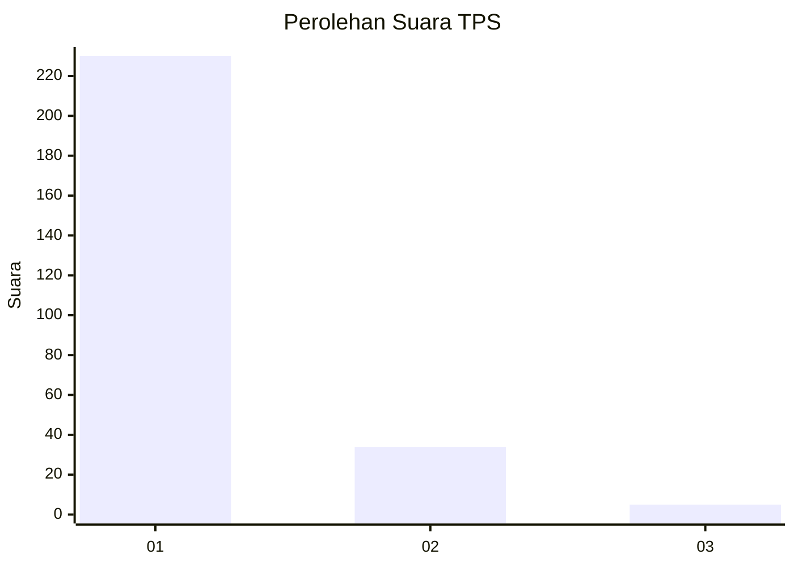
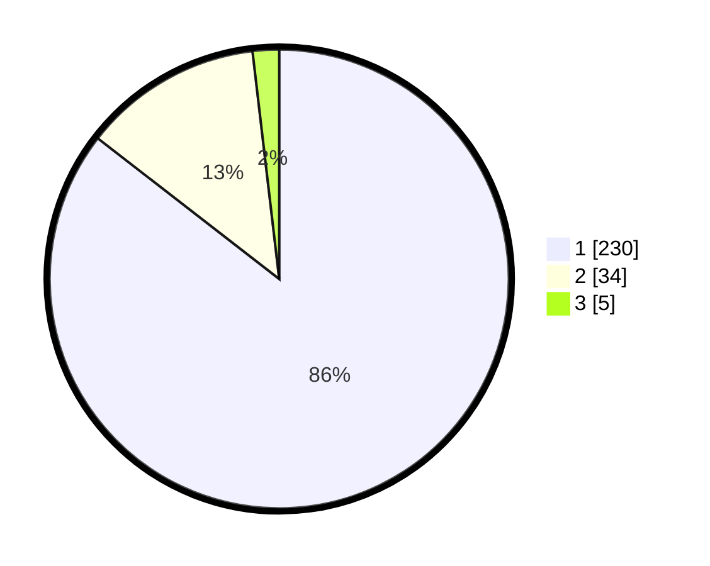

# Hasil

## Grafik

## Tabel

| No. | Nama Paslon    | Suara | Suara (raw) | Persentase |
|:--- |:-------------- | -----:| -----------:| ----------:|
| 1   | ANIES MUHAIMIN | 230   | [230][p-1]  | 85,50      |
| 2   | PRABOWO GIBRAN | 34    | [34][p-2]   | 12,64      |
| 3   | GANJAR MAHFUD  | 5     | [5][p-3]    | 1,86       |

[p-1]: https://github.com/gigit-pemilu/pemilu-2024-11-aceh/blob/main/pilpres/hitung-suara/sub/11-aceh/sub/05-aceh-barat/sub/02-kaway-xvi/sub/2002-kampong-mesjid/sub/002-tps/sub/paslon-1.txt
[p-2]: https://github.com/gigit-pemilu/pemilu-2024-11-aceh/blob/main/pilpres/hitung-suara/sub/11-aceh/sub/05-aceh-barat/sub/02-kaway-xvi/sub/2002-kampong-mesjid/sub/002-tps/sub/paslon-2.txt
[p-3]: https://github.com/gigit-pemilu/pemilu-2024-11-aceh/blob/main/pilpres/hitung-suara/sub/11-aceh/sub/05-aceh-barat/sub/02-kaway-xvi/sub/2002-kampong-mesjid/sub/002-tps/sub/paslon-3.txt

## Foto C Plano

https://sirekap-obj-formc.kpu.go.id/dff3/pemilu/ppwp/11/05/02/20/02/1105022002002-20240218-132000--66d4ef09-2f84-4849-9df5-6b1b019f81e9.jpg

https://sirekap-obj-formc.kpu.go.id/dff3/pemilu/ppwp/11/05/02/20/02/1105022002002-20240218-132002--2aa73137-10a5-4318-b3ac-2b834888fc40.jpg

https://sirekap-obj-formc.kpu.go.id/dff3/pemilu/ppwp/11/05/02/20/02/1105022002002-20240218-132001--81947e6e-e389-4399-987f-dfa4bed24009.jpg

## Metadata

| Key        | Value               |
| ---------- | ------------------- |
| Time Stamp | 2024-02-21 10:00:00 |

## DATA PEMILIH TETAP

Jumlah pemilih dalam DPT: **286**.
 * L: **153**.
 * P: **133**.

## DATA PENGGUNA HAK PILIH

Jumlah pengguna hak pilih dalam DPT: **270**.
 * L: **147**.
 * P: **123**.

Jumlah pengguna hak pilih dalam DPTb: **1**.
 * L: **0**.
 * P: **1**.

Jumlah pengguna hak pilih dalam DPK: **1**.
 * L: **0**.
 * P: **1**.

Jumlah pengguna hak pilih: **272**.
 * L: **147**.
 * P: **125**.

## JUMLAH SUARA SAH DAN TIDAK SAH

JUMLAH SELURUH SUARA SAH: **269**.

JUMLAH SUARA TIDAK SAH: **3**.

JUMLAH SELURUH SUARA SAH DAN SUARA TIDAK SAH: **272**.

