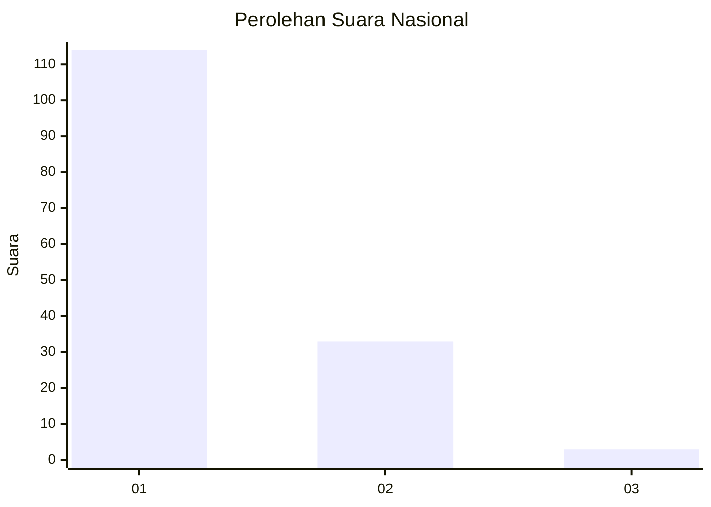
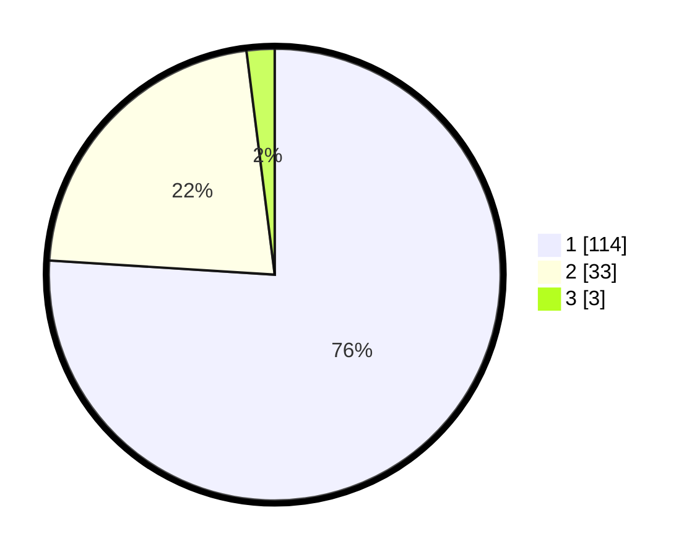

# Hasil

## Grafik

## Tabel

| No. | Nama Paslon    | Suara | Suara (raw) | Persentase |
|:--- |:-------------- | -----:| -----------:| ----------:|
| 1   | ANIES MUHAIMIN | 114   | [114][p-1]  | 76,00      |
| 2   | PRABOWO GIBRAN | 33    | [33][p-2]   | 22,00      |
| 3   | GANJAR MAHFUD  | 3     | [3][p-3]    | 2,00       |

[p-1]: https://github.com/gigit-pemilu/pemilu-2024/blob/main/pilpres/hitung-suara/sub/11-aceh/sub/05-aceh-barat/sub/02-kaway-xvi/sub/2003-padang-mancang/sub/001-tps/sub/paslon-1.txt
[p-2]: https://github.com/gigit-pemilu/pemilu-2024/blob/main/pilpres/hitung-suara/sub/11-aceh/sub/05-aceh-barat/sub/02-kaway-xvi/sub/2003-padang-mancang/sub/001-tps/sub/paslon-2.txt
[p-3]: https://github.com/gigit-pemilu/pemilu-2024/blob/main/pilpres/hitung-suara/sub/11-aceh/sub/05-aceh-barat/sub/02-kaway-xvi/sub/2003-padang-mancang/sub/001-tps/sub/paslon-3.txt

## Foto C Plano

https://sirekap-obj-formc.kpu.go.id/bdee/pemilu/ppwp/11/05/02/20/03/1105022003001-20240217-125216--17ad4d4e-3301-4da6-9e8d-d9cd205fc1e2.jpg

https://sirekap-obj-formc.kpu.go.id/bdee/pemilu/ppwp/11/05/02/20/03/1105022003001-20240217-125223--d05d9a2b-63ce-4044-b23b-ceee1924933d.jpg

https://sirekap-obj-formc.kpu.go.id/bdee/pemilu/ppwp/11/05/02/20/03/1105022003001-20240217-125228--b24c8cd1-1325-4956-b1ec-29eee3debfe9.jpg

## Metadata

| Key        | Value               |
| ---------- | ------------------- |
| Time Stamp | 2024-02-19 23:00:00 |

## DATA PEMILIH TETAP

Jumlah pemilih dalam DPT: **175**.
 * L: **89**.
 * P: **86**.

## DATA PENGGUNA HAK PILIH

Jumlah pengguna hak pilih dalam DPT: **155**.
 * L: **79**.
 * P: **76**.

Jumlah pengguna hak pilih dalam DPTb: **0**.
 * L: **0**.
 * P: **0**.

Jumlah pengguna hak pilih dalam DPK: **0**.
 * L: **0**.
 * P: **0**.

Jumlah pengguna hak pilih: **155**.
 * L: **79**.
 * P: **76**.

## JUMLAH SUARA SAH DAN TIDAK SAH

JUMLAH SELURUH SUARA SAH: **150**.

JUMLAH SUARA TIDAK SAH: **5**.

JUMLAH SELURUH SUARA SAH DAN SUARA TIDAK SAH: **155**.

