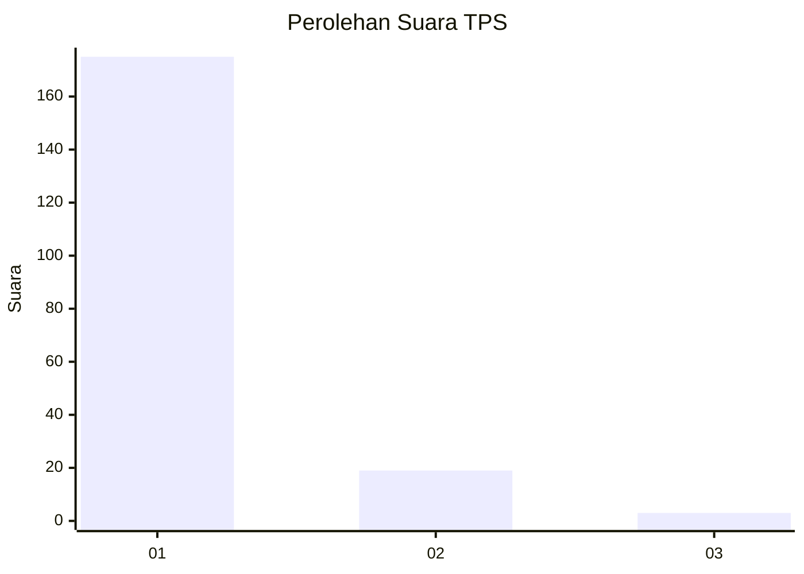
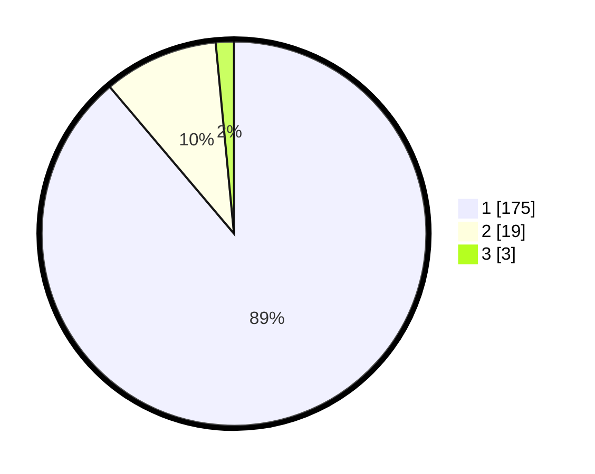

# Hasil

## Grafik

## Tabel

| No. | Nama Paslon    | Suara | Suara (raw) | Persentase |
|:--- |:-------------- | -----:| -----------:| ----------:|
| 1   | ANIES MUHAIMIN | 175   | [175][p-1]  | 88,83      |
| 2   | PRABOWO GIBRAN | 19    | [19][p-2]   | 9,64       |
| 3   | GANJAR MAHFUD  | 3     | [3][p-3]    | 1,52       |

[p-1]: https://github.com/gigit-pemilu/pemilu-2024-11-aceh/blob/main/pilpres/hitung-suara/sub/11-aceh/sub/05-aceh-barat/sub/02-kaway-xvi/sub/2018-palimbungan/sub/001-tps/sub/paslon-1.txt
[p-2]: https://github.com/gigit-pemilu/pemilu-2024-11-aceh/blob/main/pilpres/hitung-suara/sub/11-aceh/sub/05-aceh-barat/sub/02-kaway-xvi/sub/2018-palimbungan/sub/001-tps/sub/paslon-2.txt
[p-3]: https://github.com/gigit-pemilu/pemilu-2024-11-aceh/blob/main/pilpres/hitung-suara/sub/11-aceh/sub/05-aceh-barat/sub/02-kaway-xvi/sub/2018-palimbungan/sub/001-tps/sub/paslon-3.txt

## Foto C Plano

https://sirekap-obj-formc.kpu.go.id/fa75/pemilu/ppwp/11/05/02/20/18/1105022018001-20240220-212117--34ea6ea1-2633-4fcf-bd7c-dedb091b5af4.jpg

https://sirekap-obj-formc.kpu.go.id/fa75/pemilu/ppwp/11/05/02/20/18/1105022018001-20240220-212235--cba9db61-0270-46b2-a46b-47247c70c4a0.jpg

https://sirekap-obj-formc.kpu.go.id/fa75/pemilu/ppwp/11/05/02/20/18/1105022018001-20240220-212420--63430f05-294e-4c94-b988-39d36cac1b45.jpg

## Metadata

| Key        | Value               |
| ---------- | ------------------- |
| Time Stamp | 2024-02-24 22:31:28 |

