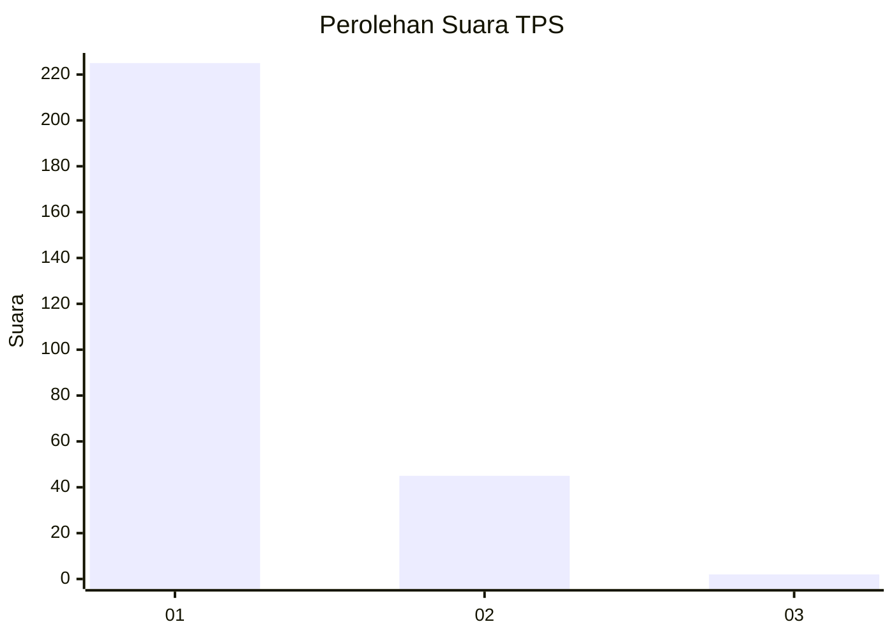
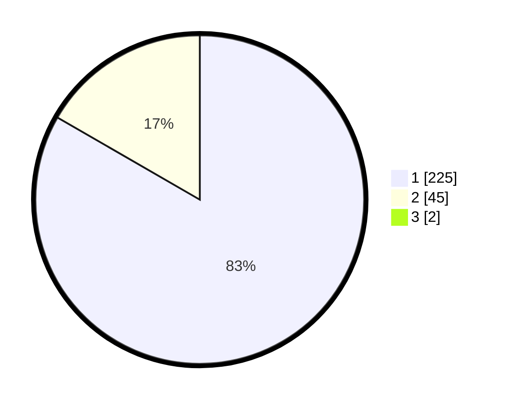

# Hasil

## Grafik

## Tabel

| No. | Nama Paslon    | Suara | Suara (raw) | Persentase |
|:--- |:-------------- | -----:| -----------:| ----------:|
| 1   | ANIES MUHAIMIN | 225   | [225][p-1]  | 82,72      |
| 2   | PRABOWO GIBRAN | 45    | [45][p-2]   | 16,54      |
| 3   | GANJAR MAHFUD  | 2     | [2][p-3]    | 0,74       |

[p-1]: https://github.com/gigit-pemilu/pemilu-2024-11-aceh/blob/main/pilpres/hitung-suara/sub/11-aceh/sub/05-aceh-barat/sub/02-kaway-xvi/sub/2023-tanjong-bungong/sub/001-tps/sub/paslon-1.txt
[p-2]: https://github.com/gigit-pemilu/pemilu-2024-11-aceh/blob/main/pilpres/hitung-suara/sub/11-aceh/sub/05-aceh-barat/sub/02-kaway-xvi/sub/2023-tanjong-bungong/sub/001-tps/sub/paslon-2.txt
[p-3]: https://github.com/gigit-pemilu/pemilu-2024-11-aceh/blob/main/pilpres/hitung-suara/sub/11-aceh/sub/05-aceh-barat/sub/02-kaway-xvi/sub/2023-tanjong-bungong/sub/001-tps/sub/paslon-3.txt

## Foto C Plano

https://sirekap-obj-formc.kpu.go.id/3841/pemilu/ppwp/11/05/02/20/23/1105022023001-20240218-180435--a6b607c8-4404-40ad-aaf2-755ccc8f15ba.jpg

https://sirekap-obj-formc.kpu.go.id/3841/pemilu/ppwp/11/05/02/20/23/1105022023001-20240214-190359--3f279ac8-8bec-45da-9c34-1bf208ed2dc9.jpg

https://sirekap-obj-formc.kpu.go.id/3841/pemilu/ppwp/11/05/02/20/23/1105022023001-20240218-181255--f8632143-3e8f-4204-9d3a-2259a5b62d63.jpg

## Metadata

| Key        | Value               |
| ---------- | ------------------- |
| Time Stamp | 2024-02-19 06:16:00 |

