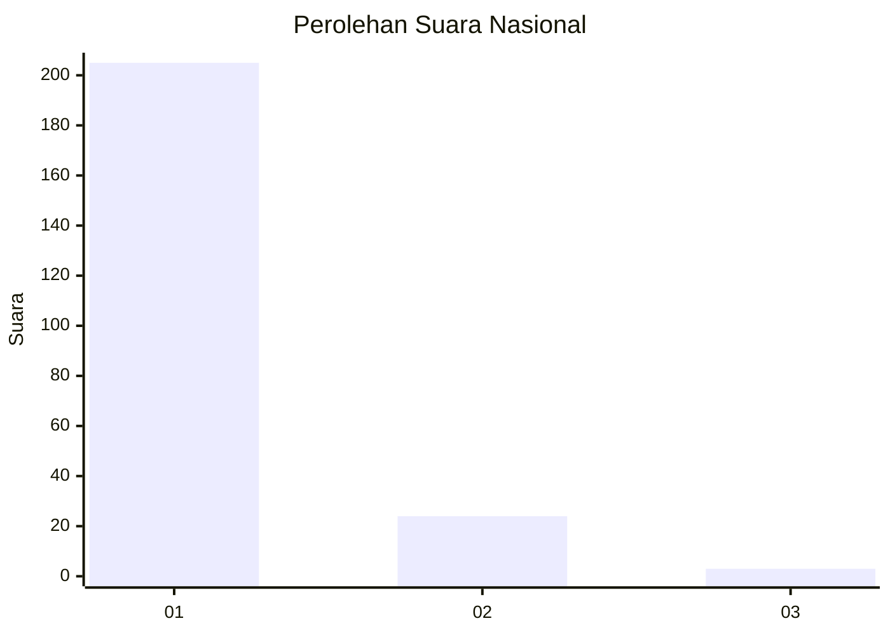
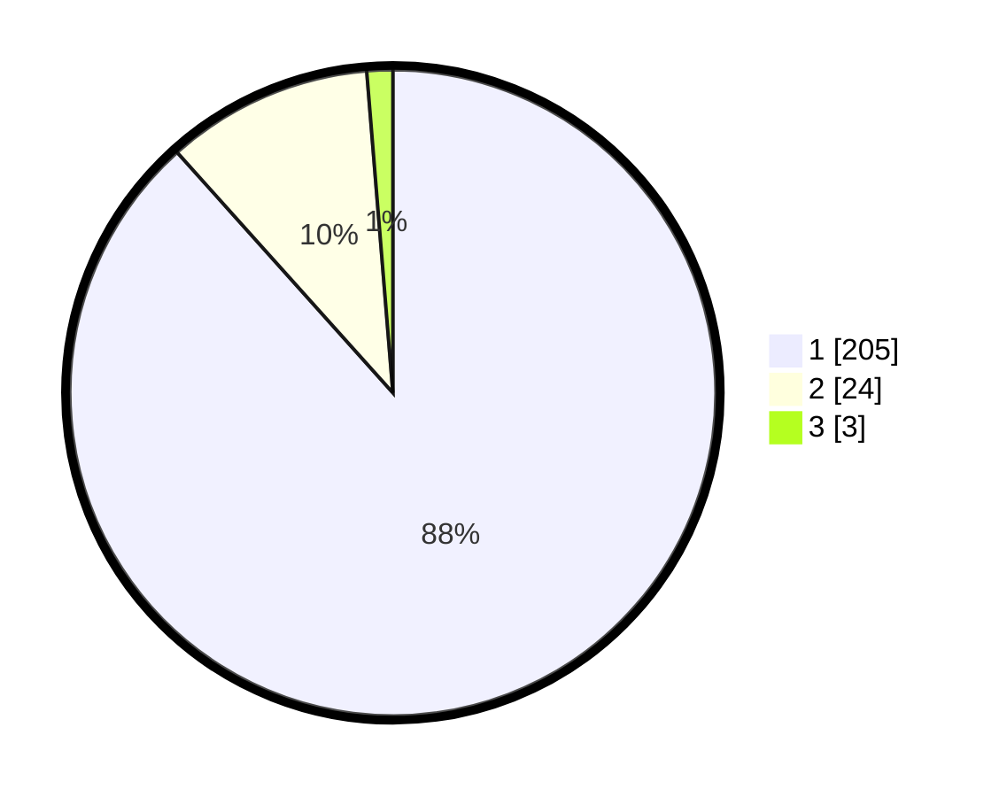

# Hasil

## Grafik

## Tabel

| No. | Nama Paslon    | Suara | Suara (raw) | Persentase |
|:--- |:-------------- | -----:| -----------:| ----------:|
| 1   | ANIES MUHAIMIN | 205   | [205][p-1]  | 88,36      |
| 2   | PRABOWO GIBRAN | 24    | [24][p-2]   | 10,34      |
| 3   | GANJAR MAHFUD  | 3     | [3][p-3]    | 1,29       |

[p-1]: https://github.com/gigit-pemilu/pemilu-2024/blob/main/pilpres/hitung-suara/sub/11-aceh/sub/05-aceh-barat/sub/02-kaway-xvi/sub/2024-alue-on/sub/001-tps/sub/paslon-1.txt
[p-2]: https://github.com/gigit-pemilu/pemilu-2024/blob/main/pilpres/hitung-suara/sub/11-aceh/sub/05-aceh-barat/sub/02-kaway-xvi/sub/2024-alue-on/sub/001-tps/sub/paslon-2.txt
[p-3]: https://github.com/gigit-pemilu/pemilu-2024/blob/main/pilpres/hitung-suara/sub/11-aceh/sub/05-aceh-barat/sub/02-kaway-xvi/sub/2024-alue-on/sub/001-tps/sub/paslon-3.txt

## Foto C Plano

https://sirekap-obj-formc.kpu.go.id/7937/pemilu/ppwp/11/05/02/20/24/1105022024001-20240215-020822--8278bad3-17c7-44fa-8391-357515c8bd42.jpg

https://sirekap-obj-formc.kpu.go.id/7937/pemilu/ppwp/11/05/02/20/24/1105022024001-20240215-021026--9091c199-6c55-4540-96c3-ba394e3c6bae.jpg

https://sirekap-obj-formc.kpu.go.id/7937/pemilu/ppwp/11/05/02/20/24/1105022024001-20240215-021219--3ee83959-a20a-44a5-a1b4-8f2e18f457c8.jpg

## Metadata

| Key        | Value               |
| ---------- | ------------------- |
| Time Stamp | 2024-02-15 18:00:26 |

