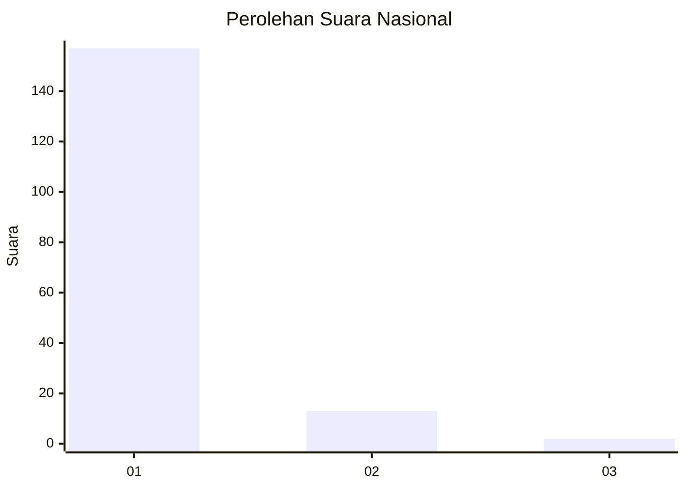
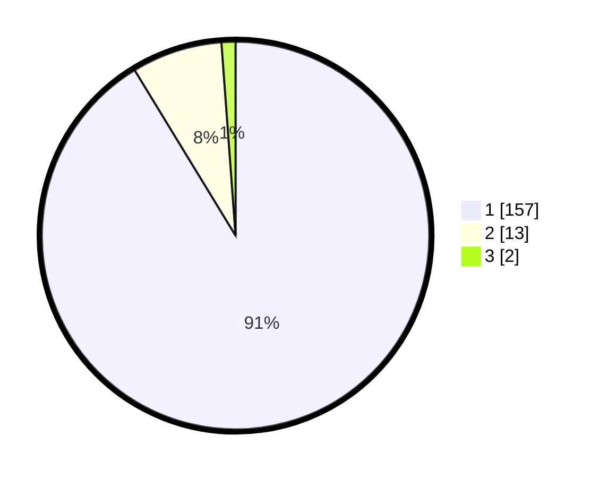

# Hasil

## Grafik

## Tabel

| No. | Nama Paslon    | Suara | Suara (raw) | Persentase |
|:--- |:-------------- | -----:| -----------:| ----------:|
| 1   | ANIES MUHAIMIN | 157   | [157][p-1]  | 91,28      |
| 2   | PRABOWO GIBRAN | 13    | [13][p-2]   | 7,56       |
| 3   | GANJAR MAHFUD  | 2     | [2][p-3]    | 1,16       |

[p-1]: https://github.com/gigit-pemilu/pemilu-2024/blob/main/pilpres/hitung-suara/sub/11-aceh/sub/05-aceh-barat/sub/02-kaway-xvi/sub/2048-pasi-meugat/sub/002-tps/sub/paslon-1.txt
[p-2]: https://github.com/gigit-pemilu/pemilu-2024/blob/main/pilpres/hitung-suara/sub/11-aceh/sub/05-aceh-barat/sub/02-kaway-xvi/sub/2048-pasi-meugat/sub/002-tps/sub/paslon-2.txt
[p-3]: https://github.com/gigit-pemilu/pemilu-2024/blob/main/pilpres/hitung-suara/sub/11-aceh/sub/05-aceh-barat/sub/02-kaway-xvi/sub/2048-pasi-meugat/sub/002-tps/sub/paslon-3.txt

## Foto C Plano

https://sirekap-obj-formc.kpu.go.id/3bcc/pemilu/ppwp/11/05/02/20/48/1105022048002-20240214-214712--b51669a2-b35a-48e5-8267-938401bcd2a2.jpg

https://sirekap-obj-formc.kpu.go.id/3bcc/pemilu/ppwp/11/05/02/20/48/1105022048002-20240214-214858--c418151a-44d6-4e63-9606-68f7785315d0.jpg

https://sirekap-obj-formc.kpu.go.id/3bcc/pemilu/ppwp/11/05/02/20/48/1105022048002-20240214-214944--4065ee17-fb5c-4056-a079-f4af3c7e094a.jpg

## Metadata

| Key        | Value               |
| ---------- | ------------------- |
| Time Stamp | 2024-02-15 20:00:44 |

