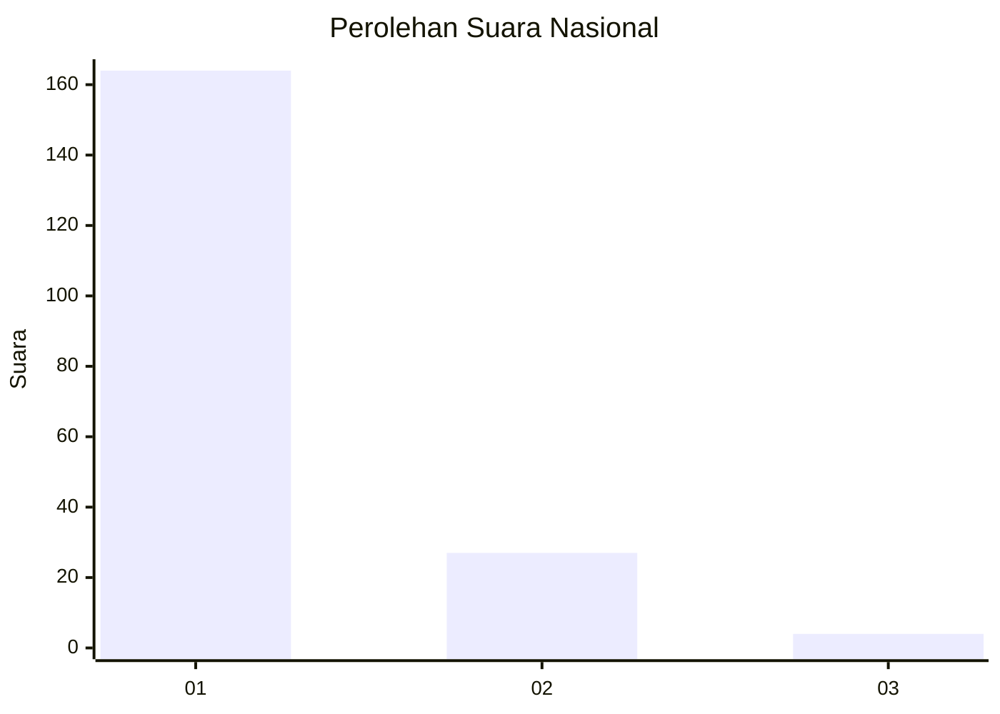
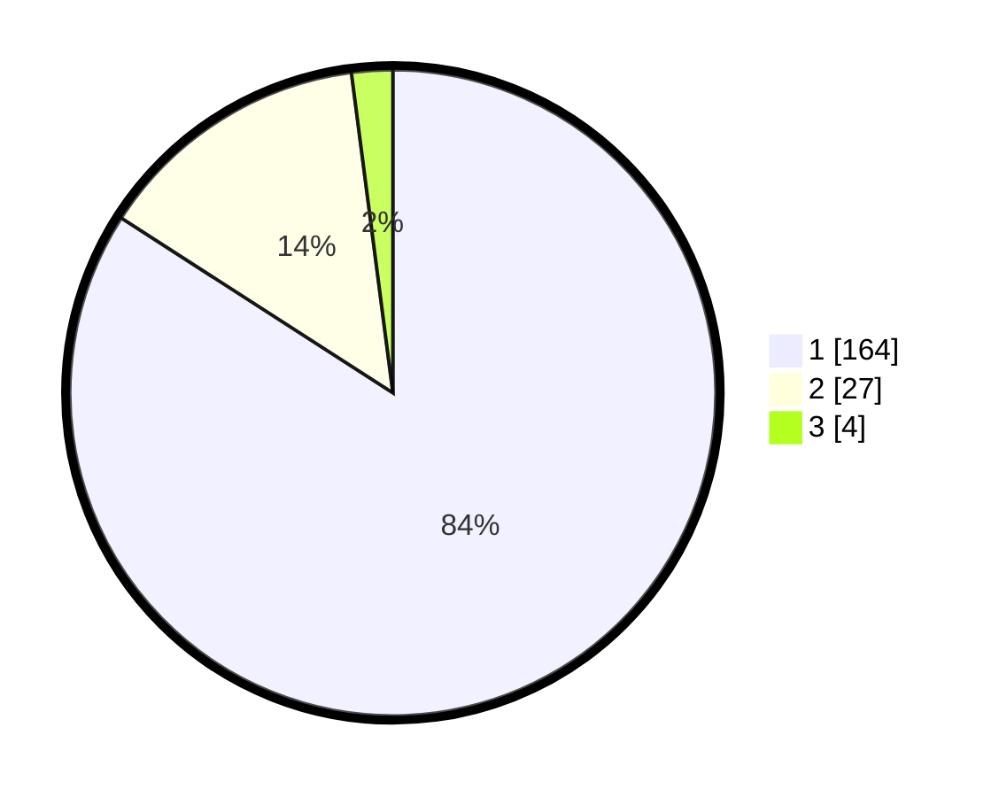

# Hasil

## Grafik

## Tabel

| No. | Nama Paslon    | Suara | Suara (raw) | Persentase |
|:--- |:-------------- | -----:| -----------:| ----------:|
| 1   | ANIES MUHAIMIN | 164   | [164][p-1]  | 84,10      |
| 2   | PRABOWO GIBRAN | 27    | [27][p-2]   | 13,85      |
| 3   | GANJAR MAHFUD  | 4     | [4][p-3]    | 2,05       |

[p-1]: https://github.com/gigit-pemilu/pemilu-2024/blob/main/pilpres/hitung-suara/sub/11-aceh/sub/05-aceh-barat/sub/02-kaway-xvi/sub/2050-pasi-kumbang/sub/002-tps/sub/paslon-1.txt
[p-2]: https://github.com/gigit-pemilu/pemilu-2024/blob/main/pilpres/hitung-suara/sub/11-aceh/sub/05-aceh-barat/sub/02-kaway-xvi/sub/2050-pasi-kumbang/sub/002-tps/sub/paslon-2.txt
[p-3]: https://github.com/gigit-pemilu/pemilu-2024/blob/main/pilpres/hitung-suara/sub/11-aceh/sub/05-aceh-barat/sub/02-kaway-xvi/sub/2050-pasi-kumbang/sub/002-tps/sub/paslon-3.txt

## Foto C Plano

https://sirekap-obj-formc.kpu.go.id/268a/pemilu/ppwp/11/05/02/20/50/1105022050002-20240215-080810--36c63324-60e3-426c-9a1f-da00533415ee.jpg

https://sirekap-obj-formc.kpu.go.id/268a/pemilu/ppwp/11/05/02/20/50/1105022050002-20240219-221605--935f9d88-5583-4323-9a8f-6b8514b987ff.jpg

## Metadata

| Key        | Value               |
| ---------- | ------------------- |
| Time Stamp | 2024-02-25 14:00:00 |

