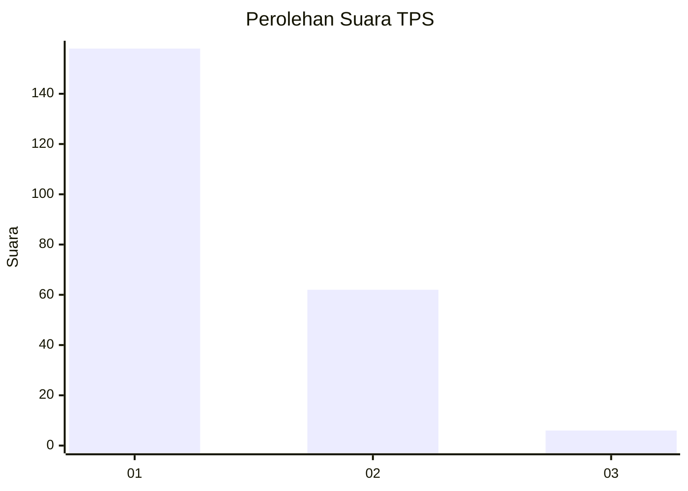
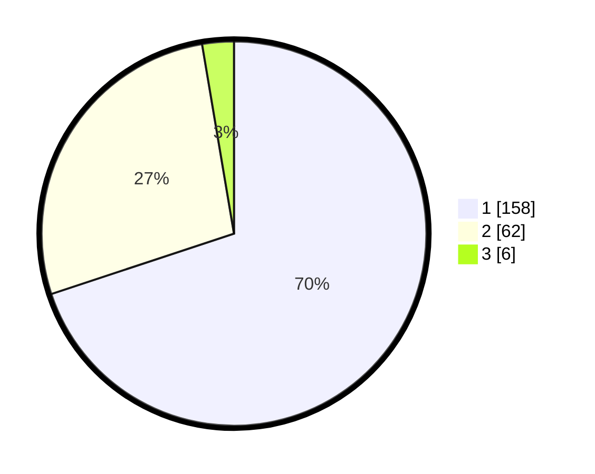

# Hasil

## Grafik

## Tabel

| No. | Nama Paslon    | Suara | Suara (raw) | Persentase |
|:--- |:-------------- | -----:| -----------:| ----------:|
| 1   | ANIES MUHAIMIN | 158   | [158][p-1]  | 69,91      |
| 2   | PRABOWO GIBRAN | 62    | [62][p-2]   | 27,43      |
| 3   | GANJAR MAHFUD  | 6     | [6][p-3]    | 2,65       |

[p-1]: https://github.com/gigit-pemilu/pemilu-2024-11-aceh/blob/main/pilpres/hitung-suara/sub/11-aceh/sub/05-aceh-barat/sub/02-kaway-xvi/sub/2051-padang-sikabu/sub/002-tps/sub/paslon-1.txt
[p-2]: https://github.com/gigit-pemilu/pemilu-2024-11-aceh/blob/main/pilpres/hitung-suara/sub/11-aceh/sub/05-aceh-barat/sub/02-kaway-xvi/sub/2051-padang-sikabu/sub/002-tps/sub/paslon-2.txt
[p-3]: https://github.com/gigit-pemilu/pemilu-2024-11-aceh/blob/main/pilpres/hitung-suara/sub/11-aceh/sub/05-aceh-barat/sub/02-kaway-xvi/sub/2051-padang-sikabu/sub/002-tps/sub/paslon-3.txt

## Foto C Plano

https://sirekap-obj-formc.kpu.go.id/f61d/pemilu/ppwp/11/05/02/20/51/1105022051002-20240217-213716--faf7eece-7ee9-4536-bfe7-5b34e28331c2.jpg

https://sirekap-obj-formc.kpu.go.id/f61d/pemilu/ppwp/11/05/02/20/51/1105022051002-20240217-220829--9016529b-56f0-490e-9687-2614c94ee8dd.jpg

https://sirekap-obj-formc.kpu.go.id/f61d/pemilu/ppwp/11/05/02/20/51/1105022051002-20240217-213932--ac5f0edd-45b8-4822-a4d8-be051bc907dd.jpg

## Metadata

| Key        | Value               |
| ---------- | ------------------- |
| Time Stamp | 2024-02-19 06:16:00 |

## DATA PEMILIH TETAP

Jumlah pemilih dalam DPT: **257**.
 * L: **130**.
 * P: **127**.

## DATA PENGGUNA HAK PILIH

Jumlah pengguna hak pilih dalam DPT: **215**.
 * L: **112**.
 * P: **103**.

Jumlah pengguna hak pilih dalam DPTb: **1**.
 * L: **1**.
 * P: **0**.

Jumlah pengguna hak pilih dalam DPK: **11**.
 * L: **8**.
 * P: **3**.

Jumlah pengguna hak pilih: **227**.
 * L: **121**.
 * P: **106**.

## JUMLAH SUARA SAH DAN TIDAK SAH

JUMLAH SELURUH SUARA SAH: **226**.

JUMLAH SUARA TIDAK SAH: **1**.

JUMLAH SELURUH SUARA SAH DAN SUARA TIDAK SAH: **227**.

