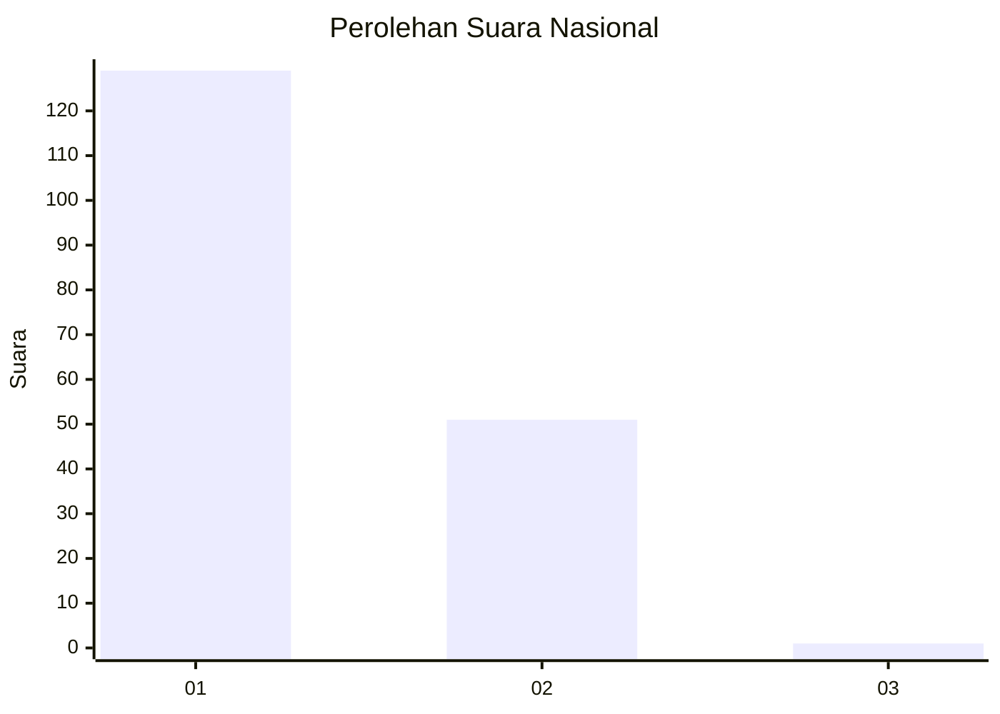
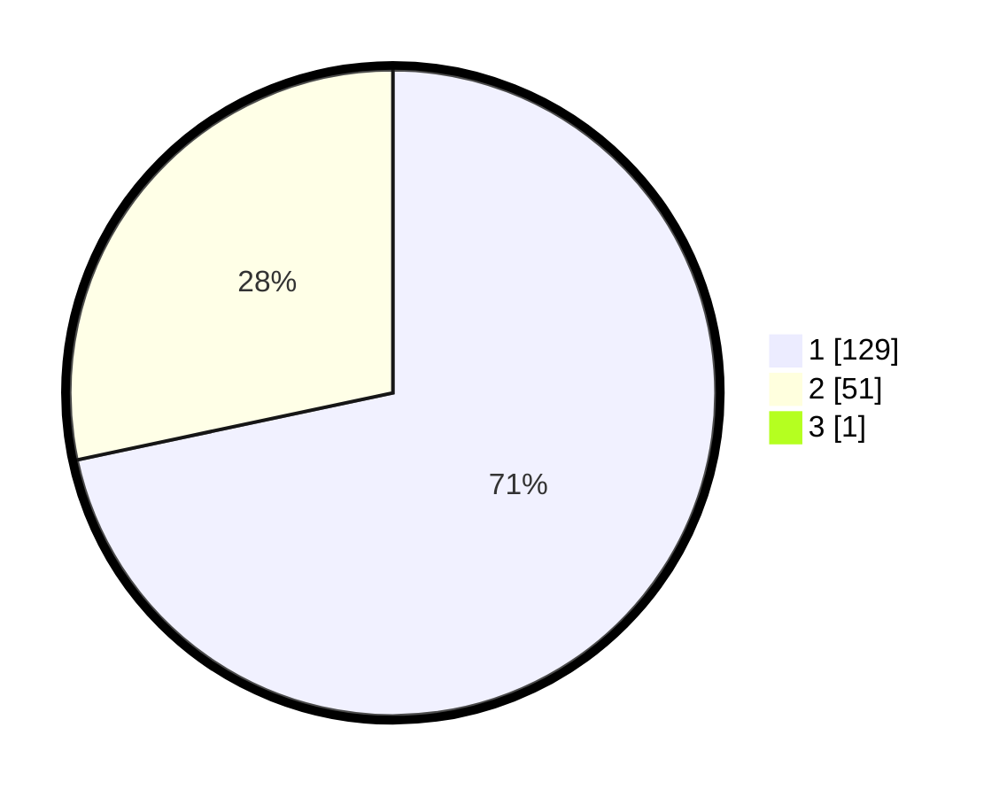

# Hasil

## Grafik

## Tabel

| No. | Nama Paslon    | Suara | Suara (raw) | Persentase |
|:--- |:-------------- | -----:| -----------:| ----------:|
| 1   | ANIES MUHAIMIN | 129   | [129][p-1]  | 71,27      |
| 2   | PRABOWO GIBRAN | 51    | [51][p-2]   | 28,18      |
| 3   | GANJAR MAHFUD  | 1     | [1][p-3]    | 0,55       |

[p-1]: https://github.com/gigit-pemilu/pemilu-2024/blob/main/pilpres/hitung-suara/sub/11-aceh/sub/05-aceh-barat/sub/02-kaway-xvi/sub/2052-sawang-teubei/sub/002-tps/sub/paslon-1.txt
[p-2]: https://github.com/gigit-pemilu/pemilu-2024/blob/main/pilpres/hitung-suara/sub/11-aceh/sub/05-aceh-barat/sub/02-kaway-xvi/sub/2052-sawang-teubei/sub/002-tps/sub/paslon-2.txt
[p-3]: https://github.com/gigit-pemilu/pemilu-2024/blob/main/pilpres/hitung-suara/sub/11-aceh/sub/05-aceh-barat/sub/02-kaway-xvi/sub/2052-sawang-teubei/sub/002-tps/sub/paslon-3.txt

## Foto C Plano

https://sirekap-obj-formc.kpu.go.id/08ef/pemilu/ppwp/11/05/02/20/52/1105022052002-20240214-204148--de3afb3f-d39c-49d3-8d8e-725155249939.jpg

https://sirekap-obj-formc.kpu.go.id/08ef/pemilu/ppwp/11/05/02/20/52/1105022052002-20240214-204622--3a8e0f8f-016f-44d9-a9ca-bdf4d0414673.jpg

https://sirekap-obj-formc.kpu.go.id/08ef/pemilu/ppwp/11/05/02/20/52/1105022052002-20240214-204740--8142f85b-decd-47be-810e-c0fa3a660de3.jpg

## Metadata

| Key        | Value               |
| ---------- | ------------------- |
| Time Stamp | 2024-02-15 20:00:44 |

