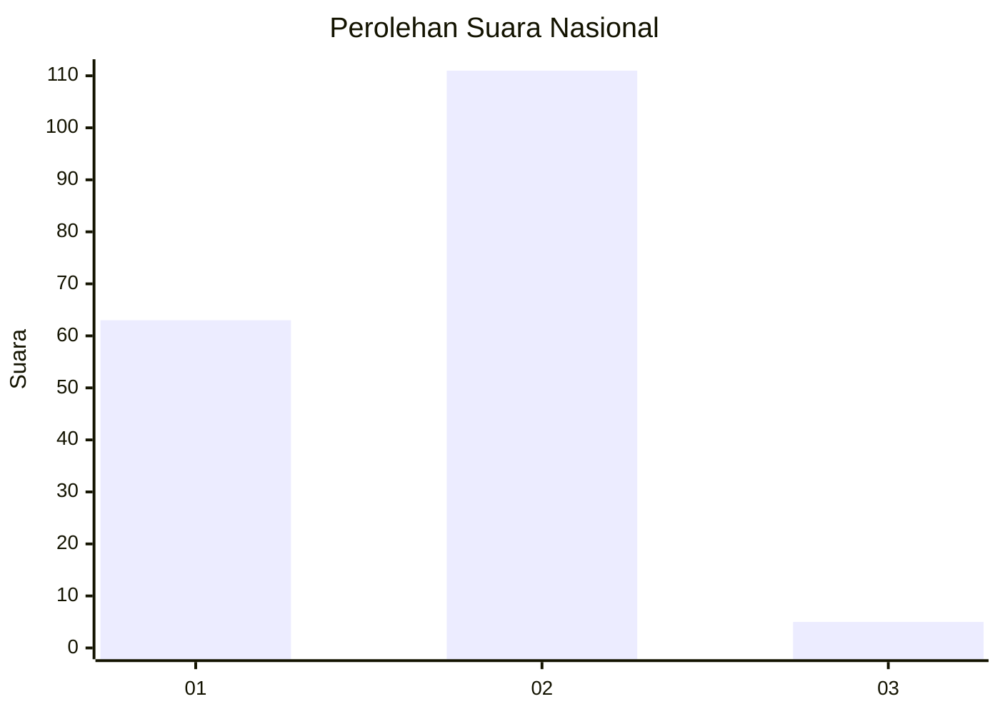
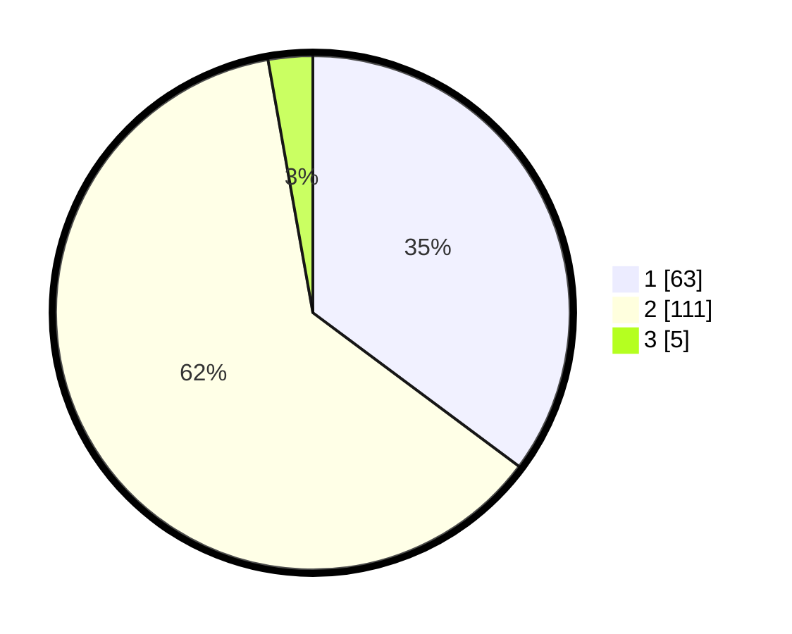

# Hasil

## Grafik

## Tabel

| No. | Nama Paslon    | Suara | Suara (raw) | Persentase |
|:--- |:-------------- | -----:| -----------:| ----------:|
| 1   | ANIES MUHAIMIN | 63    | [63][p-1]   | 35,20      |
| 2   | PRABOWO GIBRAN | 111   | [111][p-2]  | 62,01      |
| 3   | GANJAR MAHFUD  | 5     | [5][p-3]    | 2,79       |

[p-1]: https://github.com/gigit-pemilu/pemilu-2024/blob/main/pilpres/hitung-suara/sub/11-aceh/sub/05-aceh-barat/sub/03-sungai-mas/sub/2001-tungkop/sub/001-tps/sub/paslon-1.txt
[p-2]: https://github.com/gigit-pemilu/pemilu-2024/blob/main/pilpres/hitung-suara/sub/11-aceh/sub/05-aceh-barat/sub/03-sungai-mas/sub/2001-tungkop/sub/001-tps/sub/paslon-2.txt
[p-3]: https://github.com/gigit-pemilu/pemilu-2024/blob/main/pilpres/hitung-suara/sub/11-aceh/sub/05-aceh-barat/sub/03-sungai-mas/sub/2001-tungkop/sub/001-tps/sub/paslon-3.txt

## Foto C Plano

https://sirekap-obj-formc.kpu.go.id/a574/pemilu/ppwp/11/05/03/20/01/1105032001001-20240215-155909--185b6007-c0b0-4ec9-98f8-5ebbb37a03ee.jpg

https://sirekap-obj-formc.kpu.go.id/a574/pemilu/ppwp/11/05/03/20/01/1105032001001-20240215-151715--1940b4b2-03ec-4bd1-a6f7-b27a79fe34d0.jpg

https://sirekap-obj-formc.kpu.go.id/a574/pemilu/ppwp/11/05/03/20/01/1105032001001-20240215-160015--38f410ff-b2c8-41ef-b1da-adaf0474b71d.jpg

## Metadata

| Key        | Value               |
| ---------- | ------------------- |
| Time Stamp | 2024-02-15 23:29:50 |

## DATA PEMILIH TETAP

Jumlah pemilih dalam DPT: **190**.
 * L: **99**.
 * P: **91**.

## DATA PENGGUNA HAK PILIH

Jumlah pengguna hak pilih dalam DPT: **182**.
 * L: **91**.
 * P: **91**.

Jumlah pengguna hak pilih dalam DPTb: **0**.
 * L: **0**.
 * P: **0**.

Jumlah pengguna hak pilih dalam DPK: **0**.
 * L: **0**.
 * P: **0**.

Jumlah pengguna hak pilih: **182**.
 * L: **91**.
 * P: **91**.

## JUMLAH SUARA SAH DAN TIDAK SAH

JUMLAH SELURUH SUARA SAH: **179**.

JUMLAH SUARA TIDAK SAH: **3**.

JUMLAH SELURUH SUARA SAH DAN SUARA TIDAK SAH: **182**.

