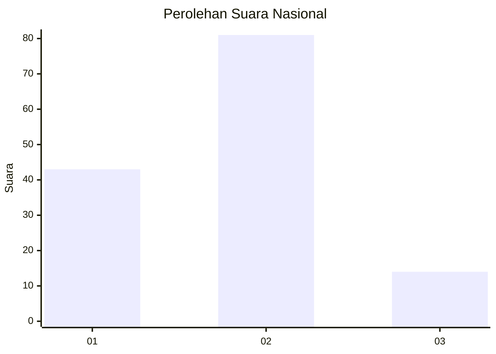
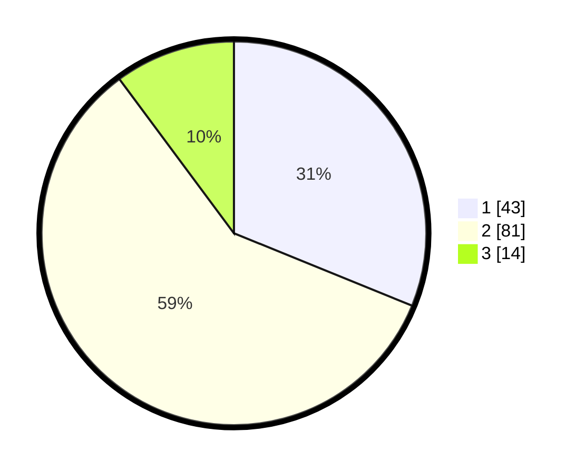

# Hasil

## Grafik

## Tabel

| No. | Nama Paslon    | Suara | Suara (raw) | Persentase |
|:--- |:-------------- | -----:| -----------:| ----------:|
| 1   | ANIES MUHAIMIN | 43    | [43][p-1]   | 31,16      |
| 2   | PRABOWO GIBRAN | 81    | [81][p-2]   | 58,70      |
| 3   | GANJAR MAHFUD  | 14    | [14][p-3]   | 10,14      |

[p-1]: https://github.com/gigit-pemilu/pemilu-2024/blob/main/pilpres/hitung-suara/sub/11-aceh/sub/05-aceh-barat/sub/03-sungai-mas/sub/2001-tungkop/sub/002-tps/sub/paslon-1.txt
[p-2]: https://github.com/gigit-pemilu/pemilu-2024/blob/main/pilpres/hitung-suara/sub/11-aceh/sub/05-aceh-barat/sub/03-sungai-mas/sub/2001-tungkop/sub/002-tps/sub/paslon-2.txt
[p-3]: https://github.com/gigit-pemilu/pemilu-2024/blob/main/pilpres/hitung-suara/sub/11-aceh/sub/05-aceh-barat/sub/03-sungai-mas/sub/2001-tungkop/sub/002-tps/sub/paslon-3.txt

## Foto C Plano

https://sirekap-obj-formc.kpu.go.id/1178/pemilu/ppwp/11/05/03/20/01/1105032001002-20240215-183828--39456682-d0e3-4a0f-b740-bd24b7cf594e.jpg

https://sirekap-obj-formc.kpu.go.id/1178/pemilu/ppwp/11/05/03/20/01/1105032001002-20240215-183848--7d551cea-a70c-4c1c-bc75-6ee5508fa573.jpg

https://sirekap-obj-formc.kpu.go.id/1178/pemilu/ppwp/11/05/03/20/01/1105032001002-20240215-183905--73478c9f-9d0c-4986-aa52-00d3ffb0dd40.jpg

## Metadata

| Key        | Value               |
| ---------- | ------------------- |
| Time Stamp | 2024-02-16 22:01:00 |

## DATA PEMILIH TETAP

Jumlah pemilih dalam DPT: **141**.
 * L: **70**.
 * P: **71**.

## DATA PENGGUNA HAK PILIH

Jumlah pengguna hak pilih dalam DPT: **134**.
 * L: **66**.
 * P: **68**.

Jumlah pengguna hak pilih dalam DPTb: **1**.
 * L: **0**.
 * P: **1**.

Jumlah pengguna hak pilih dalam DPK: **3**.
 * L: **1**.
 * P: **2**.

Jumlah pengguna hak pilih: **138**.
 * L: **67**.
 * P: **71**.

## JUMLAH SUARA SAH DAN TIDAK SAH

JUMLAH SELURUH SUARA SAH: **138**.

JUMLAH SUARA TIDAK SAH: **0**.

JUMLAH SELURUH SUARA SAH DAN SUARA TIDAK SAH: **138**.

