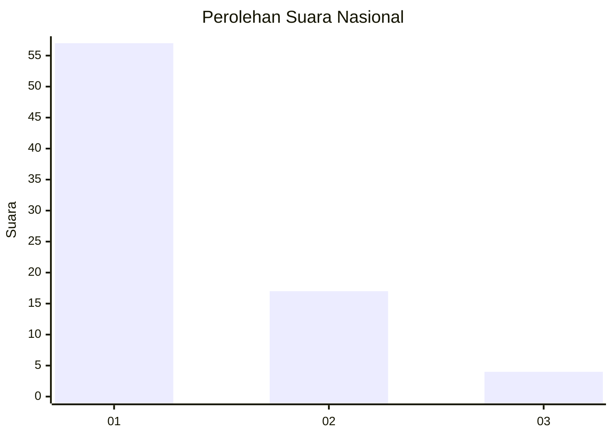
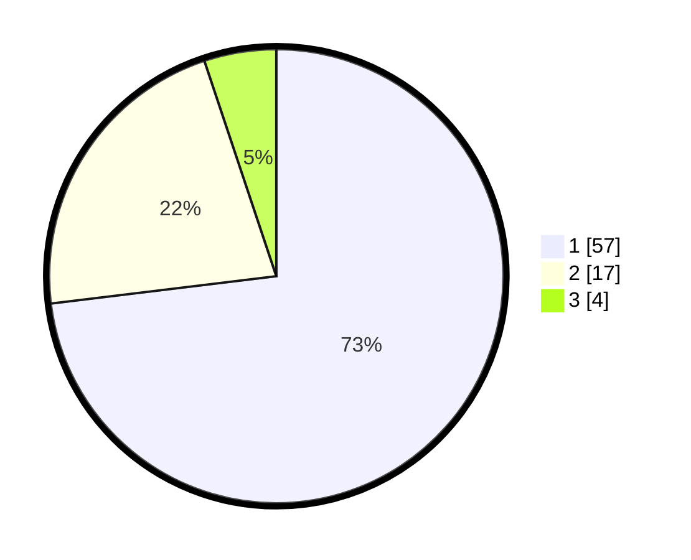

# Hasil

## Grafik

## Tabel

| No. | Nama Paslon    | Suara | Suara (raw) | Persentase |
|:--- |:-------------- | -----:| -----------:| ----------:|
| 1   | ANIES MUHAIMIN | 57    | [57][p-1]   | 73,08      |
| 2   | PRABOWO GIBRAN | 17    | [17][p-2]   | 21,79      |
| 3   | GANJAR MAHFUD  | 4     | [4][p-3]    | 5,13       |

[p-1]: https://github.com/gigit-pemilu/pemilu-2024/blob/main/pilpres/hitung-suara/sub/11-aceh/sub/05-aceh-barat/sub/03-sungai-mas/sub/2002-sakuy/sub/001-tps/sub/paslon-1.txt
[p-2]: https://github.com/gigit-pemilu/pemilu-2024/blob/main/pilpres/hitung-suara/sub/11-aceh/sub/05-aceh-barat/sub/03-sungai-mas/sub/2002-sakuy/sub/001-tps/sub/paslon-2.txt
[p-3]: https://github.com/gigit-pemilu/pemilu-2024/blob/main/pilpres/hitung-suara/sub/11-aceh/sub/05-aceh-barat/sub/03-sungai-mas/sub/2002-sakuy/sub/001-tps/sub/paslon-3.txt

## Foto C Plano

https://sirekap-obj-formc.kpu.go.id/b4a4/pemilu/ppwp/11/05/03/20/02/1105032002001-20240219-174309--d1115c90-7da5-408c-aff3-3c8f3941b2b2.jpg

https://sirekap-obj-formc.kpu.go.id/b4a4/pemilu/ppwp/11/05/03/20/02/1105032002001-20240219-174310--bc986cc7-c8cc-419a-aac8-d7dbb37aaedd.jpg

https://sirekap-obj-formc.kpu.go.id/b4a4/pemilu/ppwp/11/05/03/20/02/1105032002001-20240219-174309--cf81a4a3-ab26-4da8-ba55-a127acf6796a.jpg

## Metadata

| Key        | Value               |
| ---------- | ------------------- |
| Time Stamp | 2024-02-20 23:00:00 |

## DATA PEMILIH TETAP

Jumlah pemilih dalam DPT: **84**.
 * L: **40**.
 * P: **44**.

## DATA PENGGUNA HAK PILIH

Jumlah pengguna hak pilih dalam DPT: **79**.
 * L: **40**.
 * P: **39**.

Jumlah pengguna hak pilih dalam DPTb: **0**.
 * L: **0**.
 * P: **0**.

Jumlah pengguna hak pilih dalam DPK: **0**.
 * L: **0**.
 * P: **0**.

Jumlah pengguna hak pilih: **79**.
 * L: **40**.
 * P: **39**.

## JUMLAH SUARA SAH DAN TIDAK SAH

JUMLAH SELURUH SUARA SAH: **78**.

JUMLAH SUARA TIDAK SAH: **1**.

JUMLAH SELURUH SUARA SAH DAN SUARA TIDAK SAH: **79**.

