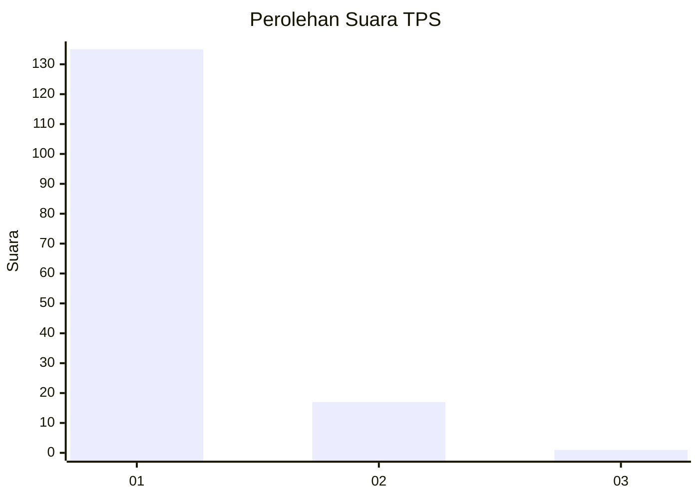
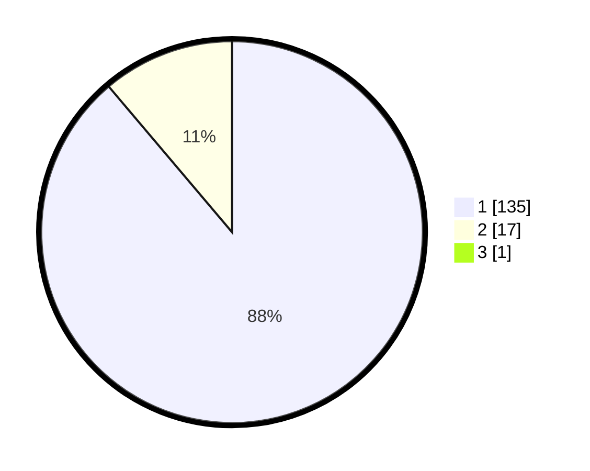

# Hasil

## Grafik

## Tabel

| No. | Nama Paslon    | Suara | Suara (raw) | Persentase |
|:--- |:-------------- | -----:| -----------:| ----------:|
| 1   | ANIES MUHAIMIN | 135   | [135][p-1]  | 88,24      |
| 2   | PRABOWO GIBRAN | 17    | [17][p-2]   | 11,11      |
| 3   | GANJAR MAHFUD  | 1     | [1][p-3]    | 0,65       |

[p-1]: https://github.com/gigit-pemilu/pemilu-2024-11-aceh/blob/main/pilpres/hitung-suara/sub/11-aceh/sub/05-aceh-barat/sub/03-sungai-mas/sub/2003-kajeung/sub/002-tps/sub/paslon-1.txt
[p-2]: https://github.com/gigit-pemilu/pemilu-2024-11-aceh/blob/main/pilpres/hitung-suara/sub/11-aceh/sub/05-aceh-barat/sub/03-sungai-mas/sub/2003-kajeung/sub/002-tps/sub/paslon-2.txt
[p-3]: https://github.com/gigit-pemilu/pemilu-2024-11-aceh/blob/main/pilpres/hitung-suara/sub/11-aceh/sub/05-aceh-barat/sub/03-sungai-mas/sub/2003-kajeung/sub/002-tps/sub/paslon-3.txt

## Foto C Plano

https://sirekap-obj-formc.kpu.go.id/cab9/pemilu/ppwp/11/05/03/20/03/1105032003002-20240214-155141--be610a14-41f1-4aa4-943d-9a817fb44147.jpg

https://sirekap-obj-formc.kpu.go.id/cab9/pemilu/ppwp/11/05/03/20/03/1105032003002-20240214-155603--d6c773b8-5814-4304-bd74-246dfe43e29b.jpg

https://sirekap-obj-formc.kpu.go.id/cab9/pemilu/ppwp/11/05/03/20/03/1105032003002-20240214-155216--3e8593cb-7bcc-4178-b17f-d8c298aa40fc.jpg

## Metadata

| Key        | Value               |
| ---------- | ------------------- |
| Time Stamp | 2024-02-15 20:00:44 |

