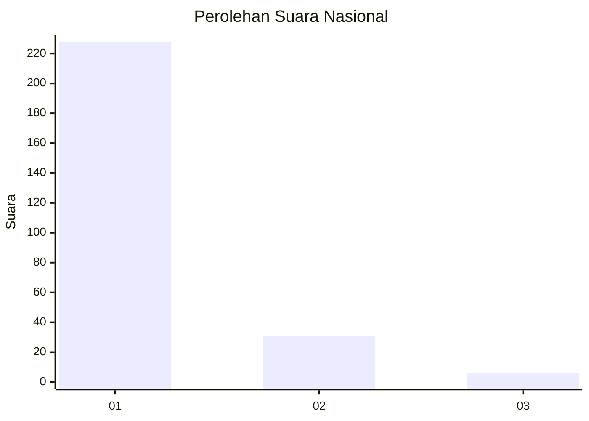
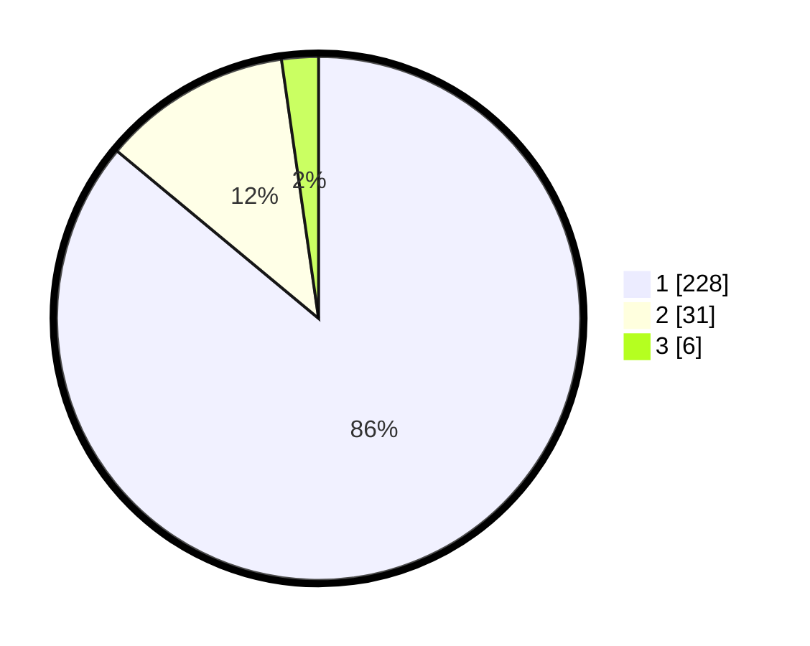

# Hasil

## Grafik

## Tabel

| No. | Nama Paslon    | Suara | Suara (raw) | Persentase |
|:--- |:-------------- | -----:| -----------:| ----------:|
| 1   | ANIES MUHAIMIN | 228   | [228][p-1]  | 86,04      |
| 2   | PRABOWO GIBRAN | 31    | [31][p-2]   | 11,70      |
| 3   | GANJAR MAHFUD  | 6     | [6][p-3]    | 2,26       |

[p-1]: https://github.com/gigit-pemilu/pemilu-2024/blob/main/pilpres/hitung-suara/sub/11-aceh/sub/05-aceh-barat/sub/03-sungai-mas/sub/2004-geudong/sub/001-tps/sub/paslon-1.txt
[p-2]: https://github.com/gigit-pemilu/pemilu-2024/blob/main/pilpres/hitung-suara/sub/11-aceh/sub/05-aceh-barat/sub/03-sungai-mas/sub/2004-geudong/sub/001-tps/sub/paslon-2.txt
[p-3]: https://github.com/gigit-pemilu/pemilu-2024/blob/main/pilpres/hitung-suara/sub/11-aceh/sub/05-aceh-barat/sub/03-sungai-mas/sub/2004-geudong/sub/001-tps/sub/paslon-3.txt

## Foto C Plano

https://sirekap-obj-formc.kpu.go.id/e153/pemilu/ppwp/11/05/03/20/04/1105032004001-20240214-202224--14d1d0d7-1a87-486c-b0d1-9df46fb97f8e.jpg

https://sirekap-obj-formc.kpu.go.id/e153/pemilu/ppwp/11/05/03/20/04/1105032004001-20240214-202514--174cbebd-0e31-4726-9827-7c0f4920ab27.jpg

https://sirekap-obj-formc.kpu.go.id/e153/pemilu/ppwp/11/05/03/20/04/1105032004001-20240215-152230--48b3e261-8f23-499d-ac82-7ef52a8b3040.jpg

## Metadata

| Key        | Value               |
| ---------- | ------------------- |
| Time Stamp | 2024-02-15 21:01:18 |

## DATA PEMILIH TETAP

Jumlah pemilih dalam DPT: **285**.
 * L: **143**.
 * P: **144**.

## DATA PENGGUNA HAK PILIH

Jumlah pengguna hak pilih dalam DPT: **57**.
 * L: **170**.
 * P: **177**.

Jumlah pengguna hak pilih dalam DPTb: **1**.
 * L: **1**.
 * P: **0**.

Jumlah pengguna hak pilih dalam DPK: **1**.
 * L: **1**.
 * P: **0**.

Jumlah pengguna hak pilih: **69**.
 * L: **170**.
 * P: **177**.

## JUMLAH SUARA SAH DAN TIDAK SAH

JUMLAH SELURUH SUARA SAH: **265**.

JUMLAH SUARA TIDAK SAH: **4**.

JUMLAH SELURUH SUARA SAH DAN SUARA TIDAK SAH: **269**.

