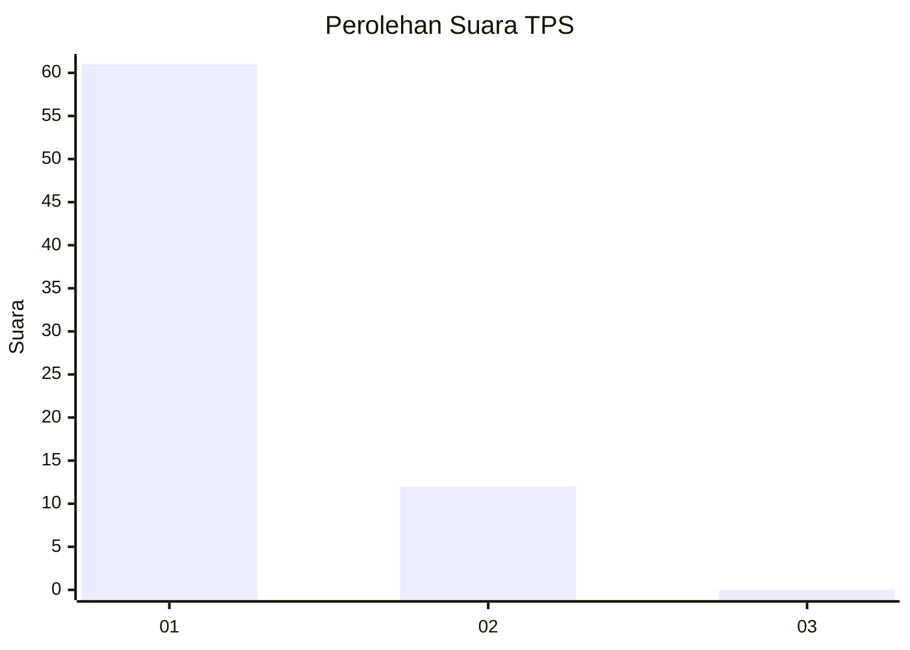
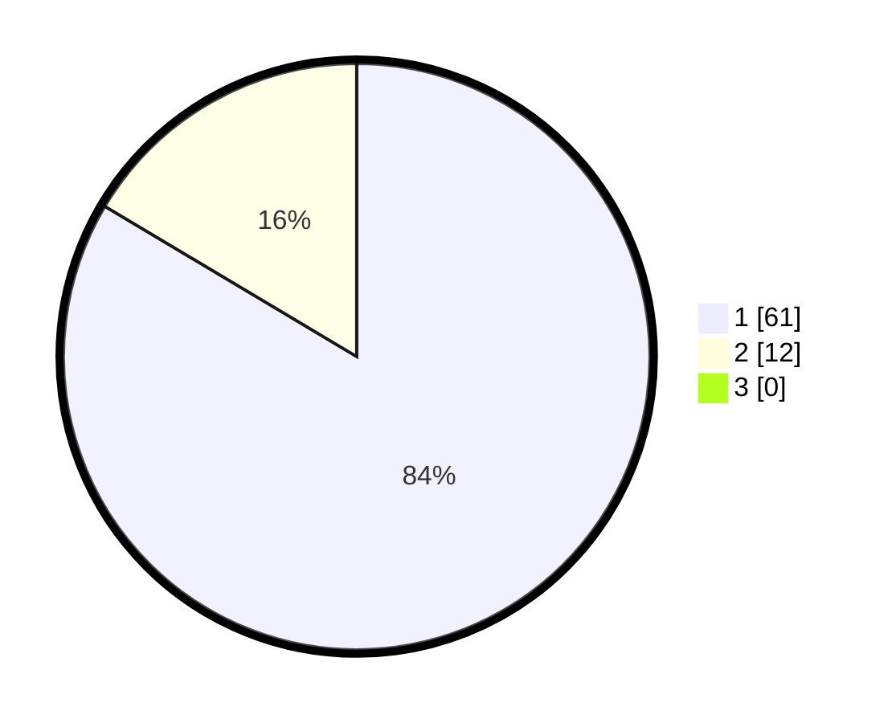

# Hasil

## Grafik

## Tabel

| No. | Nama Paslon    | Suara | Suara (raw) | Persentase |
|:--- |:-------------- | -----:| -----------:| ----------:|
| 1   | ANIES MUHAIMIN | 61    | [61][p-1]   | 83,56      |
| 2   | PRABOWO GIBRAN | 12    | [12][p-2]   | 16,44      |
| 3   | GANJAR MAHFUD  | 0     | [0][p-3]    | 0,00       |

[p-1]: https://github.com/gigit-pemilu/pemilu-2024-11-aceh/blob/main/pilpres/hitung-suara/sub/11-aceh/sub/05-aceh-barat/sub/03-sungai-mas/sub/2008-tuwi-saya/sub/001-tps/sub/paslon-1.txt
[p-2]: https://github.com/gigit-pemilu/pemilu-2024-11-aceh/blob/main/pilpres/hitung-suara/sub/11-aceh/sub/05-aceh-barat/sub/03-sungai-mas/sub/2008-tuwi-saya/sub/001-tps/sub/paslon-2.txt
[p-3]: https://github.com/gigit-pemilu/pemilu-2024-11-aceh/blob/main/pilpres/hitung-suara/sub/11-aceh/sub/05-aceh-barat/sub/03-sungai-mas/sub/2008-tuwi-saya/sub/001-tps/sub/paslon-3.txt

## Foto C Plano

https://sirekap-obj-formc.kpu.go.id/493e/pemilu/ppwp/11/05/03/20/08/1105032008001-20240219-134845--3d924b14-167a-4f8f-91f7-29483e7b1c1e.jpg

https://sirekap-obj-formc.kpu.go.id/493e/pemilu/ppwp/11/05/03/20/08/1105032008001-20240219-134846--7482483d-a2b6-436b-9259-60c02d9ca7f3.jpg

https://sirekap-obj-formc.kpu.go.id/493e/pemilu/ppwp/11/05/03/20/08/1105032008001-20240215-024950--7d13c849-048b-4d42-b1b8-cfb4326e49d0.jpg

## Metadata

| Key        | Value               |
| ---------- | ------------------- |
| Time Stamp | 2024-02-21 10:00:00 |

## DATA PEMILIH TETAP

Jumlah pemilih dalam DPT: **79**.
 * L: **40**.
 * P: **39**.

## DATA PENGGUNA HAK PILIH

Jumlah pengguna hak pilih dalam DPT: **73**.
 * L: **37**.
 * P: **36**.

Jumlah pengguna hak pilih dalam DPTb: **1**.
 * L: **0**.
 * P: **1**.

Jumlah pengguna hak pilih dalam DPK: **0**.
 * L: **0**.
 * P: **0**.

Jumlah pengguna hak pilih: **74**.
 * L: **37**.
 * P: **37**.

## JUMLAH SUARA SAH DAN TIDAK SAH

JUMLAH SELURUH SUARA SAH: **73**.

JUMLAH SUARA TIDAK SAH: **1**.

JUMLAH SELURUH SUARA SAH DAN SUARA TIDAK SAH: **74**.

