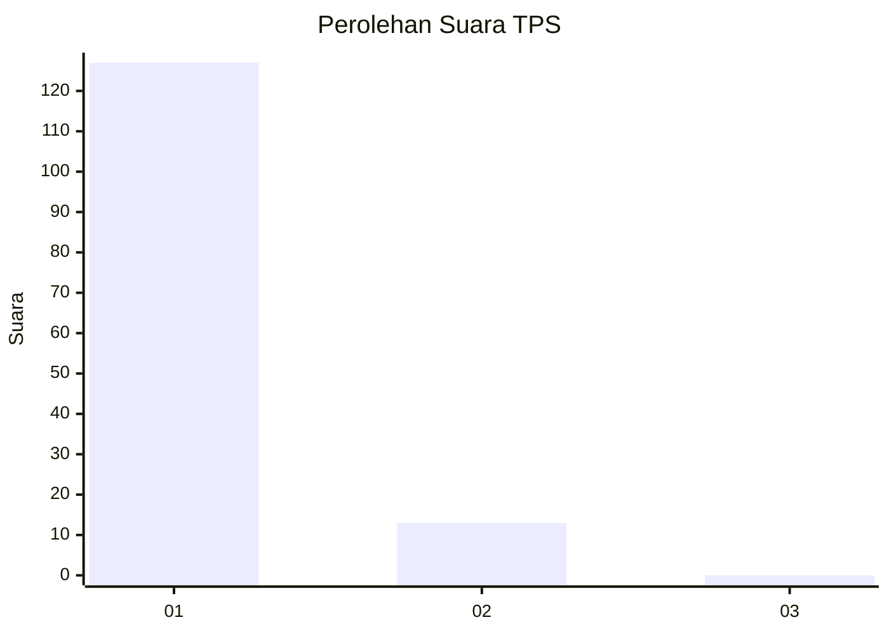
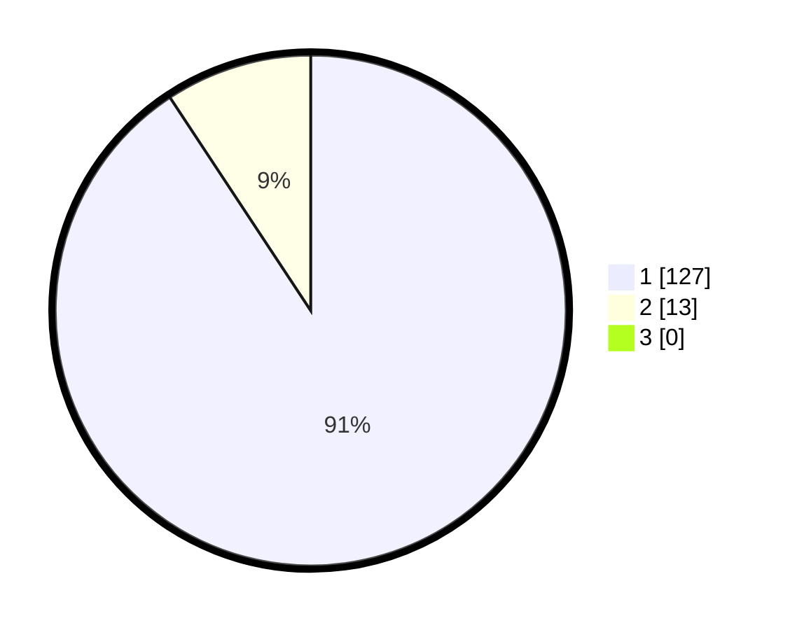

# Hasil

## Grafik

## Tabel

| No. | Nama Paslon    | Suara | Suara (raw) | Persentase |
|:--- |:-------------- | -----:| -----------:| ----------:|
| 1   | ANIES MUHAIMIN | 127   | [127][p-1]  | 90,71      |
| 2   | PRABOWO GIBRAN | 13    | [13][p-2]   | 9,29       |
| 3   | GANJAR MAHFUD  | 0     | [0][p-3]    | 0,00       |

[p-1]: https://github.com/gigit-pemilu/pemilu-2024-11-aceh/blob/main/pilpres/hitung-suara/sub/11-aceh/sub/05-aceh-barat/sub/03-sungai-mas/sub/2011-pungkie/sub/001-tps/sub/paslon-1.txt
[p-2]: https://github.com/gigit-pemilu/pemilu-2024-11-aceh/blob/main/pilpres/hitung-suara/sub/11-aceh/sub/05-aceh-barat/sub/03-sungai-mas/sub/2011-pungkie/sub/001-tps/sub/paslon-2.txt
[p-3]: https://github.com/gigit-pemilu/pemilu-2024-11-aceh/blob/main/pilpres/hitung-suara/sub/11-aceh/sub/05-aceh-barat/sub/03-sungai-mas/sub/2011-pungkie/sub/001-tps/sub/paslon-3.txt

## Foto C Plano

https://sirekap-obj-formc.kpu.go.id/aef4/pemilu/ppwp/11/05/03/20/11/1105032011001-20240215-052112--f212e4e0-03af-4c0c-b7d0-5da882de3f79.jpg

https://sirekap-obj-formc.kpu.go.id/aef4/pemilu/ppwp/11/05/03/20/11/1105032011001-20240215-052247--ead42d09-dde6-45ef-b99b-6c24dc28a909.jpg

https://sirekap-obj-formc.kpu.go.id/aef4/pemilu/ppwp/11/05/03/20/11/1105032011001-20240215-052358--30e4d8f5-2c1c-48cd-ba47-efdc6dad2b39.jpg

## Metadata

| Key        | Value               |
| ---------- | ------------------- |
| Time Stamp | 2024-02-15 22:00:27 |

