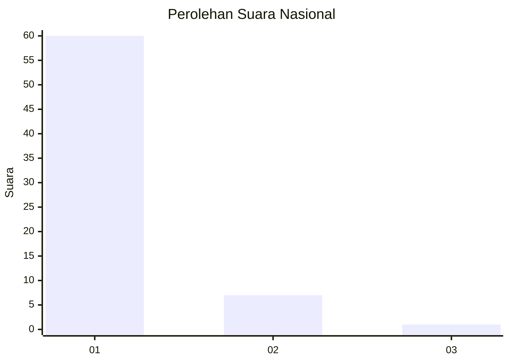
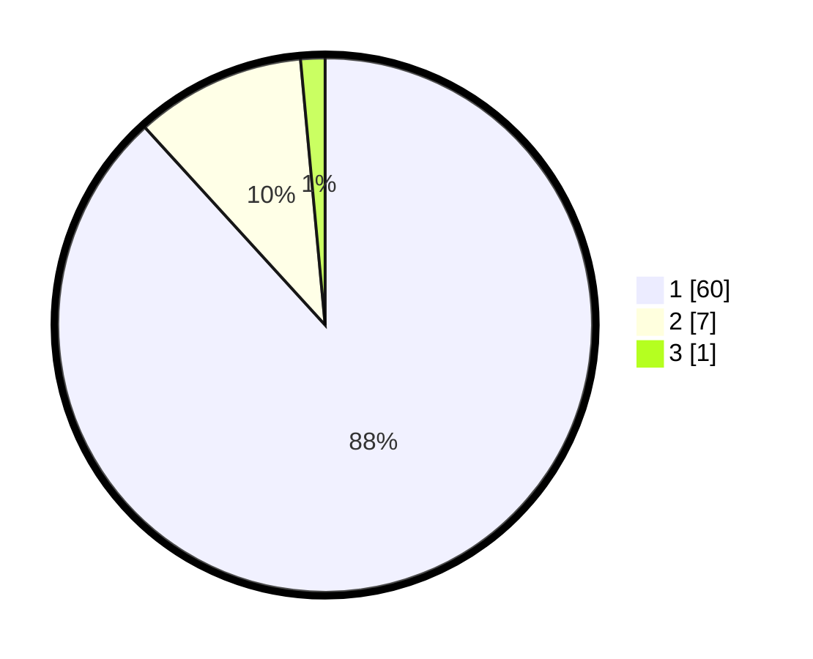

# Hasil

## Grafik

## Tabel

| No. | Nama Paslon    | Suara | Suara (raw) | Persentase |
|:--- |:-------------- | -----:| -----------:| ----------:|
| 1   | ANIES MUHAIMIN | 60    | [60][p-1]   | 88,24      |
| 2   | PRABOWO GIBRAN | 7     | [7][p-2]    | 10,29      |
| 3   | GANJAR MAHFUD  | 1     | [1][p-3]    | 1,47       |

[p-1]: https://github.com/gigit-pemilu/pemilu-2024/blob/main/pilpres/hitung-suara/sub/11-aceh/sub/05-aceh-barat/sub/03-sungai-mas/sub/2012-gunong-buloh/sub/001-tps/sub/paslon-1.txt
[p-2]: https://github.com/gigit-pemilu/pemilu-2024/blob/main/pilpres/hitung-suara/sub/11-aceh/sub/05-aceh-barat/sub/03-sungai-mas/sub/2012-gunong-buloh/sub/001-tps/sub/paslon-2.txt
[p-3]: https://github.com/gigit-pemilu/pemilu-2024/blob/main/pilpres/hitung-suara/sub/11-aceh/sub/05-aceh-barat/sub/03-sungai-mas/sub/2012-gunong-buloh/sub/001-tps/sub/paslon-3.txt

## Foto C Plano

https://sirekap-obj-formc.kpu.go.id/4943/pemilu/ppwp/11/05/03/20/12/1105032012001-20240215-005926--0b12c4e9-2de3-4fcb-972d-c3a805cef863.jpg

https://sirekap-obj-formc.kpu.go.id/4943/pemilu/ppwp/11/05/03/20/12/1105032012001-20240215-010240--d6e40826-aec2-4e4c-a4bd-b47bef47c766.jpg

https://sirekap-obj-formc.kpu.go.id/4943/pemilu/ppwp/11/05/03/20/12/1105032012001-20240215-010410--025c8ed0-a598-4804-b63c-d3ccf5523517.jpg

## Metadata

| Key        | Value               |
| ---------- | ------------------- |
| Time Stamp | 2024-02-15 12:00:28 |

## DATA PEMILIH TETAP

Jumlah pemilih dalam DPT: **73**.
 * L: **36**.
 * P: **37**.

## DATA PENGGUNA HAK PILIH

Jumlah pengguna hak pilih dalam DPT: **73**.
 * L: **36**.
 * P: **37**.

Jumlah pengguna hak pilih dalam DPTb: **0**.
 * L: **0**.
 * P: **0**.

Jumlah pengguna hak pilih dalam DPK: **0**.
 * L: **0**.
 * P: **0**.

Jumlah pengguna hak pilih: **73**.
 * L: **36**.
 * P: **37**.

## JUMLAH SUARA SAH DAN TIDAK SAH

JUMLAH SELURUH SUARA SAH: **68**.

JUMLAH SUARA TIDAK SAH: **2**.

JUMLAH SELURUH SUARA SAH DAN SUARA TIDAK SAH: **70**.

