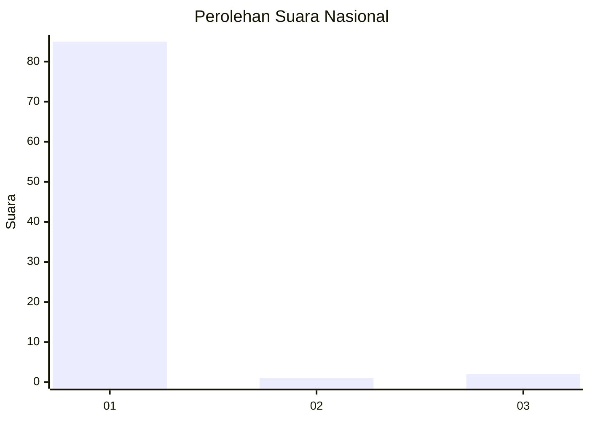
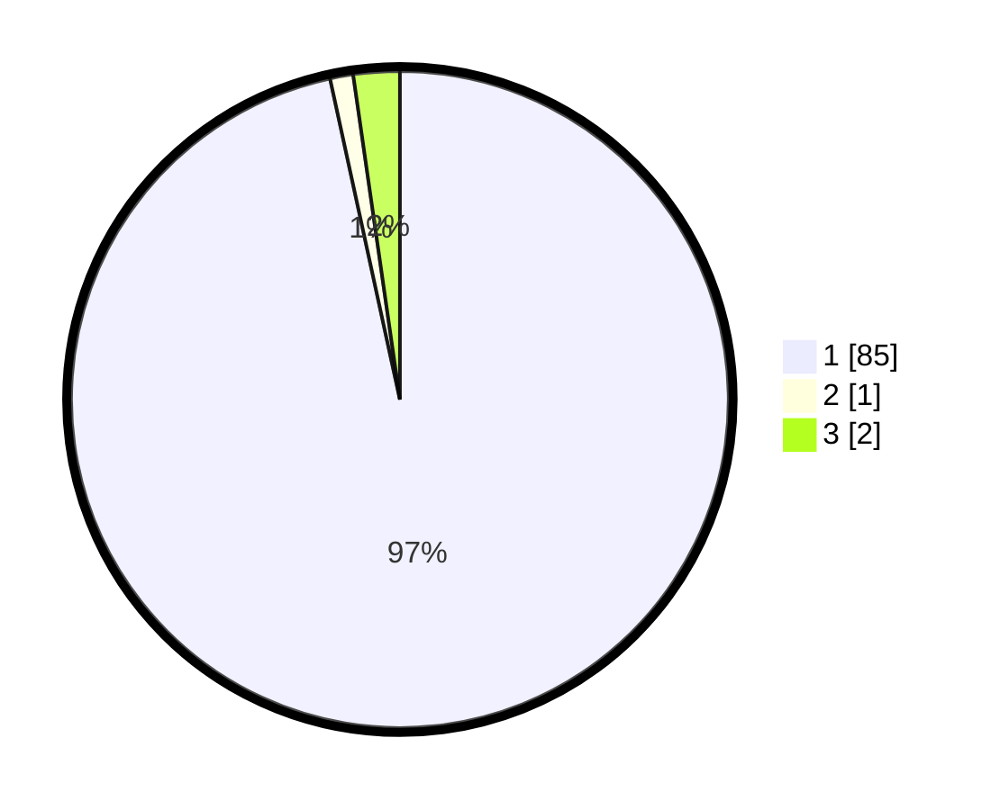

# Hasil

## Grafik

## Tabel

| No. | Nama Paslon    | Suara | Suara (raw) | Persentase |
|:--- |:-------------- | -----:| -----------:| ----------:|
| 1   | ANIES MUHAIMIN | 85    | [85][p-1]   | 96,59      |
| 2   | PRABOWO GIBRAN | 1     | [1][p-2]    | 1,14       |
| 3   | GANJAR MAHFUD  | 2     | [2][p-3]    | 2,27       |

[p-1]: https://github.com/gigit-pemilu/pemilu-2024/blob/main/pilpres/hitung-suara/sub/11-aceh/sub/05-aceh-barat/sub/03-sungai-mas/sub/2013-ramitie/sub/001-tps/sub/paslon-1.txt
[p-2]: https://github.com/gigit-pemilu/pemilu-2024/blob/main/pilpres/hitung-suara/sub/11-aceh/sub/05-aceh-barat/sub/03-sungai-mas/sub/2013-ramitie/sub/001-tps/sub/paslon-2.txt
[p-3]: https://github.com/gigit-pemilu/pemilu-2024/blob/main/pilpres/hitung-suara/sub/11-aceh/sub/05-aceh-barat/sub/03-sungai-mas/sub/2013-ramitie/sub/001-tps/sub/paslon-3.txt

## Foto C Plano

https://sirekap-obj-formc.kpu.go.id/4ee0/pemilu/ppwp/11/05/03/20/13/1105032013001-20240215-042758--051e54a0-3912-40d3-aee9-ed00f6660c42.jpg

https://sirekap-obj-formc.kpu.go.id/4ee0/pemilu/ppwp/11/05/03/20/13/1105032013001-20240215-042941--c8f72eac-28b8-4553-affe-73271397c0a0.jpg

https://sirekap-obj-formc.kpu.go.id/4ee0/pemilu/ppwp/11/05/03/20/13/1105032013001-20240215-043108--4c7f6596-9869-4344-a4f6-0bc716a3391c.jpg

## Metadata

| Key        | Value               |
| ---------- | ------------------- |
| Time Stamp | 2024-02-15 20:00:44 |

