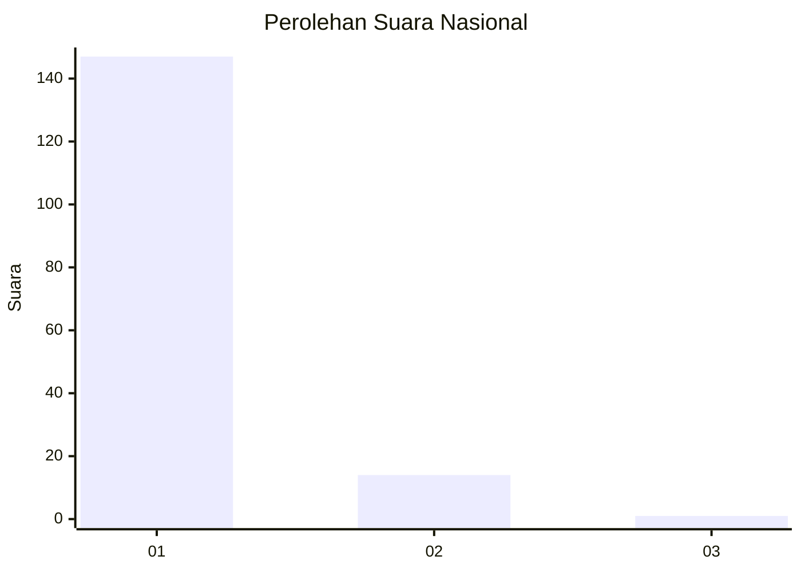
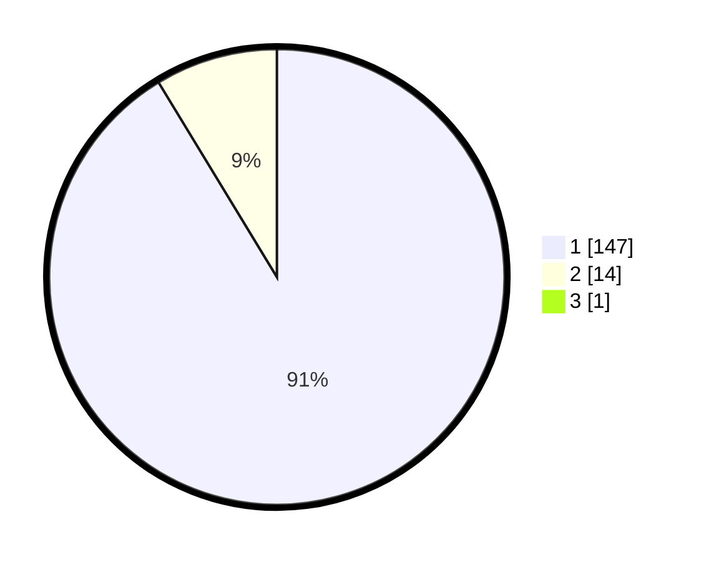

# Hasil

## Grafik

## Tabel

| No. | Nama Paslon    | Suara | Suara (raw) | Persentase |
|:--- |:-------------- | -----:| -----------:| ----------:|
| 1   | ANIES MUHAIMIN | 147   | [147][p-1]  | 90,74      |
| 2   | PRABOWO GIBRAN | 14    | [14][p-2]   | 8,64       |
| 3   | GANJAR MAHFUD  | 1     | [1][p-3]    | 0,62       |

[p-1]: https://github.com/gigit-pemilu/pemilu-2024/blob/main/pilpres/hitung-suara/sub/11-aceh/sub/05-aceh-barat/sub/03-sungai-mas/sub/2015-gleng/sub/002-tps/sub/paslon-1.txt
[p-2]: https://github.com/gigit-pemilu/pemilu-2024/blob/main/pilpres/hitung-suara/sub/11-aceh/sub/05-aceh-barat/sub/03-sungai-mas/sub/2015-gleng/sub/002-tps/sub/paslon-2.txt
[p-3]: https://github.com/gigit-pemilu/pemilu-2024/blob/main/pilpres/hitung-suara/sub/11-aceh/sub/05-aceh-barat/sub/03-sungai-mas/sub/2015-gleng/sub/002-tps/sub/paslon-3.txt

## Foto C Plano

https://sirekap-obj-formc.kpu.go.id/352a/pemilu/ppwp/11/05/03/20/15/1105032015002-20240214-213420--d5b3a031-7d0d-4b72-9333-30e91440ec93.jpg

https://sirekap-obj-formc.kpu.go.id/352a/pemilu/ppwp/11/05/03/20/15/1105032015002-20240214-213549--46cc7e93-d5cc-4da3-851e-26b1158c2547.jpg

https://sirekap-obj-formc.kpu.go.id/352a/pemilu/ppwp/11/05/03/20/15/1105032015002-20240214-203316--b3c2cbe2-ae25-4a2d-a1b8-9168e7acfda0.jpg

## Metadata

| Key        | Value               |
| ---------- | ------------------- |
| Time Stamp | 2024-02-15 19:30:26 |

