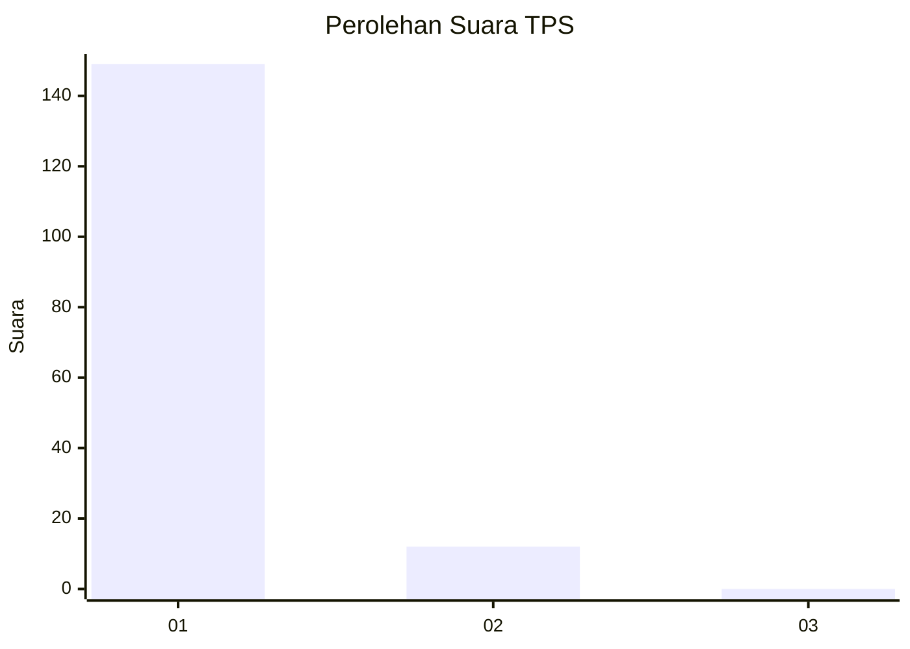
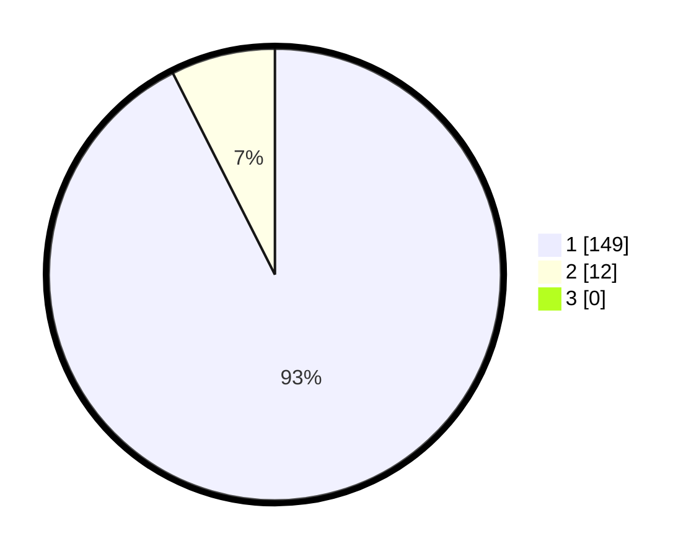

# Hasil

## Grafik

## Tabel

| No. | Nama Paslon    | Suara | Suara (raw) | Persentase |
|:--- |:-------------- | -----:| -----------:| ----------:|
| 1   | ANIES MUHAIMIN | 149   | [149][p-1]  | 92,55      |
| 2   | PRABOWO GIBRAN | 12    | [12][p-2]   | 7,45       |
| 3   | GANJAR MAHFUD  | 0     | [0][p-3]    | 0,00       |

[p-1]: https://github.com/gigit-pemilu/pemilu-2024-11-aceh/blob/main/pilpres/hitung-suara/sub/11-aceh/sub/05-aceh-barat/sub/03-sungai-mas/sub/2017-gaseu/sub/001-tps/sub/paslon-1.txt
[p-2]: https://github.com/gigit-pemilu/pemilu-2024-11-aceh/blob/main/pilpres/hitung-suara/sub/11-aceh/sub/05-aceh-barat/sub/03-sungai-mas/sub/2017-gaseu/sub/001-tps/sub/paslon-2.txt
[p-3]: https://github.com/gigit-pemilu/pemilu-2024-11-aceh/blob/main/pilpres/hitung-suara/sub/11-aceh/sub/05-aceh-barat/sub/03-sungai-mas/sub/2017-gaseu/sub/001-tps/sub/paslon-3.txt

## Foto C Plano

https://sirekap-obj-formc.kpu.go.id/8408/pemilu/ppwp/11/05/03/20/17/1105032017001-20240215-084120--4ac612a5-5f44-4f27-b2d7-d2f6a4ee4d02.jpg

https://sirekap-obj-formc.kpu.go.id/8408/pemilu/ppwp/11/05/03/20/17/1105032017001-20240215-024150--4c6acd5f-292b-4c1b-ba1f-b7754480af5d.jpg

https://sirekap-obj-formc.kpu.go.id/8408/pemilu/ppwp/11/05/03/20/17/1105032017001-20240215-024253--3e468cd9-5486-4ba0-b0e9-766b2755db42.jpg

## Metadata

| Key        | Value               |
| ---------- | ------------------- |
| Time Stamp | 2024-02-15 18:00:26 |

