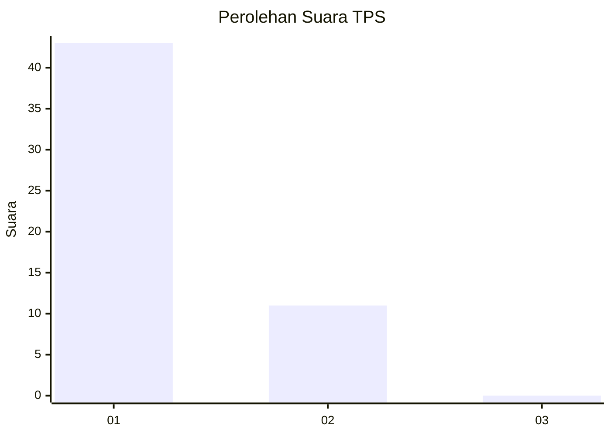
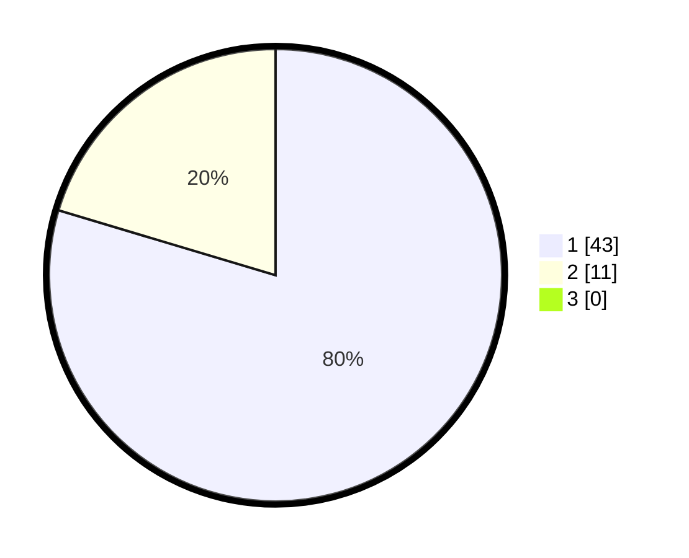

# Hasil

## Grafik

## Tabel

| No. | Nama Paslon    | Suara | Suara (raw) | Persentase |
|:--- |:-------------- | -----:| -----------:| ----------:|
| 1   | ANIES MUHAIMIN | 43    | [43][p-1]   | 79,63      |
| 2   | PRABOWO GIBRAN | 11    | [11][p-2]   | 20,37      |
| 3   | GANJAR MAHFUD  | 0     | [0][p-3]    | 0,00       |

[p-1]: https://github.com/gigit-pemilu/pemilu-2024-11-aceh/blob/main/pilpres/hitung-suara/sub/11-aceh/sub/05-aceh-barat/sub/03-sungai-mas/sub/2018-lueng-baro/sub/001-tps/sub/paslon-1.txt
[p-2]: https://github.com/gigit-pemilu/pemilu-2024-11-aceh/blob/main/pilpres/hitung-suara/sub/11-aceh/sub/05-aceh-barat/sub/03-sungai-mas/sub/2018-lueng-baro/sub/001-tps/sub/paslon-2.txt
[p-3]: https://github.com/gigit-pemilu/pemilu-2024-11-aceh/blob/main/pilpres/hitung-suara/sub/11-aceh/sub/05-aceh-barat/sub/03-sungai-mas/sub/2018-lueng-baro/sub/001-tps/sub/paslon-3.txt

## Foto C Plano

https://sirekap-obj-formc.kpu.go.id/d69c/pemilu/ppwp/11/05/03/20/18/1105032018001-20240214-221355--515d5afa-d4e0-46a5-b20e-f4291bf761d5.jpg

https://sirekap-obj-formc.kpu.go.id/d69c/pemilu/ppwp/11/05/03/20/18/1105032018001-20240214-221436--6b1624f7-ff06-43fc-814d-139a07c29d84.jpg

https://sirekap-obj-formc.kpu.go.id/d69c/pemilu/ppwp/11/05/03/20/18/1105032018001-20240214-221456--a6b4ca8b-41f0-4a24-a442-c27d3bb1ba04.jpg

## Metadata

| Key        | Value               |
| ---------- | ------------------- |
| Time Stamp | 2024-02-15 19:00:26 |

