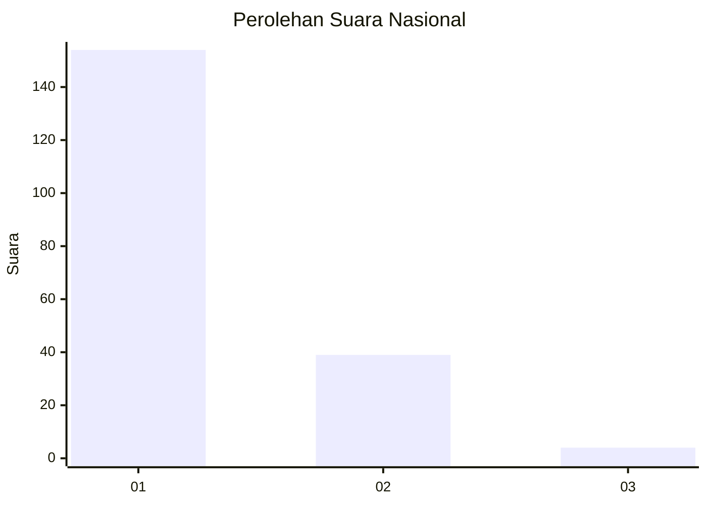
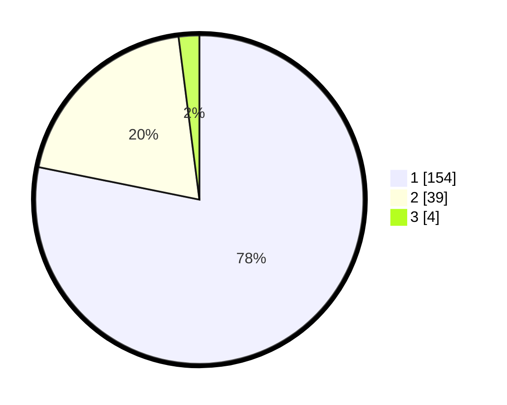

# Hasil

## Grafik

## Tabel

| No. | Nama Paslon    | Suara | Suara (raw) | Persentase |
|:--- |:-------------- | -----:| -----------:| ----------:|
| 1   | ANIES MUHAIMIN | 154   | [154][p-1]  | 78,17      |
| 2   | PRABOWO GIBRAN | 39    | [39][p-2]   | 19,80      |
| 3   | GANJAR MAHFUD  | 4     | [4][p-3]    | 2,03       |

[p-1]: https://github.com/gigit-pemilu/pemilu-2024/blob/main/pilpres/hitung-suara/sub/11-aceh/sub/05-aceh-barat/sub/04-woyla/sub/2001-kuala-bhee/sub/002-tps/sub/paslon-1.txt
[p-2]: https://github.com/gigit-pemilu/pemilu-2024/blob/main/pilpres/hitung-suara/sub/11-aceh/sub/05-aceh-barat/sub/04-woyla/sub/2001-kuala-bhee/sub/002-tps/sub/paslon-2.txt
[p-3]: https://github.com/gigit-pemilu/pemilu-2024/blob/main/pilpres/hitung-suara/sub/11-aceh/sub/05-aceh-barat/sub/04-woyla/sub/2001-kuala-bhee/sub/002-tps/sub/paslon-3.txt

## Foto C Plano

https://sirekap-obj-formc.kpu.go.id/e3fb/pemilu/ppwp/11/05/04/20/01/1105042001002-20240214-235324--f4ec2c5a-994f-4d69-b76b-1cbc9937675e.jpg

https://sirekap-obj-formc.kpu.go.id/e3fb/pemilu/ppwp/11/05/04/20/01/1105042001002-20240214-235444--60c4e4d8-d57c-4eb2-82f3-8053c71a73e0.jpg

https://sirekap-obj-formc.kpu.go.id/e3fb/pemilu/ppwp/11/05/04/20/01/1105042001002-20240214-235630--583528c0-e2f2-4319-9902-2e6ae4f7aff0.jpg

## Metadata

| Key        | Value               |
| ---------- | ------------------- |
| Time Stamp | 2024-02-15 21:01:18 |

