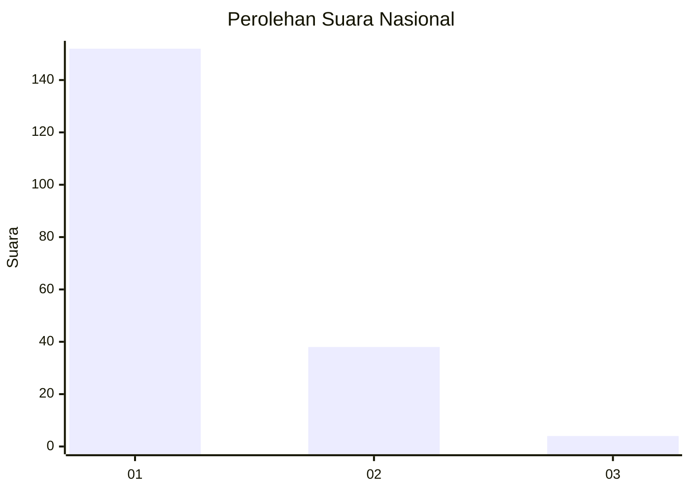
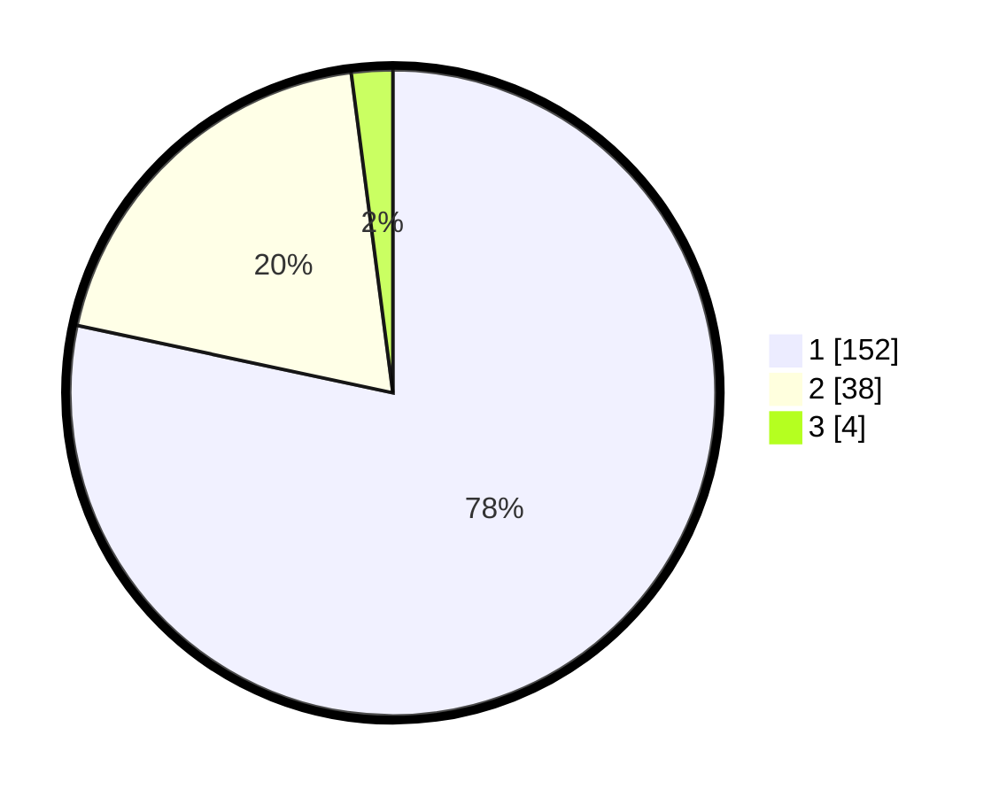

# Hasil

## Grafik

## Tabel

| No. | Nama Paslon    | Suara | Suara (raw) | Persentase |
|:--- |:-------------- | -----:| -----------:| ----------:|
| 1   | ANIES MUHAIMIN | 152   | [152][p-1]  | 78,35      |
| 2   | PRABOWO GIBRAN | 38    | [38][p-2]   | 19,59      |
| 3   | GANJAR MAHFUD  | 4     | [4][p-3]    | 2,06       |

[p-1]: https://github.com/gigit-pemilu/pemilu-2024/blob/main/pilpres/hitung-suara/sub/11-aceh/sub/05-aceh-barat/sub/04-woyla/sub/2001-kuala-bhee/sub/003-tps/sub/paslon-1.txt
[p-2]: https://github.com/gigit-pemilu/pemilu-2024/blob/main/pilpres/hitung-suara/sub/11-aceh/sub/05-aceh-barat/sub/04-woyla/sub/2001-kuala-bhee/sub/003-tps/sub/paslon-2.txt
[p-3]: https://github.com/gigit-pemilu/pemilu-2024/blob/main/pilpres/hitung-suara/sub/11-aceh/sub/05-aceh-barat/sub/04-woyla/sub/2001-kuala-bhee/sub/003-tps/sub/paslon-3.txt

## Foto C Plano

https://sirekap-obj-formc.kpu.go.id/4030/pemilu/ppwp/11/05/04/20/01/1105042001003-20240216-145934--e8b56f7b-4728-4aaa-aa19-bdd74f935169.jpg

https://sirekap-obj-formc.kpu.go.id/4030/pemilu/ppwp/11/05/04/20/01/1105042001003-20240216-145936--cbd3ad89-0f51-4e4c-83da-a46b8e8b3f10.jpg

https://sirekap-obj-formc.kpu.go.id/4030/pemilu/ppwp/11/05/04/20/01/1105042001003-20240216-145935--3aa1021c-ea80-49c1-a93b-bf63f21c314d.jpg

## Metadata

| Key        | Value               |
| ---------- | ------------------- |
| Time Stamp | 2024-02-16 16:25:10 |

## DATA PEMILIH TETAP

Jumlah pemilih dalam DPT: **211**.
 * L: **99**.
 * P: **112**.

## DATA PENGGUNA HAK PILIH

Jumlah pengguna hak pilih dalam DPT: **194**.
 * L: **90**.
 * P: **104**.

Jumlah pengguna hak pilih dalam DPTb: **2**.
 * L: **1**.
 * P: **1**.

Jumlah pengguna hak pilih dalam DPK: **0**.
 * L: **0**.
 * P: **0**.

Jumlah pengguna hak pilih: **196**.
 * L: **91**.
 * P: **105**.

## JUMLAH SUARA SAH DAN TIDAK SAH

JUMLAH SELURUH SUARA SAH: **194**.

JUMLAH SUARA TIDAK SAH: **2**.

JUMLAH SELURUH SUARA SAH DAN SUARA TIDAK SAH: **196**.

