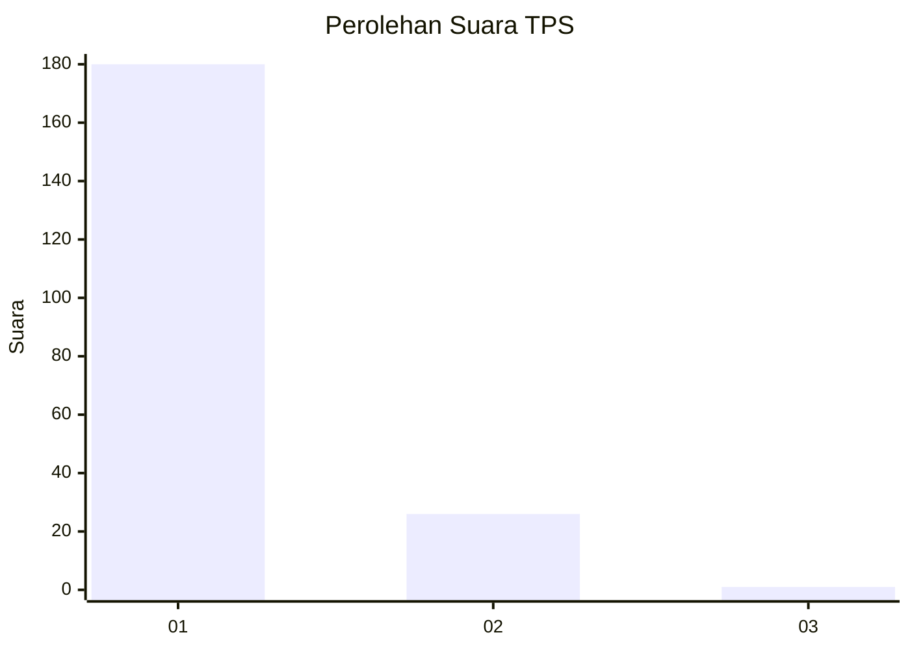
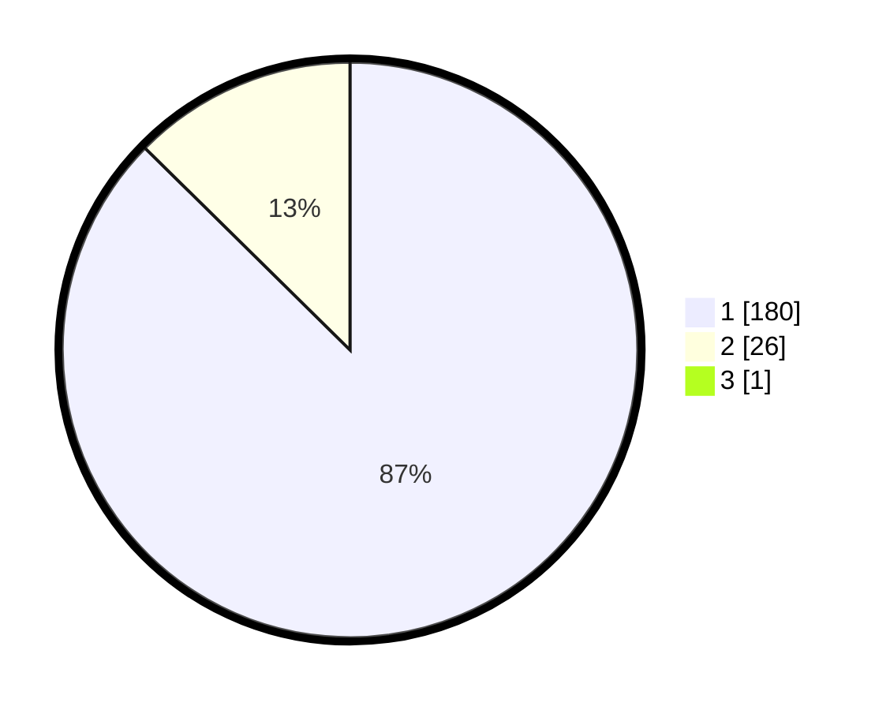

# Hasil

## Grafik

## Tabel

| No. | Nama Paslon    | Suara | Suara (raw) | Persentase |
|:--- |:-------------- | -----:| -----------:| ----------:|
| 1   | ANIES MUHAIMIN | 180   | [180][p-1]  | 86,96      |
| 2   | PRABOWO GIBRAN | 26    | [26][p-2]   | 12,56      |
| 3   | GANJAR MAHFUD  | 1     | [1][p-3]    | 0,48       |

[p-1]: https://github.com/gigit-pemilu/pemilu-2024-11-aceh/blob/main/pilpres/hitung-suara/sub/11-aceh/sub/05-aceh-barat/sub/04-woyla/sub/2007-ranto-panyang/sub/001-tps/sub/paslon-1.txt
[p-2]: https://github.com/gigit-pemilu/pemilu-2024-11-aceh/blob/main/pilpres/hitung-suara/sub/11-aceh/sub/05-aceh-barat/sub/04-woyla/sub/2007-ranto-panyang/sub/001-tps/sub/paslon-2.txt
[p-3]: https://github.com/gigit-pemilu/pemilu-2024-11-aceh/blob/main/pilpres/hitung-suara/sub/11-aceh/sub/05-aceh-barat/sub/04-woyla/sub/2007-ranto-panyang/sub/001-tps/sub/paslon-3.txt

## Foto C Plano

https://sirekap-obj-formc.kpu.go.id/9751/pemilu/ppwp/11/05/04/20/07/1105042007001-20240215-095108--fae94766-31ae-45a4-aa90-178f82860f1e.jpg

https://sirekap-obj-formc.kpu.go.id/9751/pemilu/ppwp/11/05/04/20/07/1105042007001-20240215-094555--a5403fc0-6ae8-4336-be6a-188c18d44735.jpg

https://sirekap-obj-formc.kpu.go.id/9751/pemilu/ppwp/11/05/04/20/07/1105042007001-20240215-094851--a8155221-5fa0-4227-89c5-f7b2bbee88f4.jpg

## Metadata

| Key        | Value               |
| ---------- | ------------------- |
| Time Stamp | 2024-02-15 21:01:18 |

