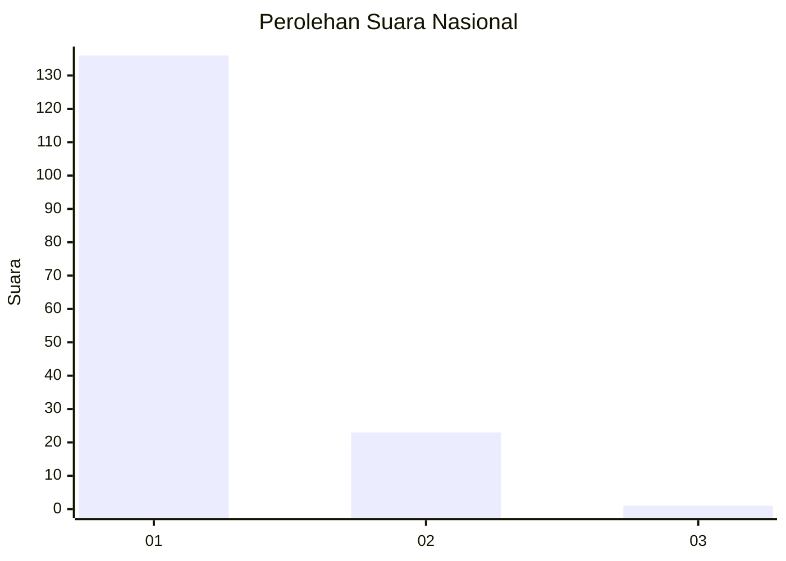
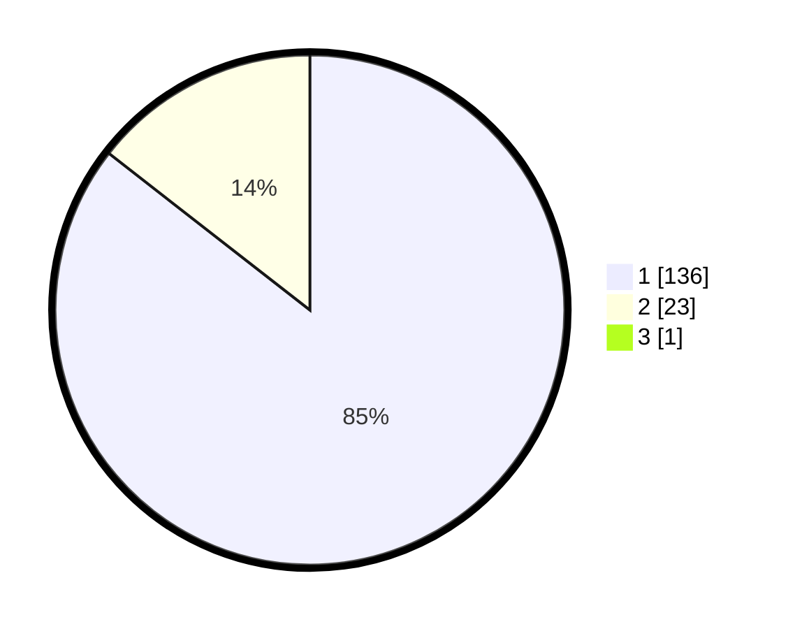

# Hasil

## Grafik

## Tabel

| No. | Nama Paslon    | Suara | Suara (raw) | Persentase |
|:--- |:-------------- | -----:| -----------:| ----------:|
| 1   | ANIES MUHAIMIN | 136   | [136][p-1]  | 85,00      |
| 2   | PRABOWO GIBRAN | 23    | [23][p-2]   | 14,38      |
| 3   | GANJAR MAHFUD  | 1     | [1][p-3]    | 0,63       |

[p-1]: https://github.com/gigit-pemilu/pemilu-2024/blob/main/pilpres/hitung-suara/sub/11-aceh/sub/05-aceh-barat/sub/04-woyla/sub/2009-padang-jawa/sub/001-tps/sub/paslon-1.txt
[p-2]: https://github.com/gigit-pemilu/pemilu-2024/blob/main/pilpres/hitung-suara/sub/11-aceh/sub/05-aceh-barat/sub/04-woyla/sub/2009-padang-jawa/sub/001-tps/sub/paslon-2.txt
[p-3]: https://github.com/gigit-pemilu/pemilu-2024/blob/main/pilpres/hitung-suara/sub/11-aceh/sub/05-aceh-barat/sub/04-woyla/sub/2009-padang-jawa/sub/001-tps/sub/paslon-3.txt

## Foto C Plano

https://sirekap-obj-formc.kpu.go.id/8681/pemilu/ppwp/11/05/04/20/09/1105042009001-20240215-094209--7cae801e-3885-4037-967a-d02cb076100f.jpg

https://sirekap-obj-formc.kpu.go.id/8681/pemilu/ppwp/11/05/04/20/09/1105042009001-20240215-094301--d92b7a2f-14be-4a87-a3da-e83b42eb814f.jpg

https://sirekap-obj-formc.kpu.go.id/8681/pemilu/ppwp/11/05/04/20/09/1105042009001-20240215-094343--e0bce001-6005-43af-a7be-2216efdbbb6e.jpg

## Metadata

| Key        | Value               |
| ---------- | ------------------- |
| Time Stamp | 2024-02-15 21:01:18 |

