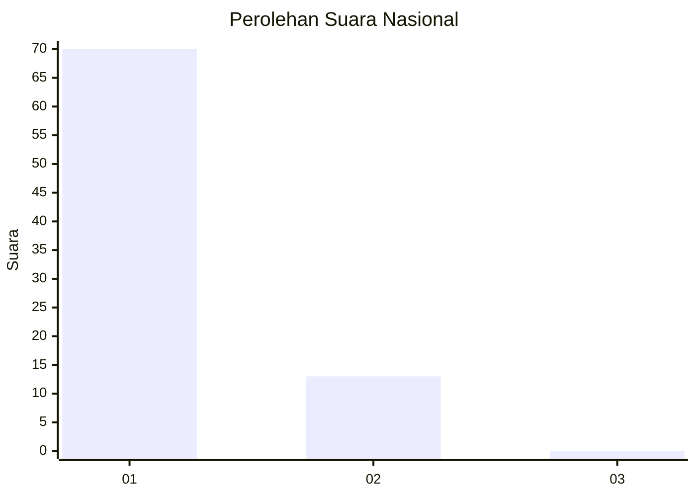
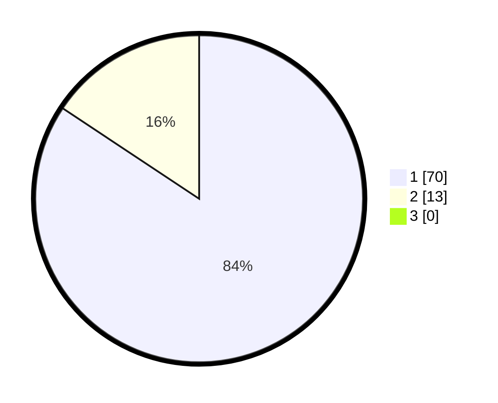

# Hasil

## Grafik

## Tabel

| No. | Nama Paslon    | Suara | Suara (raw) | Persentase |
|:--- |:-------------- | -----:| -----------:| ----------:|
| 1   | ANIES MUHAIMIN | 70    | [70][p-1]   | 84,34      |
| 2   | PRABOWO GIBRAN | 13    | [13][p-2]   | 15,66      |
| 3   | GANJAR MAHFUD  | 0     | [0][p-3]    | 0,00       |

[p-1]: https://github.com/gigit-pemilu/pemilu-2024/blob/main/pilpres/hitung-suara/sub/11-aceh/sub/05-aceh-barat/sub/04-woyla/sub/2017-gunong-hampa/sub/001-tps/sub/paslon-1.txt
[p-2]: https://github.com/gigit-pemilu/pemilu-2024/blob/main/pilpres/hitung-suara/sub/11-aceh/sub/05-aceh-barat/sub/04-woyla/sub/2017-gunong-hampa/sub/001-tps/sub/paslon-2.txt
[p-3]: https://github.com/gigit-pemilu/pemilu-2024/blob/main/pilpres/hitung-suara/sub/11-aceh/sub/05-aceh-barat/sub/04-woyla/sub/2017-gunong-hampa/sub/001-tps/sub/paslon-3.txt

## Foto C Plano

https://sirekap-obj-formc.kpu.go.id/3469/pemilu/ppwp/11/05/04/20/17/1105042017001-20240214-235711--7d544b15-91e0-49d0-a2c6-03814083323c.jpg

https://sirekap-obj-formc.kpu.go.id/3469/pemilu/ppwp/11/05/04/20/17/1105042017001-20240214-235941--b22e944c-aa46-4c1b-8a4b-0343c28090cb.jpg

https://sirekap-obj-formc.kpu.go.id/3469/pemilu/ppwp/11/05/04/20/17/1105042017001-20240215-000346--e665b45e-17b3-4b8e-a603-9f7eb8a993d2.jpg

## Metadata

| Key        | Value               |
| ---------- | ------------------- |
| Time Stamp | 2024-02-20 23:00:00 |

