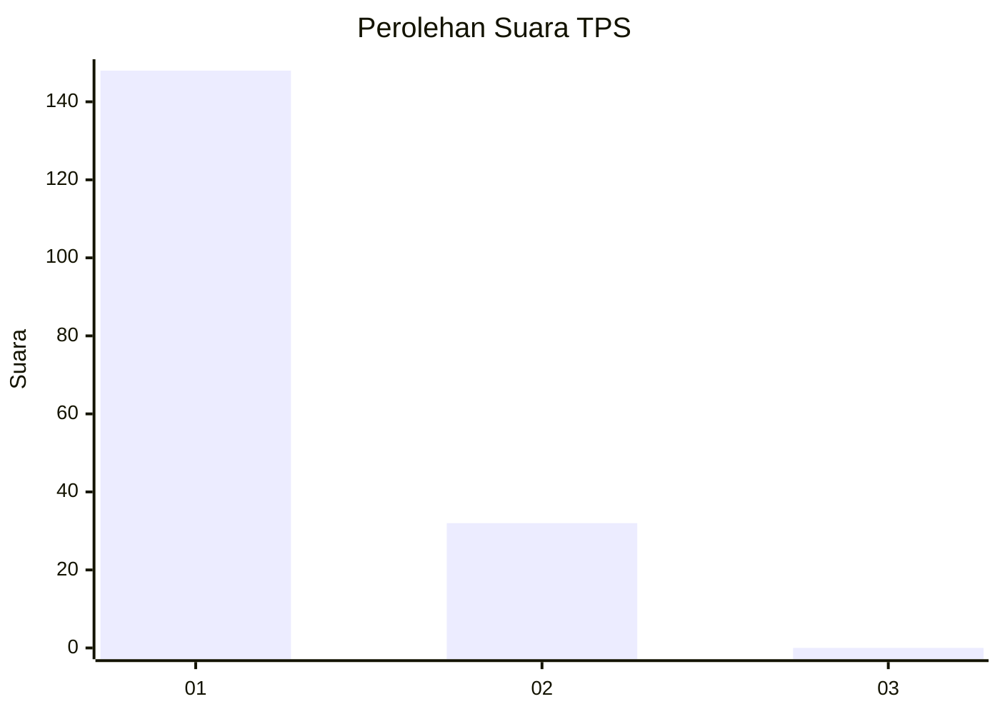
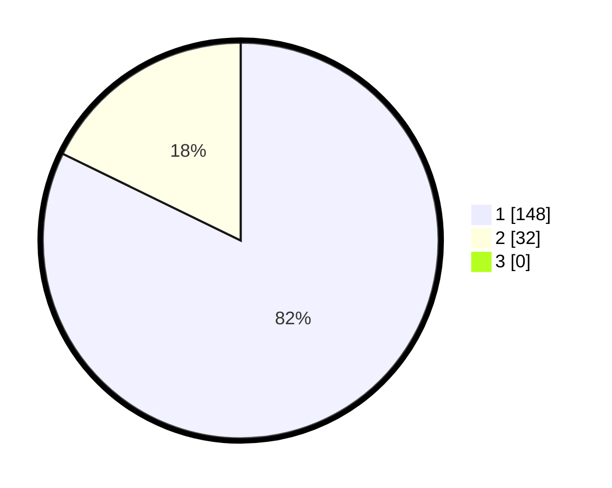

# Hasil

## Grafik

## Tabel

| No. | Nama Paslon    | Suara | Suara (raw) | Persentase |
|:--- |:-------------- | -----:| -----------:| ----------:|
| 1   | ANIES MUHAIMIN | 148   | [148][p-1]  | 82,22      |
| 2   | PRABOWO GIBRAN | 32    | [32][p-2]   | 17,78      |
| 3   | GANJAR MAHFUD  | 0     | [0][p-3]    | 0,00       |

[p-1]: https://github.com/gigit-pemilu/pemilu-2024-11-aceh/blob/main/pilpres/hitung-suara/sub/11-aceh/sub/05-aceh-barat/sub/04-woyla/sub/2018-lueng-jawa/sub/001-tps/sub/paslon-1.txt
[p-2]: https://github.com/gigit-pemilu/pemilu-2024-11-aceh/blob/main/pilpres/hitung-suara/sub/11-aceh/sub/05-aceh-barat/sub/04-woyla/sub/2018-lueng-jawa/sub/001-tps/sub/paslon-2.txt
[p-3]: https://github.com/gigit-pemilu/pemilu-2024-11-aceh/blob/main/pilpres/hitung-suara/sub/11-aceh/sub/05-aceh-barat/sub/04-woyla/sub/2018-lueng-jawa/sub/001-tps/sub/paslon-3.txt

## Foto C Plano

https://sirekap-obj-formc.kpu.go.id/092e/pemilu/ppwp/11/05/04/20/18/1105042018001-20240215-054850--baaba640-689b-43a7-b515-daa34951c7cd.jpg

https://sirekap-obj-formc.kpu.go.id/092e/pemilu/ppwp/11/05/04/20/18/1105042018001-20240215-054652--30dea0e5-9db8-40c1-806d-e47f13704b2e.jpg

https://sirekap-obj-formc.kpu.go.id/092e/pemilu/ppwp/11/05/04/20/18/1105042018001-20240215-054345--0efe15f1-bfcb-4fa3-8c29-7436d7020dbe.jpg

## Metadata

| Key        | Value               |
| ---------- | ------------------- |
| Time Stamp | 2024-02-15 22:30:27 |

