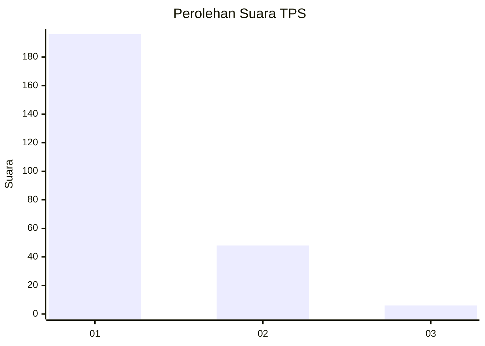
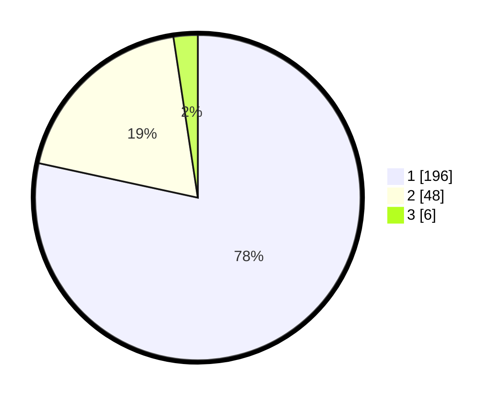

# Hasil

## Grafik

## Tabel

| No. | Nama Paslon    | Suara | Suara (raw) | Persentase |
|:--- |:-------------- | -----:| -----------:| ----------:|
| 1   | ANIES MUHAIMIN | 196   | [196][p-1]  | 78,40      |
| 2   | PRABOWO GIBRAN | 48    | [48][p-2]   | 19,20      |
| 3   | GANJAR MAHFUD  | 6     | [6][p-3]    | 2,40       |

[p-1]: https://github.com/gigit-pemilu/pemilu-2024-11-aceh/blob/main/pilpres/hitung-suara/sub/11-aceh/sub/05-aceh-barat/sub/04-woyla/sub/2026-keuleumbah/sub/001-tps/sub/paslon-1.txt
[p-2]: https://github.com/gigit-pemilu/pemilu-2024-11-aceh/blob/main/pilpres/hitung-suara/sub/11-aceh/sub/05-aceh-barat/sub/04-woyla/sub/2026-keuleumbah/sub/001-tps/sub/paslon-2.txt
[p-3]: https://github.com/gigit-pemilu/pemilu-2024-11-aceh/blob/main/pilpres/hitung-suara/sub/11-aceh/sub/05-aceh-barat/sub/04-woyla/sub/2026-keuleumbah/sub/001-tps/sub/paslon-3.txt

## Foto C Plano

https://sirekap-obj-formc.kpu.go.id/ffd6/pemilu/ppwp/11/05/04/20/26/1105042026001-20240214-212555--8ddfce89-c23e-480f-b287-bb7105269c3f.jpg

https://sirekap-obj-formc.kpu.go.id/ffd6/pemilu/ppwp/11/05/04/20/26/1105042026001-20240214-212644--0d4eac4f-64ef-4aed-bc4e-a36189d6c8c1.jpg

https://sirekap-obj-formc.kpu.go.id/ffd6/pemilu/ppwp/11/05/04/20/26/1105042026001-20240214-212725--9d72586d-428e-4e42-8251-a148d785feaa.jpg

## Metadata

| Key        | Value               |
| ---------- | ------------------- |
| Time Stamp | 2024-02-15 21:01:18 |

