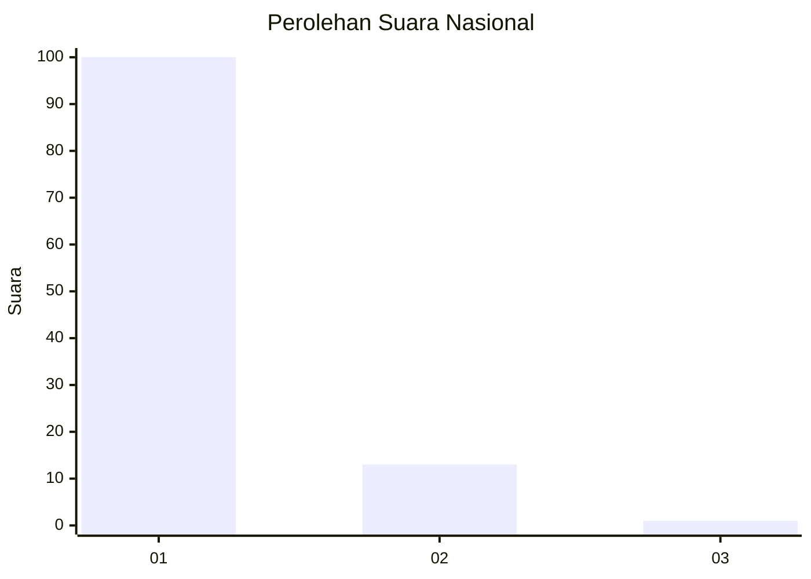
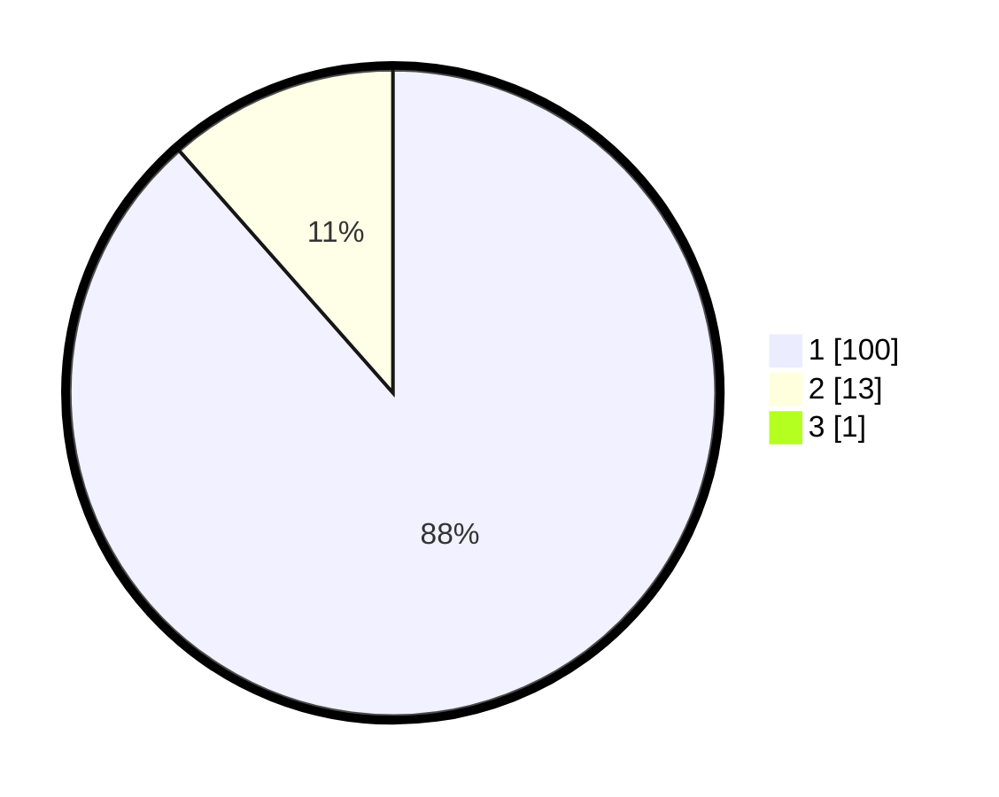

# Hasil

## Grafik

## Tabel

| No. | Nama Paslon    | Suara | Suara (raw) | Persentase |
|:--- |:-------------- | -----:| -----------:| ----------:|
| 1   | ANIES MUHAIMIN | 100   | [100][p-1]  | 87,72      |
| 2   | PRABOWO GIBRAN | 13    | [13][p-2]   | 11,40      |
| 3   | GANJAR MAHFUD  | 1     | [1][p-3]    | 0,88       |

[p-1]: https://github.com/gigit-pemilu/pemilu-2024/blob/main/pilpres/hitung-suara/sub/11-aceh/sub/05-aceh-barat/sub/04-woyla/sub/2032-cot-situah/sub/001-tps/sub/paslon-1.txt
[p-2]: https://github.com/gigit-pemilu/pemilu-2024/blob/main/pilpres/hitung-suara/sub/11-aceh/sub/05-aceh-barat/sub/04-woyla/sub/2032-cot-situah/sub/001-tps/sub/paslon-2.txt
[p-3]: https://github.com/gigit-pemilu/pemilu-2024/blob/main/pilpres/hitung-suara/sub/11-aceh/sub/05-aceh-barat/sub/04-woyla/sub/2032-cot-situah/sub/001-tps/sub/paslon-3.txt

## Foto C Plano

https://sirekap-obj-formc.kpu.go.id/7790/pemilu/ppwp/11/05/04/20/32/1105042032001-20240214-212431--ec7ac887-bc58-447b-aa4d-10ff034d81cd.jpg

https://sirekap-obj-formc.kpu.go.id/7790/pemilu/ppwp/11/05/04/20/32/1105042032001-20240215-093215--424682c3-0385-4010-ac58-fd92f7f6b92c.jpg

https://sirekap-obj-formc.kpu.go.id/7790/pemilu/ppwp/11/05/04/20/32/1105042032001-20240215-093702--a26d9caa-a089-4eb3-834b-8edf7ca59160.jpg

## Metadata

| Key        | Value               |
| ---------- | ------------------- |
| Time Stamp | 2024-02-15 21:01:18 |

## DATA PEMILIH TETAP

Jumlah pemilih dalam DPT: **117**.
 * L: **61**.
 * P: **56**.

## DATA PENGGUNA HAK PILIH

Jumlah pengguna hak pilih dalam DPT: **113**.
 * L: **60**.
 * P: **53**.

Jumlah pengguna hak pilih dalam DPTb: **2**.
 * L: **0**.
 * P: **2**.

Jumlah pengguna hak pilih dalam DPK: **0**.
 * L: **0**.
 * P: **0**.

Jumlah pengguna hak pilih: **115**.
 * L: **60**.
 * P: **55**.

## JUMLAH SUARA SAH DAN TIDAK SAH

JUMLAH SELURUH SUARA SAH: **114**.

JUMLAH SUARA TIDAK SAH: **1**.

JUMLAH SELURUH SUARA SAH DAN SUARA TIDAK SAH: **115**.

