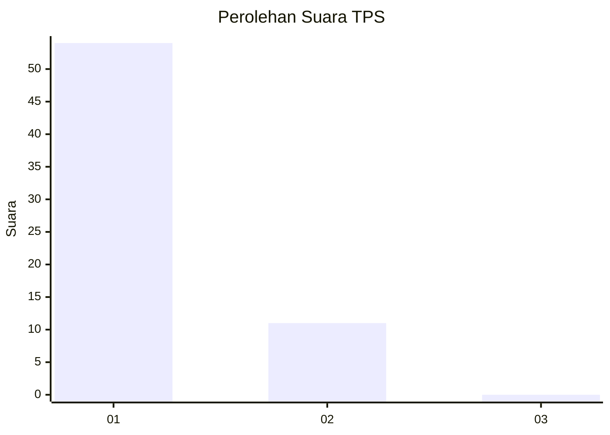
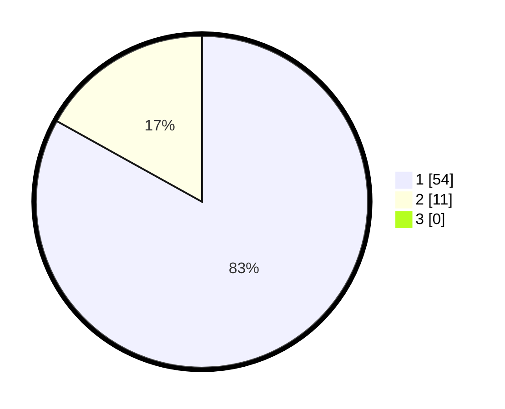

# Hasil

## Grafik

## Tabel

| No. | Nama Paslon    | Suara | Suara (raw) | Persentase |
|:--- |:-------------- | -----:| -----------:| ----------:|
| 1   | ANIES MUHAIMIN | 54    | [54][p-1]   | 83,08      |
| 2   | PRABOWO GIBRAN | 11    | [11][p-2]   | 16,92      |
| 3   | GANJAR MAHFUD  | 0     | [0][p-3]    | 0,00       |

[p-1]: https://github.com/gigit-pemilu/pemilu-2024-11-aceh/blob/main/pilpres/hitung-suara/sub/11-aceh/sub/05-aceh-barat/sub/04-woyla/sub/2036-alue-sundak/sub/001-tps/sub/paslon-1.txt
[p-2]: https://github.com/gigit-pemilu/pemilu-2024-11-aceh/blob/main/pilpres/hitung-suara/sub/11-aceh/sub/05-aceh-barat/sub/04-woyla/sub/2036-alue-sundak/sub/001-tps/sub/paslon-2.txt
[p-3]: https://github.com/gigit-pemilu/pemilu-2024-11-aceh/blob/main/pilpres/hitung-suara/sub/11-aceh/sub/05-aceh-barat/sub/04-woyla/sub/2036-alue-sundak/sub/001-tps/sub/paslon-3.txt

## Foto C Plano

https://sirekap-obj-formc.kpu.go.id/fea8/pemilu/ppwp/11/05/04/20/36/1105042036001-20240216-132214--26f61afc-0bee-40ae-a7e7-6359c301dc68.jpg

https://sirekap-obj-formc.kpu.go.id/fea8/pemilu/ppwp/11/05/04/20/36/1105042036001-20240216-132215--64214e70-7e92-4d6e-b96a-3e01a9d80765.jpg

https://sirekap-obj-formc.kpu.go.id/fea8/pemilu/ppwp/11/05/04/20/36/1105042036001-20240216-132214--05929a02-0ba7-4748-bae0-83c87189731c.jpg

## Metadata

| Key        | Value               |
| ---------- | ------------------- |
| Time Stamp | 2024-02-16 16:25:10 |

## DATA PEMILIH TETAP

Jumlah pemilih dalam DPT: **67**.
 * L: **36**.
 * P: **31**.

## DATA PENGGUNA HAK PILIH

Jumlah pengguna hak pilih dalam DPT: **64**.
 * L: **34**.
 * P: **30**.

Jumlah pengguna hak pilih dalam DPTb: **1**.
 * L: **0**.
 * P: **1**.

Jumlah pengguna hak pilih dalam DPK: **0**.
 * L: **0**.
 * P: **0**.

Jumlah pengguna hak pilih: **65**.
 * L: **34**.
 * P: **31**.

## JUMLAH SUARA SAH DAN TIDAK SAH

JUMLAH SELURUH SUARA SAH: **65**.

JUMLAH SUARA TIDAK SAH: **0**.

JUMLAH SELURUH SUARA SAH DAN SUARA TIDAK SAH: **65**.

